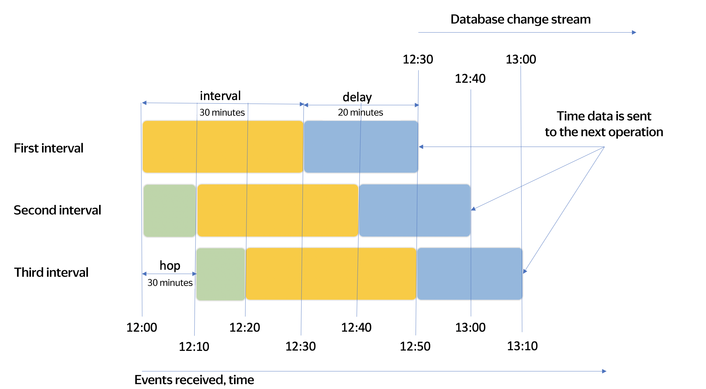

# Streaming data processing windows

Streaming data processing is used for computations on unlimited data streams. Since a data stream is not limited, aggregate functions like COUNT or SUM can't complete because the data stream is endless. This prevents you from getting correct results.

That's why a special window data aggregation mode is used for streaming queries. Under window aggregation, all operations are only performed on some data that is limited with a time window. 

Streaming data processing is often used for analyzing data from different devices, such as mobiles. Devices may sometimes disconnect from the network and then resume connection and send data accumulated during this time. This results in a balance between the accuracy of computations and the rate of getting results. You can manage this balance by setting a timeout for receiving data:
- The longer the timeout, the more accurate the results, but the later they will be calculated.
- The shorter the timeout, the less accurate the results, but you'll get them faster.

The sample query below calculates the number of items in a 20-second time window and waits for delayed data for 30 seconds.

```sql
SELECT
    HOP_END(),
    COUNT(*)
FROM
    source
GROUP BY HOP(`timestamp`, "PT20S", "PT20S", "PT30S")
```

In YQL, a `HOP window` is defined as follows:

```sql
HOP(time_extractor, hop, interval, delay)
```

| Name | Description |
|--------|--------|
| `time_extractor` | Expression used to get a timestamp for grouping |
| `hop` | Grouping window step by time |
| `interval` | Grouping window duration by time |
| `delay` | Waiting time for delayed data |

The `hop`, `interval`, and `delay` field values are specified in [ISO_8601](https://ru.wikipedia.org/wiki/ISO_8601) format. For example, "PT10M" is a 10-minute interval, while "PT30S" is a 30-second interval.

The entire query is given below:

```sql
SELECT
    key,
    COUNT(*)
FROM my_stream
GROUP BY
    HOP(CAST(evt_time AS Timestamp), "PT10M", "PT30M", "PT20M"),
    key;
```

Let's assume that data started arriving at 12:00, then:
- The first data interval is from 12:00 to 12:30 (the `interval` value is 30 minutes).
- The second interval is from 12:10 to 12:40 (the data `hop` is 10 minutes and the interval duration is 30 minutes).
- The third interval is from 12:20 to 12:50.
- And so on.

Not all data arrives on time. For example, data being sent from a user's mobile where a connection break occurred may be delayed.

The waiting time for all delayed data to arrive is 20 minutes. The final query results will be calculated as follows:
- The first interval starts at 12:50 (the waiting time for lagging data, the `delay` value, is 20 minutes). Data being sent includes events that occurred until 12:30.
- The second interval starts at 13:00. Data being sent includes events that occurred until 12:40.
- The third interval starts at 13:10. Data being sent includes events that occurred until 12:50.
- And so on.

The larger the value set for the `delay` parameter, the more complete the data, but the later it will be sent for further processing.

The image below illustrates how data is aggregated by the HOP time value from the example above.



In the image, the `interval` parameter is highlighted in yellow, the `hop` parameter in green, and the `delay` parameter in blue.