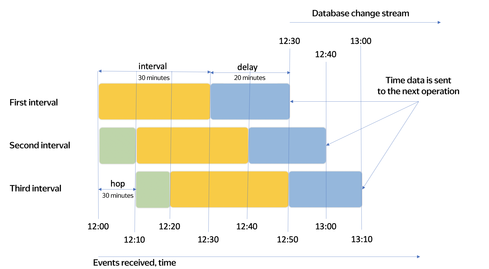

# Streaming data processing windows

Streaming data processing is used for computations on unlimited data streams. With an unlimited data stream, aggregate functions like COUNT or SUM cannot be completed because the data stream has no end. This prevents you from getting correct results. 

This is why the special _window_ data aggregation mode is used for streaming queries. With window aggregation, all operations are performed on only a portion of data, limited by a time window.

Streaming data processing is often used for analyzing data from different devices, such as mobile phones. Devices may get disconnected from the network and then resume the connection to send the data accumulated during this time. Thus, you strike a balance between the accuracy of computations and how quickly you get the results. You can manage this balance by setting a data wait timeout:
- The longer the timeout, the more accurate the results, and the later you are going to get them.
- The shorter the timeout, the less accurate the results, and the sooner you are going to get them.

The sample query below calculates the number of items in a 20-second time window and waits for delayed data for 30 seconds.

```sql
SELECT
    HOP_END(),
    COUNT(*)
FROM
    source
GROUP BY HOP(`timestamp`, "PT20S", "PT20S", "PT30S")
```

YQL defines `HOP window` as follows:

```sql
HOP(time_extractor, hop, interval, delay)
```

|Name|Description|
|--------|--------|
|`time_extractor`|Expression used to get a timestamp for grouping|
|`hop`|Grouping window step by time|
|`interval`|Grouping window duration by time|
|`delay`|Waiting time for delayed data|

For the `hop`, `interval`, and `delay` fields, specify the respective values in [ISO_8601](https://ru.wikipedia.org/wiki/ISO_8601) format. For example, "PT10M" is a 10-minute interval, while "PT30S" is a 30-second interval.

The entire query is given below:

```sql
SELECT 
    key,
    COUNT(*)
FROM my_stream
GROUP BY
    HOP(CAST(evt_time AS Timestamp), "PT10M", "PT30M", "PT20M"),
    key;
```

Let's assume that data started arriving at 12:00, then:
- The first data interval is from 12:00 to 12:30 (the `interval` value is 30 minutes).
- The second one is from 12:10 to 12:40 (the data `hop` is 10 minutes and the interval duration is 30 minutes).
- The third one is from 12:20 to 12:50.
- And so on.

Not all data arrives on time. For example, data being sent from a user's mobile where a connection break occurred may be delayed.

The waiting time for all delayed data to arrive is 20 minutes. The final query results will be calculated as follows:
- For the first interval, at 12:50 (the wait time for delayed data, `delay`, is 20 minutes). The sent data will include events up to 12:30.
- For the second interval, at 13:00. The sent data will include events up to 12:40.
- For the third interval, at 13:10. The sent data will include events up to 12:50.
- And so on.

The higher the `delay` value, the more complete the data will be, but the later it will go for further processing.

The image below illustrates how data is aggregated by the HOP time value from the example above.



In the image, the `interval` parameter is highlighted in yellow, the `hop` parameter, in green, and the `delay` parameter, in blue.

## Use cases {#examples}

* [{#T}](../tutorials/cloud-logging.md)
* [{#T}](../tutorials/debezium.md)
