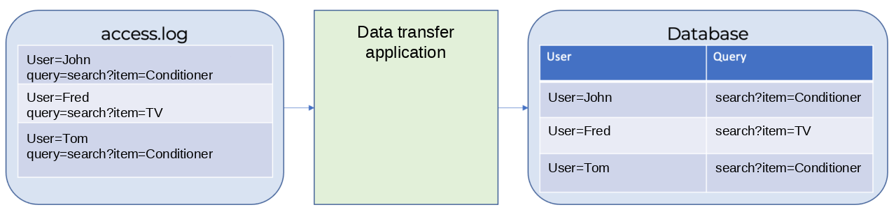
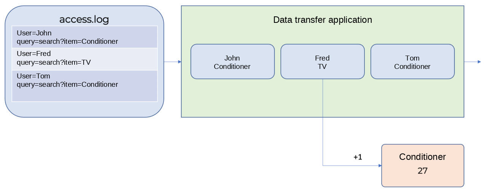

# Streaming data analysis

The easiest way to explain how streaming data analysis works is to use an example. Let's say we want to build a pre-ordering system for our online store. Every day we are going to analyze the number of searches for "air conditioner" during the past day on our online store website to make an order on the next one. 

All search history is logged to a file named access.log. A special program transfers data from the access.log file to a DB table.



Users search for products 100,000 times every day, meaning the DB table will store 300,000 search records. 

To count the number of search queries for goods for the last day, run the following query:

```sql
SELECT 
    date, 
    count(*) 
FROM 
    database 
WHERE 
    query LIKE ‘%conditioner%’ 
        AND 
            date IN [today()-1, today] 
GROUP BY date
```

If the size per search record is 1KB, 100,000 records will take up 100 MB of space. This means we need to scan all 100 MB of data to calculate the number of search queries for conditioners. 

## Streaming analysis

Now let's solve the same problem through streaming analysis.

It processes records one by one while they're being transferred from the source to the target, that is, from the access.log file to the database, instead of handling the data previously accumulated in storage systems. In this case, only computation results are saved, while unnecessary data is discarded.



Streaming analysis systems let you describe operations on the data being transferred in the regular SQL.

A similar SQL query for streaming analysis looks like this:

```sql
SELECT 
    HOP_BEGIN(), 
    COUNT(*) 
FROM 
    database 
WHERE 
    query LIKE '%conditioner%'
GROUP BY HOP(`date`, "PT24H", "PT24H", "PT1H")
```

This query counts the number of search queries containing the word "air conditioner" and groups them by 24-hour interval.

## Differences between batch and streaming analysis

[Batch analysis](./batch-processing.md) is usually performed in the context of a DBMS that already stores all data required for the analysis. Streaming analysis uses data received at a given time from actual sources, and this data may be incomplete as of the analysis time. 

The main difference between streaming and batch data processing is the balance between the processing rate and completeness of data being processed. Under streaming processing, the delay is shorter and data is less complete; under batch processing, the delay is longer and the data is more complete.

||Batch processing|Streaming processing|
|----|----|----|
|Data processing delay|Hours, days. Performed once all necessary data is accumulated|Seconds, minutes. Performed on partially received data|
|Accuracy of results|Complete, since all the necessary data is previously accumulated|Partial, since processing is limited by the maximum waiting time for data.|
|Impact on the runtime system|Affects the DBMS in the context of which it's performed|Run using the allocated capacity of the streaming analysis system and has no impact on the DBMS|
|Variability|The DBMS allows running any types of queries even those not planned beforehand|Only queries prepared in advance|

## Reference use

Usually streaming data only contains IDs rather than complete data. For example, only a user's ID instead of their full name. In this case, the user's full name is saved to some storage system.

While processing, streaming data is often extended with additional information. This information is called reference and the process of adding data is called enrichment.

{{ yq-full-name }} can use data stored in {{ objstorage-full-name }} for enrichment. To enrich data, use the SQL `JOIN` clause. 



When using `JOIN` to join streaming data and references, make sure to specify the data stream in your `JOIN` clause first, followed by the reference.



Sample data enrichment query

```sql
$json_stream =
SELECT
    CAST(Data AS json) AS data,
FROM 
    yds.`input_stream`
WITH 
(  
    format=raw, 
    SCHEMA (Data String)
);

$events =
SELECT
    CAST(JSON_VALUE(data, '$.hostid') AS String) AS hostid,
FROM 
    $json_stream;

$host_dictionary =
SELECT
        *
FROM object_storage_lookup.`hosts.csv`
WITH 
(
    format=csv_with_names,
    SCHEMA 
    (
        hostid String,
        host_name String
    )
);

SELECT 
    *
FROM 
    $events AS events
INNER JOIN $host_dictionary AS host_dictionary
    ON events.hostid=host_dictionary.hostid;
```

## Use cases {#examples}

* [{#T}](../tutorials/cloud-logging.md)
* [{#T}](../tutorials/debezium.md)
