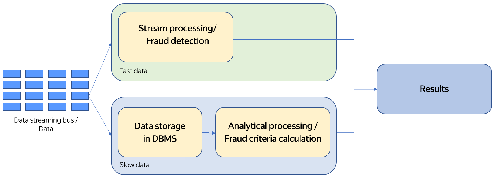
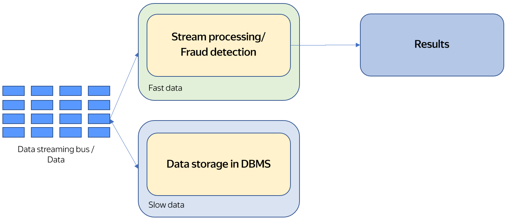

# Unified analysis of streaming and analytical data

Let's say we need to develop an anti-fraud system to detect fraudulent transactions. They need to be detected in real time, so it's convenient to use [streaming data processing](./stream-processing.md) for our purposes.

To detect fraudulent transactions, we need to know the criteria that distinguish them from regular transactions. A DBMS for processing banking data logs the full history of all customer transactions. This data can be used to define criteria that will help identify fraudulent actions. To do this, we need to write SQL queries that will analyze all the stored data and calculate the necessary criteria.

The criteria found by analytical queries should be transferred to the streaming analysis system to quickly detect fraudulent actions. In other words, the same data should be processed using different methods: batch and streaming.

Below are the architecture patterns that allow analytical and streaming queries to be executed:
- [Lambda architecture](#lambda).
- [Kappa architecture](#kappa).
- [Unified Lambda architecture](#unified).

## [Lambda architecture](https://en.wikipedia.org/wiki/Lambda_architecture) {#lambda}

Transaction data from a [data bus](../../data-streams/concepts/index.md) concurrently goes to the streaming processing system and to a DBMS (or a similar system) for storage. The streaming analysis system detects fraudulent actions. The analytical system stores data for a long time and uses it to calculate criteria for identifying fraudulent transactions. This means that two independent analysis systems are used: one for streaming analysis and the other one for running analytical queries.

The main advantage of this architecture is its simplicity: each individual task is handled by a separate system. Its main disadvantage is that separate systems are used to handle the two tasks.

If one system with its own processing language is used for batch processing and another one with a different development language is used for streaming analysis, this leads to complications in maintaining the two different systems, supporting and transferring the source code, and engaging different experts to maintain the two systems. All this makes it much more difficult to support the solution.

## [Kappa architecture](https://hazelcast.com/glossary/kappa-architecture/) {#kappa}

This architecture tries to eliminate the major disadvantage of the Lambda architecture: the need to support two independent data processing systems.

In this architecture, a stream from a streaming data bus is sent for processing to a streaming analysis system and for storage in a DBMS (or a similar system).

As in the Lambda architecture, streaming analysis is performed in the allocated streaming analysis system. However, unlike the Lambda architecture where the computing takes place in the allocated analytical system, analytical computations in the Kappa architecture are performed in the streaming analysis system. To implement this, historical data from the storage system is sent to the streaming data bus and, from there, to the streaming analysis system.

The advantage of this architecture is that both batch and streaming processing are performed in a single system. Its disadvantage is that the entire volume of analytical data needs to be transferred for processing via the streaming data bus. In fact, all the stored data should be copied from the storage system to the streaming data bus. If a large volume of data is to be processed, significant delays may occur due to the need to copy the data and the difficulty of administering the streaming data bus for such amounts of data.

## Unified Lambda architecture for unified analysis of streaming and analytical data {#unified}

The unified Lambda architecture combines the advantages of the previous two generations and eliminates their typical disadvantages.

In the unified Lambda architecture, a single system processes both analytical and streaming data.

In this architecture, the runtime system should enable the processing of analytical data and data streams using common tools. This lets you unify all workflows around processing these types of data.

{{ yq-full-name }} is an example of implementing this architecture. {{ yq-full-name }} lets you interact with streaming and analytical data stored in different storage systems in a unified way. This permits:
- Data processing to be unified thanks to using a single runtime environment.
- System maintenance facilitation thanks to using a single data processing system.
