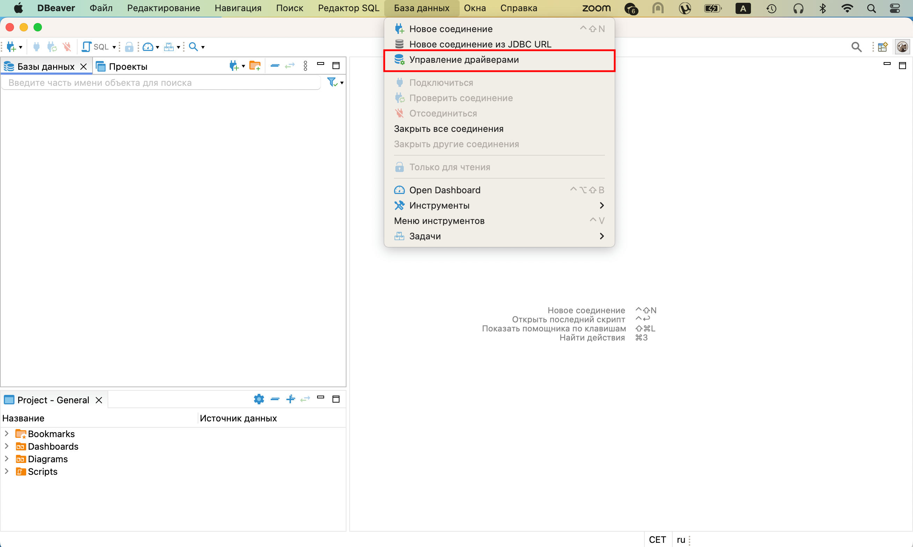
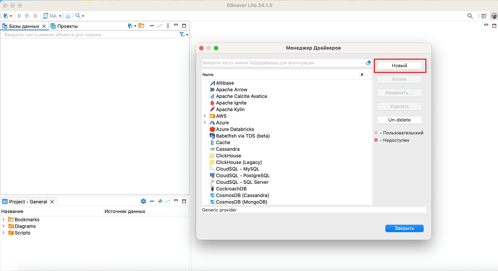
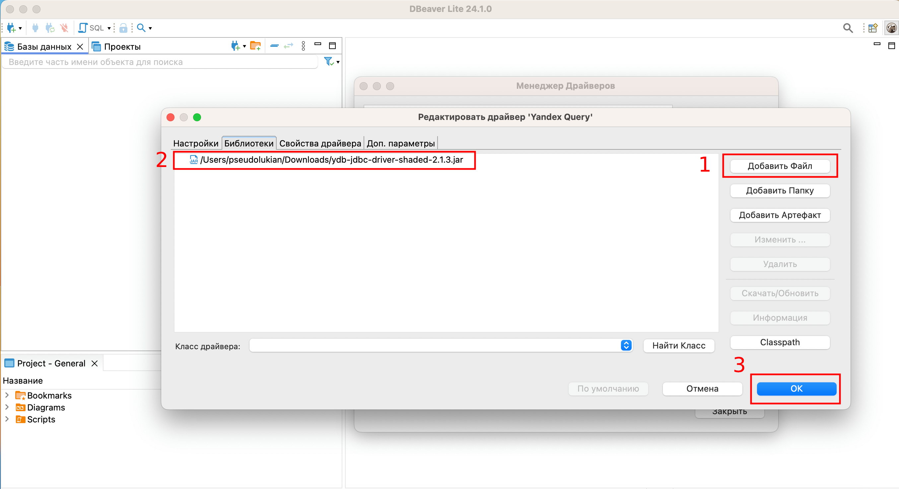
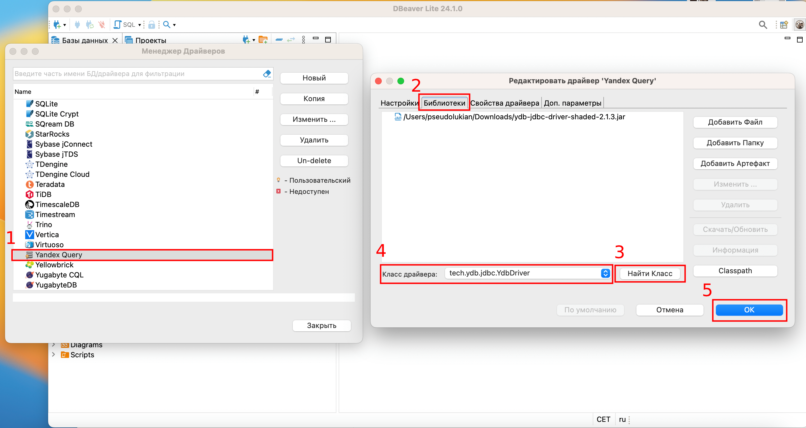

# Connecting using an IDE

{{ yq-full-name }} allows Java DataBase Connectivity ([JDBC](https://ru.wikipedia.org/wiki/Java_Database_Connectivity)) connections, so you can work with connections in {{ yq-name }} using graphical IDEs also supporting this protocol, e.g., DBeaver, DataGrip, etc.

This document describes connecting with DBeaver, but the connection process will be similar for any system supporting JDBC data sources.

## DBeaver {#dbeaver}

[DBeaver](https://dbeaver.com) is a free, open source, cross-platform database management tool with a user-friendly interface for database connections and SQL queries. It supports many databases including MySQL, PostgreSQL, Oracle, SQLite, and others.

### JDBC driver {#jdbc}

To connect to {{ yq-full-name }} from DBeaver, you will need a JDBC driver. {{ yq-full-name }} is based on {{ ydb-short-name }} [federated queries](https://ydb.tech/docs/ru/concepts/federated_query/), so the connection will use a {{ ydb-short-name }} JDBC driver.

Follow these steps to download the driver:
1. Go to the [ydb-jdbc-driver repository](https://github.com/ydb-platform/ydb-jdbc-driver/releases).
1. Select the latest release (tagged `Latest`) and save `ydb-jdbc-driver-shaded-<driver-version>.jar`.

### Connecting a JDBC driver to DBeaver {#dbeaver_yq}

To connect a JDBC driver, follow these steps:
1. Select **Database** from the DBeaver top menu and click **Driver management**:

    

1. To create a new driver, click **New** in the **Driver Manager** window:

    

1. In the **Create driver** window that opens, specify `Yandex Query` in the **Driver name** field:

    

1. Go to the **Libraries** section, click **Add file**, specify the path to the previously downloaded {{ ydb-short-name }} JDBC driver and click **OK**:

    


1. The **Yandex Query** driver will appear in the driver list. Double click the new driver and go to the **Libraries** tab, click **Find Class** and select `tech.ydb.jdbc.YdbDriver` from the drop-down list.

    

    Make sure to explicitly select `tech.ydb.jdbc.YdbDriver` from the drop-down list by clicking it. Otherwise, DBeaver will assume that you have not selected a driver.

    

    

### Creating a {{ yq-full-name }} connection {#dbeaver_yq_connection}

To create a connection, you must complete these preliminary steps:
1. [Create a service account](../../iam/operations/sa/create.md) named `dbeaver` with the `editor` role.

1. [Create an authorized key](../../iam/operations/authorized-key/create.md) for the service account and save it to a file.


After that, follow these steps:
1. In DBeaver, create a new connection by specifying the `Yandex Query` connection type.

1. In the window that opens, go to **Main**.
1. In the **JDBC URL** input field of the **General** subsection, specify the following path:

    ```text
    jdbc:ydb:grpcs://grpc.yandex-query.cloud.yandex.net:2135/<folder_id>?saFile=<path_to_auth_key_file.json>
    ```

    Where:
    * `folder_id`: ID of the folder in which queries to {{ yq-full-name }} will be run.
    * `path_to_auth_key_file.json`: Path to authorized key file.

    

1. Click **Test connection ...** to test the settings.

    If all settings are correct, you will get a successful connection test message:

    

1. Click **Done** to save the connection.

### Working with {{ yq-full-name }} {#dbeaver_yq_connection}

With DBeaver, you can view the list and structure of [data bindings](../concepts/glossary.md#binding):


You can also run data queries:


