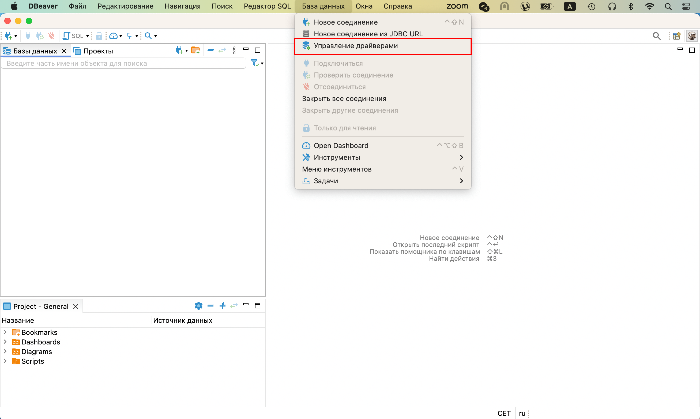
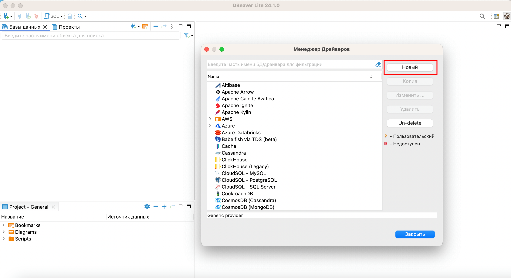
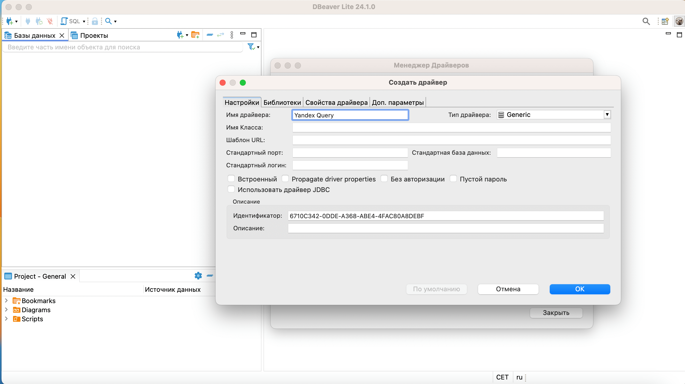
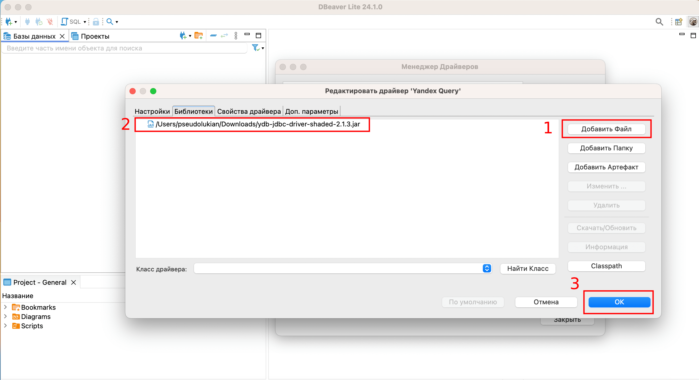
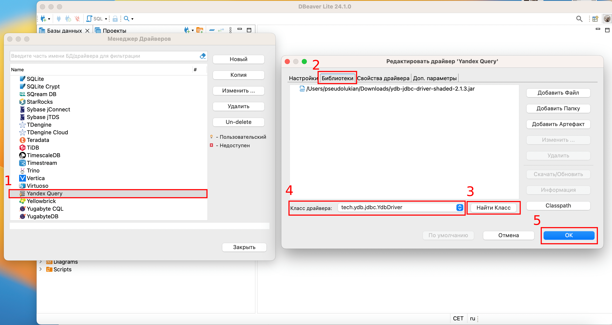
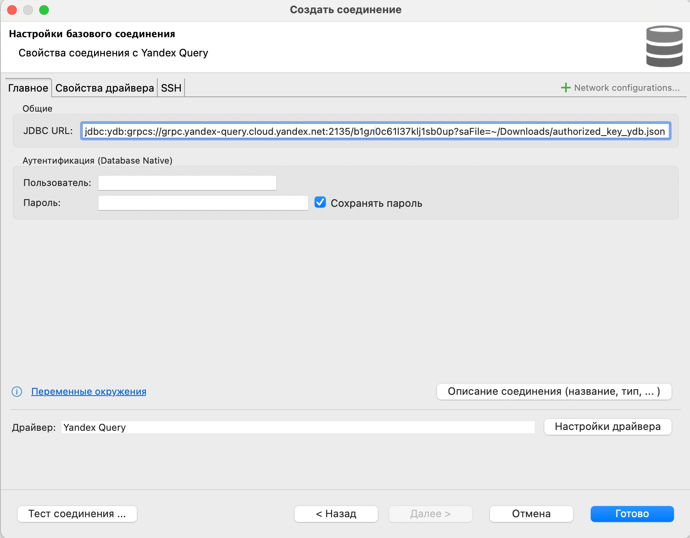
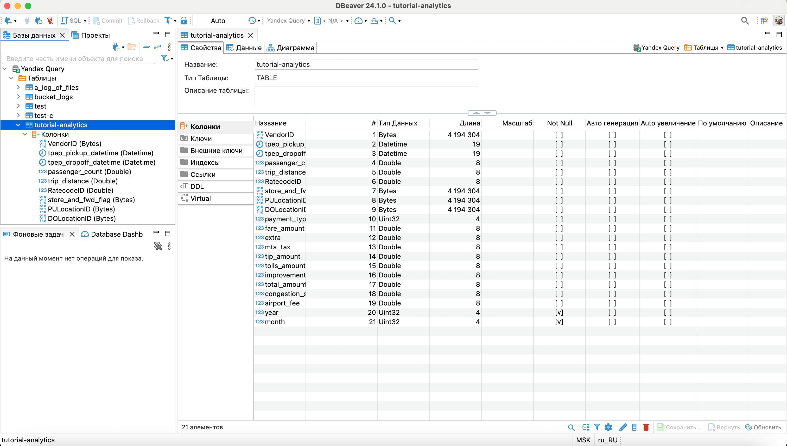
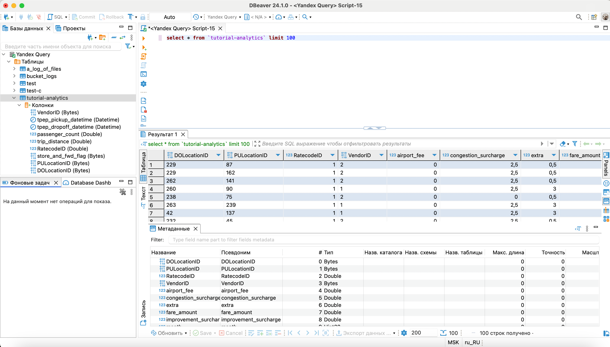

# Connecting via an IDE

{{ yq-full-name }} supports [JDBC](https://ru.wikipedia.org/wiki/Java_Database_Connectivity) (Java DataBase Connectivity) connections. It allows you to use JDBC-compatible IDEs, e.g., DBeaver and DataGrip, to work with {{ yq-name }} connections.

While this tutorial describes connecting via DBeaver, the process is the same for any system that supports JDBC data sources.

## DBeaver {#dbeaver}

[DBeaver](https://dbeaver.com) is a free, cross-platform, open-source database management tool providing an intuitive interface for connecting to databases and running SQL queries. It supports multiple databases, including MySQL, PostgreSQL, SQLite, and Oracle.

### JDBC driver {#jdbc}

Connecting to {{ yq-full-name }} from DBeaver requires a JDBC driver. Since {{ yq-full-name }} is based on {{ ydb-short-name }} [federated queries]({{ ydb.docs }}/concepts/federated_query/), the connection needs a {{ ydb-short-name }} JDBC driver.

To download the driver, do the following:
1. Navigate to the [ydb-jdbc-driver repository](https://github.com/ydb-platform/ydb-jdbc-driver/releases).
1. Select the latest release tagged `Latest` and download `ydb-jdbc-driver-shaded-<driver-version>.jar`.

### Registering a JDBC driver with DBeaver {#dbeaver_yq}

To register the JDBC driver, follow these steps:
1. Select **Database** from the DBeaver top menu and click **Driver management**:

    

1. To create a new driver, click **New** in the **Driver Manager** window:

    

1. In the **Create driver** window that opens, set **Driver name** to `Yandex Query`:

    

1. Navigate to the **Libraries** section, click **Add file**, specify the path to the {{ ydb-short-name }} JDBC driver you downloaded previously, and click **OK**:

    


1. The **Yandex Query** driver will appear in the list. Double-click the driver name, switch to the **Libraries** tab, click **Find Class**, and select `tech.ydb.jdbc.YdbDriver` from the drop-down list.

    

    Make sure you click `tech.ydb.jdbc.YdbDriver` in the drop-down list to select it. Otherwise, DBeaver will act as if you have not selected a driver.

    

    

### Creating a {{ yq-full-name }} connection {#dbeaver_yq_connection}

Before creating a connection, complete the following steps:
1. [Create a service account](../../iam/operations/sa/create.md) named `dbeaver` with the `editor` role.

1. [Create an authorized key](../../iam/operations/authentication/manage-authorized-keys.md#create-authorized-key) for the service account and save it to a file.


Then follow these steps:
1. In DBeaver, create a new connection with the `Yandex Query` connection type.

1. In the window that opens, navigate to the **Main** section.
1. Under **General**, specify the following path in the **JDBC URL** field:

    ```text
    jdbc:ydb:grpcs://grpc.yandex-query.cloud.yandex.net:2135/<folder_id>?saFile=<path_to_auth_key_file.json>&useQueryService=false
    ```

    Where:
    - `folder_id`: ID of the folder you will use to run queries against {{ yq-full-name }}.
    - `path_to_auth_key_file.json`: Authorized key file path.
    - `useQueryService`: Connection mode. Note that {{ yq-full-name }} only supports the `useQueryService=false` mode.

    

1. Click **Test connection ...** to make sure your configuration is correct.

    If everything is correct, a success message will appear:

    

1. Click **Finish** to save the connection.

### Working with {{ yq-full-name }} {#dbeaver_yq_connection}

In DBeaver, you can see the list of your [data bindings](../concepts/glossary.md#binding) and their structure:



Also, you can run queries:



