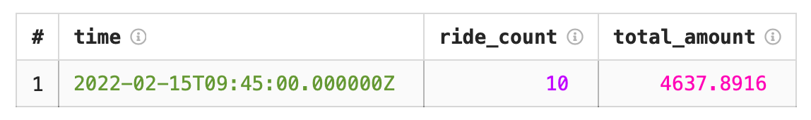

# Sample analysis of streaming data

{{yq-full-name}} can run [streaming processing](../concepts/stream-processing.md) of data in an SQL-like language called [YQL](https://ydb.tech/en/docs/yql/reference/syntax/).

In this example, we'll use a ready-made dataset (a data generator for New York City taxi trips) and calculate the number of trips and their cost for an interval of time.

Follow these steps:
1. Setting up a connection to [{{yds-full-name}}](#credentials).
1. [Run a query](#run_query).

### Setting {{yds-full-name}} connection parameters { #credentials }

Create a stream named `yellow-taxi`. To do this, follow these steps:



Create an infrastructure for generating data:



Once the infrastructure is created, data generation to the `yellow-taxi` stream starts.


## Running a query to streaming data { #run_query }

Open the query editor in the {{yq-full-name}} interface and click **New streaming query**. In the text field, enter the query text given below.

```sql
$data =
SELECT
    *
FROM bindings.`tutorial-streaming` LIMIT 10;

SELECT
    HOP_END() AS time,
    COUNT(*) AS ride_count,
    SUM(total_amount) AS total_amount
FROM
    $data
GROUP BY
    HOP(CAST(tpep_pickup_datetime as Timestamp), "PT1M", "PT1M", "PT1M");
```

## Query execution results:
Once the query is completed, you'll see the following results: the number of trips and the total cost of the first 10 trips made after running the query.

