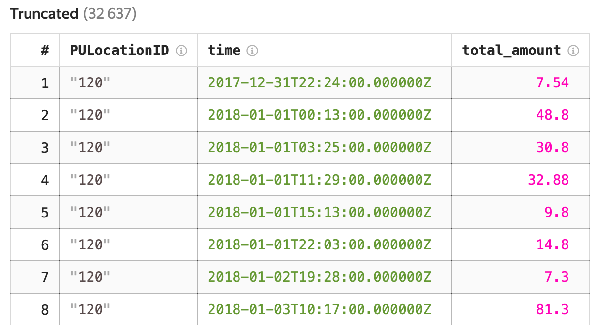
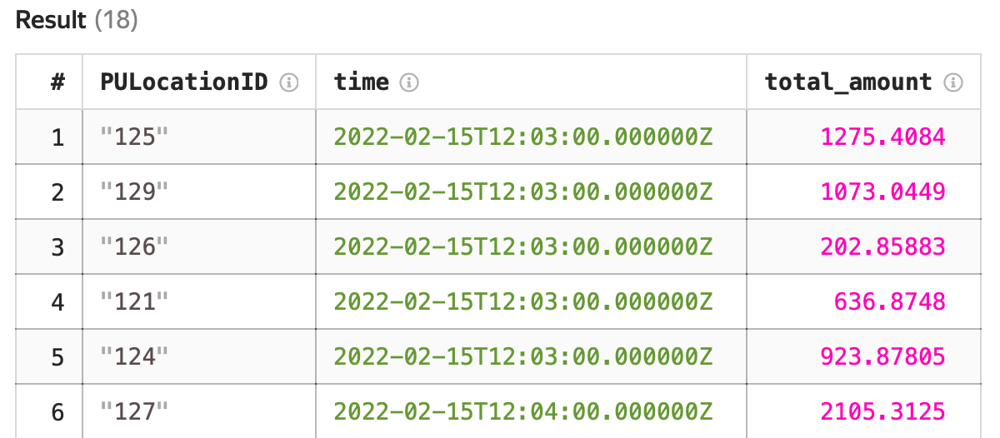

# Sample unified analysis of streaming and analytical data

{{yq-full-name}} is designed using the concept of [unified streaming and analytical computations](../concepts/unified-processing.md). This lets you use a single query to process both streaming and analytical data.

In the example below, we'll count the number of taxi trips only made in specific locations and their cost by running a unified query to analytical and streaming data. Both queries use the reference stored in {{ objstorage-full-name }} to filter query data.

In this example, we'll use two ready-made datasets:
1. A streaming data generator for New York City taxi trips to be used to calculate the number of trips and their cost for an interval of time. The generator is started within the {{yq-full-name}} training infrastructure.
1. The analytical data was previously uploaded to {{ objstorage-full-name }} and stored in a public bucket named `yq-sample-data`, in the `tutorial` folder.







Follow these steps:
1. [Create an infrastructure for streaming data](#generator_start).
1. [Create an infrastructure for analytical data](#batch_start).
1. [Run an analytical query](#run_query_analytics).
1. [Run a streaming query](#run_query_streaming).


## Before you begin {#prepare}
To get started, follow the steps below.

### Infrastructure for {{yds-full-name}} streaming data { #create_stream }

Create a stream named `yellow-taxi`. To do this, follow these steps:



Create an infrastructure for generating data:



Once the infrastructure is created, data generation to the `yellow-taxi` stream starts.

### Infrastructure for analytical data { #batch_start }




## Running an analytical query { #run_query_analytics }

Open the query editor in the {{ yq-full-name }} interface and click **New analytics query**. In the text field, enter the query text given below.

```sql
$data =
SELECT
    *
FROM
    `bindings`.`tutorial-analytics`;

$locations =
SELECT
    PULocationID
FROM
    `tutorial-analytics`.`nyc_taxi_sample/example_locations.csv`
WITH
(
    format=csv_with_names,
    SCHEMA
    (
        PULocationID String
    )
);

$time =
SELECT
    HOP_END() AS time,
    rides.PULocationID AS PULocationID,
    SUM(total_amount) AS total_amount    
FROM $data AS rides
INNER JOIN $locations AS locations
    ON rides.PULocationID=locations.PULocationID
GROUP BY
    HOP(cast(tpep_pickup_datetime AS Timestamp?), "PT1M", "PT1M", "PT1M"),
    rides.PULocationID;

SELECT
    *
FROM
    $time;
```

### Query execution results:
Once the query is completed, you'll see the following results: distribution of the taxi trip duration by number of trips.



## Running a streaming data query { #run_query_streaming }

Open the query editor in the {{yq-full-name}} interface and click **New streaming query**. In the text field, enter the query text given below.

```sql
$data =
SELECT
    *
FROM bindings.`tutorial-streaming`
LIMIT 10;

$locations =
SELECT
    PULocationID
FROM
    `tutorial-analytics`.`nyc_taxi_sample/example_locations.csv`
WITH
(
    format=csv_with_names,
    SCHEMA
    (
        PULocationID String
    )
);

$time =
SELECT
    HOP_END() AS time,
    rides.PULocationID AS PULocationID,
    SUM(total_amount) AS total_amount    
FROM $data AS rides
INNER JOIN $locations AS locations
    ON rides.PULocationID=locations.PULocationID
GROUP BY
    HOP(cast(tpep_pickup_datetime AS Timestamp?), "PT1M", "PT1M", "PT1M"),
    rides.PULocationID;

SELECT
    *
FROM
    $time;
```

### Query execution results:
Once the query is completed, you'll see the following results: the number and total cost of the first 10 trips made in specific locations after running the query.



## Conclusions

Both of the examples given above used a unified query for analyzing streaming and analytical data. The queries differ in data connections: in one query the data is stored in {{ objstorage-full-name }}, and in the other the data is stored in {{ yds-full-name }}.

The SQL query text is the same for both scenarios.