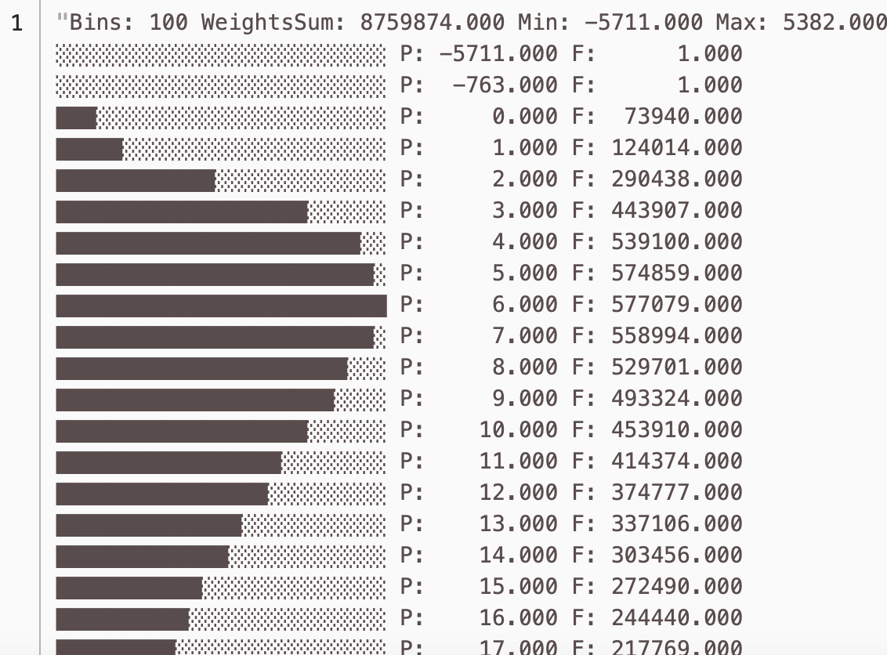

# Sample analysis of data from {{ objstorage-full-name }}

{{yq-full-name}} can perform full-featured batch processing of data stored in [{{ objstorage-full-name }}](../../storage/concepts/index.md) using an SQL-like language called [YQL](https://ydb.tech/en/docs/yql/reference/syntax/).

In this example, we'll use a ready-made dataset with New York City taxi trips for 2019-2021 to see how the trip times are distributed.







The data was previously uploaded to {{ objstorage-full-name }} and stored in a public bucket named `yq-sample-data`, in the `tutorial` folder.

Follow these steps:
1. [Create a connection to the bucket in {{ objstorage-full-name }}](#create_connection).
1. [Run a query](#run_query).

## Creating a connection { #create_connection }



## Run a query { #run_query }
Open the query editor in the {{yq-full-name}} interface and click **New analytics query**. In the text field, enter the query text given below.

```sql
$data =
SELECT
    *
FROM
    bindings.`tutorial-analytics`;

$ride_time =
SELECT
    DateTime::ToMinutes(tpep_dropoff_datetime-tpep_pickup_datetime) as ride_time
FROM $data;

SELECT
    Histogram::Print(histogram(ride_time))
FROM
    $ride_time;
```

## Query execution results:
Once the query is completed, you'll see the following results: distribution of the taxi trip duration by number of trips.

