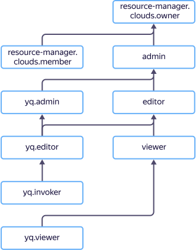

# Access management in {{ yq-name }}

{{ yandex-cloud }} users can only perform operations on resources that are allowed by the roles assigned to them. If a user doesn't have any roles assigned, almost all operations are forbidden.

To allow access to resources in {{ yq-full-name }}, assign the required roles to the user from the list below. Currently, a role can only be assigned to a parent resource (folder or cloud). Roles are inherited by nested resources.



For more information about role inheritance, see [{#T}](../../resource-manager/concepts/resources-hierarchy.md#access-rights-inheritance) in the {{ resmgr-full-name }} documentation.



## Assigning roles {#grant-roles}

To assign a user a role:



## What roles exist in the service {#roles-list}

You can manage access to {{ yq-name }} objects using both service and primitive roles. The diagram shows which roles are available in the service and how they inherit each other's permissions. For example, the `editor` role includes all `viewer` role permissions. A description of each role is given under the diagram.

## Roles {#roles}

The list below shows all roles that are considered when verifying access rights in the {{ yq-name }} service.

### yq.invoker

Users with the `yq.invoker` role can run queries in {{ yq-name }}. The role is designed for service accounts to automatically execute queries. For example, to run queries triggered by an event or on schedule.

### yq.viewer

Users with the `yq.viewer` role can view connections and bindings, create queries, and run them in {{yq-name }}.

### yq.editor

Users with the `yq.editor` role can view, edit, and delete connections they created. The role allows creating, editing, deleting, and running the user-created queries. The `yq.editor` role includes all permissions of the `ydb.viewer` role.

### yq.admin

The `yq.admin` role lets you manage any {{ yq-name }} resources, including those marked as private. The `yq.admin` role includes all permissions of the `ydb.editor` role.

### {{ roles-viewer }}

Users with the `{{ roles-viewer }}` role can view information about resources, such as query runs.

### {{ roles-editor }}

Users with the `{{ roles-editor }}` role can manage any resource, such as creating or deleting a query. The `{{ roles-editor }}` role includes all permissions of the `{{ roles-viewer }}` role.

### {{ roles-admin }}

Users with the `{{ roles-admin }}` role can manage resource access rights, such as permitting other users to create queries. The `{{ roles-admin }}` role includes all permissions of the `{{ roles-editor }}` role.


