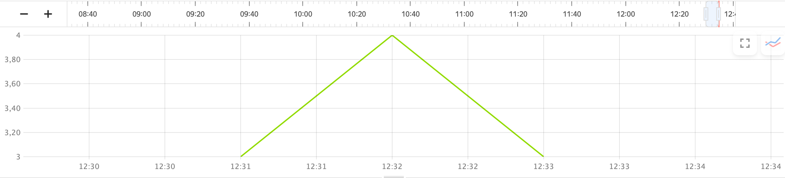

# Writing metrics to {{ monitoring-name }}

[{{ monitoring-name }}](../../monitoring/concepts/index.md) allows you to collect and store metrics, as well as display them as charts on dashboards. Data sent to {{ monitoring-name }} includes `metrics` and their descriptive `labels`.

For example, to track application failures, you can use the failure count per time interval as a metric. Data describing a failure, e.g., a host name and application version, serve as labels. The {{ monitoring-name }} interface allows you to aggregate metrics by label.

Query example for writing metrics from {{ yq-full-name }} into {{ monitoring-name }}

```sql
INSERT INTO `monitoring`.custom
SELECT
	`my_timestamp`,
	host_name,
	app_version,
	exception_count,
	"exception_monitor" as service_type
FROM $query;
```

During [stream processing](../concepts/stream-processing.md), {{ yq-full-name }} can send query results to {{ monitoring-name }} as metrics and their labels. 

## Setting up a connection {#setup-connection}

To send metrics to {{ monitoring-name }}:
1. [Navigate](../../console/operations/select-service.md#select-service) to the **{{ ui-key.yql.yq-ide-aside.connections.tab-text }}** section of the **{{ ui-key.yacloud.iam.folder.dashboard.label_yq_ru }}** interface and click **{{ ui-key.yql.yq-connection-form.action_create-new }}**.
1. In the window that opens, specify the {{ monitoring-name }} connection name in the **{{ ui-key.yql.yq-connection-form.connection-name.input-label }}** field.
1. In the **{{ ui-key.yql.yq-connection-form.connection-type.input-label }}** dropdown, select `{{ ui-key.yql.yq-connection.action_monitoring }}`.
1. In the **{{ ui-key.yql.yq-connection-form.service-account.input-label }}** field, select an existing service account or create a new one. Assign it the [`monitoring.editor`](../../monitoring/security/index.md#monitoring-editor) permissions allowing it to write metrics.

   

1. Click **{{ ui-key.yql.yq-connection-form.create.button-text }}** to create a connection.

## Data model {#data-model}

To write metrics to {{ monitoring-name }}, use the following SQL statement:

```sql
INSERT INTO 
	<connection>.custom 
SELECT 
	<fields> 
FROM 
	<query>;
```

Where:

- `<connection>`: Name of the {{ monitoring-name }} connection created in the previous step.
- `<fields>`: List of fields that include a timestamp, metrics, and their labels.
- `<query>`: {{ yq-full-name }} source data query.



When writing metrics, use the `INSERT INTO <connection>.custom` statement, where [`custom`](../../monitoring/api-ref/MetricsData/write.md#query_params) is the name reserved in {{ monitoring-name }} for user-defined metrics.



To write metrics, use the [write](../../monitoring/api-ref/MetricsData/write.md) {{ monitoring-name }} API method. When writing metrics, provide the following information:
- Timestamp.
- List of metrics and their types. {{ yq-full-name }} supports `DGAUGE` and `IGAUGE` metric types.
- List of labels.

{{ yq-full-name }} automatically infers parameter semantics from the SQL query.

| Field type | Description | Limitations |
| --- | --- | --- |
| Time: `Date`, `Datetime`, `Timestamp`, `TzDate`, `TzDatetime`, or `TzTimestamp` | Common timestamp for all metrics | A query can have only one timestamp field. |
| Integer: `Bool`, `Int8`, `Uint8`, `Int16`, `Uint16`, `Int32`, `Uint32`, `Int64`, or `Uint64` | Metric values, `IGAUGE` | The field name in the SQL statement is the metric name. A single query may contain an unlimited number of metrics. |
| Floating point: `Float` or `Double` | Metric values, `DGAUGE` | The field name in the SQL statement is the metric name. A single query may contain an unlimited number of metrics. |
| Text: `String` or `Utf8` | Label values | The field name in the SQL statement serves as the label name, and its text value as the label value. A single query may contain an unlimited number of metrics. |

No other data types are permitted in these fields.

## Metrics writing example {#example}

Query example for writing metrics from {{ yq-full-name }} to {{ monitoring-name }}:

```sql
INSERT INTO 
	`monitoring`.custom
SELECT
	`my_timestamp`,
	host AS host_name,
	app_version,
	exception_count,
	"exception_monitor" as service_type
FROM $query;
```

Where:

| Field | Type | Description |
| --- | --- | --- |
| `monitoring` | | {{ monitoring-name }} connection name |
| `$query` | | SQL query data source. It can be a YQL subquery or a data source [connection](../quickstart/streaming-example.md) |
| `my_timestamp` | Timestamp | Data source: `my_timestamp` column in the source data `stream` |
| `exception_count` | Metric | Data source: `exception_count` column in the source data `stream` |
| `host_name` | Label | Data source: `host` column in the source data `stream` |
| `app_version` | Label | Data source: `app_version` column in the source data `stream` |

Example of query results in {{ monitoring-name }}:


