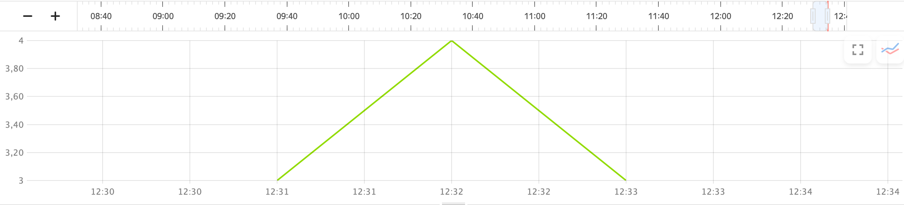

# Writing metrics to {{ monitoring-name }}

[{{ monitoring-name }}](../../monitoring/concepts/index.md) is a service that collects, stores, and presents metrics on dashboards. The data that goes to {{ monitoring-name }} contains the measured quantity values ​​(metrics) and the labels describing them.

For example, to count app failures, you can use _failure count during time interval_ as the metric. _Host name_ and _application version at the time of failure_ are labels. In the {{ monitoring-name }} interface, you can aggregate metrics by labels.

Query example for writing metrics from {{ yq-full-name }} into {{ monitoring-name }}:

```sql
INSERT INTO `monitoring`.custom
SELECT
    `my_timestamp`,
    host_name,
    app_version,
    exception_count,
    "exception_monitor" AS service_type
FROM $query;
```

During [stream processing](../concepts/stream-processing.md), {{ yq-full-name }} can send query results to {{ monitoring-name }} as metrics and their labels.

## Setting up a connection {#setup-connection}

To set up sending metrics to {{ monitoring-name }}:

1. [Navigate]({{ link-console-yq }}) to **{{ ui-key.yacloud.iam.folder.dashboard.label_yq_ru }}**.
1. In the left-hand panel, select **{{ ui-key.yql.yq-ide-aside.connections.tab-text }}**.
1. Click **{{ ui-key.yql.yq-connection-form.action_create-new }}**.
1. In the window that opens, specify the {{ monitoring-name }} connection name in the **{{ ui-key.yql.yq-connection-form.connection-name.input-label }}** field.
1. In the **{{ ui-key.yql.yq-connection-form.connection-type.input-label }}** field, select `{{ ui-key.yql.yq-connection.action_monitoring }}`.
1. In the **{{ ui-key.yql.yq-connection-form.service-account.input-label }}** field, select the service account you will use to write metrics, or create a new one and assign the [`monitoring.editor`](../../monitoring/security/index.md#monitoring-editor) role to it.

   

1. Click **{{ ui-key.yql.yq-connection-form.create.button-text }}**.

## Data model {#data-model}

To write metrics to {{ monitoring-name }}, use the following SQL statement:

```sql
INSERT INTO
    <connection>.custom
SELECT
    <fields>
FROM
    <query>;
```

Where:

* `<connection>`: Name of the {{ monitoring-name }} connection created in the previous section.
* `<fields>`: List of fields that include a timestamp, metrics, and their labels.
* `<query>`: {{ yq-full-name }} source data query.



To write custom metrics, use the `INSERT INTO <connection>.custom` structure. Where [`custom`](../../monitoring/api-ref/MetricsData/write.md#query_params) is a reserved name in {{ monitoring-name }}.



To write metrics, use the [write](../../monitoring/api-ref/MetricsData/write.md) {{ monitoring-name }} API method. Provide the following data:

* Timestamp.
* List of metrics and their types: {{ yq-full-name }} supports the `DGAUGE` and `IGAUGE` types.
* List of labels.

{{ yq-full-name }} automatically infers parameter semantics from the SQL query.

#|
|| **Field type** | **Description** | **Restrictions** ||
|| Time: `Date`, `Datetime`, `Timestamp`, `TzDate`, `TzDatetime`, or `TzTimestamp` | Common timestamp for all metrics | A query can have only one timestamp field. ||
|| Integer: `Bool`, `Int8`, `Uint8`, `Int16`, `Uint16`, `Int32`, `Uint32`, `Int64`, or `Uint64` | Metric values, `IGAUGE` | The field name from the SQL statement is the metric name. A single query may contain an unlimited number of metrics. ||
|| Floating point: `Float` or `Double` | `DGAUGE` type metric values | The field name from the SQL statement is the metric name. A single query may contain an unlimited number of metrics. ||
|| Text: `String` or `Utf8` | Label values | The field name in the SQL statement serves as the label name, and its text value as the label value. A single query can contain an unlimited number of labels. ||
|#

No other data types are permitted in these fields.

## Metrics writing example {#example}

Query example for writing metrics from {{ yq-full-name }} to {{ monitoring-name }}:

```sql
INSERT INTO
    `monitoring`.custom
SELECT
    `my_timestamp`,
    host AS host_name,
    app_version,
    exception_count,
    "exception_monitor" AS service_type
FROM $query;
```

Where:

#|
|| **Field** | **Type** | **Description** ||
|| `monitoring` |  | {{ monitoring-name }} connection name ||
|| `$query` |  | Data source in SQL query. This can be a YQL subquery, including a [connection](../quickstart/streaming-example.md) to a data source. ||
|| `my_timestamp` | Timestamp | Data source: `my_timestamp` column in the source data `stream` ||
|| `exception_count` | Metric | Data source: `exception_count` column in the source data `stream` ||
|| `host_name` | Label | Data source: `host` column in the source data `stream` ||
|| `app_version` | Label | Data source: `app_version` column in the source data `stream` ||
|#

Example of query results in {{ monitoring-name }}:


