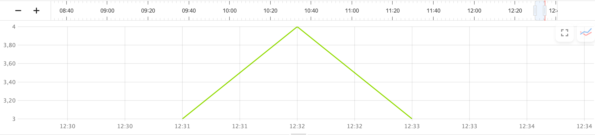

# Writing metrics to {{ monitoring-name }}

[{{ monitoring-name }}](../../monitoring/concepts/index.md) allows you to collect and store metrics and display them as charts on dashboards. Data sent to {{ monitoring-name }} represents measured values (`metrics`) and `labels` that describe them.

For example, to track the number of application failures, you can use the failure count per time interval as a metric. Data describing a failure, such as host name and application version, are labels. The {{ monitoring-name }} interface allows you to aggregate metrics by label.

Example of writing metrics from {{ yq-full-name }} to {{ monitoring-name }}:

```sql
INSERT INTO `monitoring`.custom
SELECT
        `my_timestamp`,
        host_name,
        app_version,
        exception_count,
        "exception_monitor" as service_type
FROM $query;
```

Under [streaming processing](../concepts/stream-processing.md), {{ yq-full-name }} can send query results to {{ monitoring-name }} as metrics and their labels.

## Setting up a connection

To send metrics to {{ monitoring-name }}:
1. Go to **{{ ui-key.yql.yq-ide-aside.connections.tab-text }}** in the {{ yq-full-name }} interface and click **{{ ui-key.yql.yq-connection-form.action_create-new }}**.
1. In the window that opens, specify a name for a connection to {{ monitoring-name }} in the **{{ ui-key.yql.yq-connection-form.connection-name.input-label }}** field.
1. In the drop-down list under **{{ ui-key.yql.yq-connection-form.connection-type.input-label }}**, select `{{ ui-key.yql.yq-connection.monitoring.select-item }}`.
1. In the **{{ ui-key.yql.yq-connection-form.service-account.input-label }}** field, select the service account to use for metric writes. You can also create a new service account with the [`monitoring.editor`](../../monitoring/security/index.md) permissions.
1. Click **{{ ui-key.yql.yq-connection-form.create.button-text }}** to create a connection.

## Data model

Metrics are written to {{ monitoring-name }} using the following SQL statement:

```sql
INSERT INTO
        <monitoring_connection_name>.custom
SELECT
        <fields>
FROM
        <query>;
```

Where:

- `monitoring_connection_name`: Name of the {{ monitoring-name }} connection created in the previous step.
- `fields`: List of fields that contain a timestamp, metrics, and their labels.
- `query`: {{ yq-full-name }} data source query.



When writing metrics, use `INSERT INTO <monitoring_connection_name>.custom`, where [`custom`](../../monitoring/api-ref/MetricsData/write.md#query_params) is the name reserved in {{ monitoring-name }} for writing custom metrics.



Metrics are written using the [write](../../monitoring/api-ref/MetricsData/write.md) {{ monitoring-name }} API method. Pass the following when writing metrics:
- Timestamp.
- List of metrics with their type specified. {{ yq-full-name }} supports the `DGAUGE` and `IGAUGE` metric types.
- List of labels.

{{ yq-full-name }} automatically prints the semantics of parameters from the SQL query.

| Field type | Description | Limitations |
|---|---|---|
| Time: `Date`, `Datetime`, `Timestamp`, `TzDate`,` TzDatetime`, and `TzTimestamp` | Timestamp common for all metrics | A query may only contain one field with the timestamp. |
| Integer: `Bool`, `Int8`, `Uint8`, `Int16`, `Uint16`, `Int32`, `Uint32`, `Int64`, and `Uint64` | Metric values, `IGAUGE` | The SQL query field name is the metric name. A single query may contain an unlimited number of metrics. |
| With a floating point: `Float` and `Double` | Metric values, `DGAUGE` | The SQL query field name is the metric name. A single query may contain an unlimited number of metrics. |
| Text: `String` and `Utf8` | Label values | The SQL query field name is the label name, while a text value is the label value. A single query may contain an unlimited number of metrics. |

No other data types are allowed in the fields.

## Example of writing metrics

Sample query for writing metrics from {{ yq-full-name }} to {{ monitoring-name }}:

```sql
INSERT INTO
        `monitoring`.custom
SELECT
        `my_timestamp`,
        host AS host_name,
        app_version,
        exception_count,
        "exception_monitor" as service_type
FROM $query;
```

Where:

|Field|Type|Description|
|--|---|---|
|`monitoring`| |{{ monitoring-name }} connection name|
|`$query`| |SQL query data source, can be a YQL subquery, including a [connection](../quickstart/streaming-example.md) to the data source|
|`my_timestamp`| Timestamp| Data source (`my_timestamp` column in the source `stream`)|
|`exception_count`|Metric| Data source (`exception_count` column in the source `stream`)|
|`host_name`|Label| Data source (`host` column in the source `stream`)|
|`app_version`|Label| Data source (`app_version` column in the source data `stream`)|

Sample query execution result in {{ monitoring-name }}.

