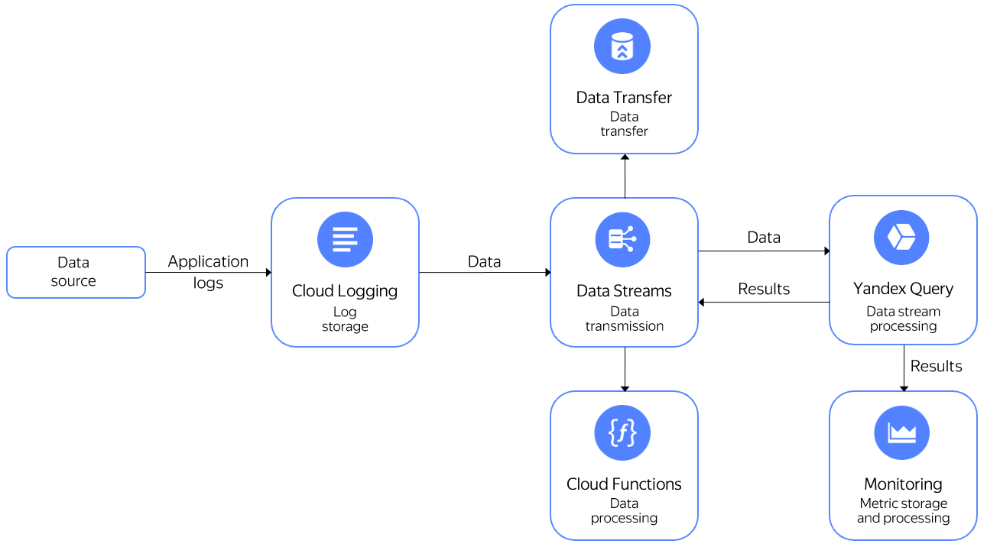

# Analyzing Cloud Logging logs

[{{ cloud-logging-name }}](../../logging/quickstart.md) is a service for reading and writing logs of Yandex Cloud services and user applications.

With {{ cloud-logging-name }}, you can transfer application logs to {{ yq-full-name }} for realtime processing. Processed data can be sent:
- To {{ monitoring-name }} to add it to charts and use it in alerting.
- Write it to a different {{ yds-full-name }} stream and send the data for processing to {{ sf-name }} or {{ data-transfer-name }} [to send the data to different storage systems](../../data-streams/tutorials/data-ingestion.md) from that stream.

Below is the architecture of the solution with {{ cloud-logging-short-name }}.


Sample query that counts the number of sent messages per host, grouped by 10-second intervals:

```sql
$cloud_logging_data =
SELECT
    CAST(JSON_VALUE(data, "$.timestamp") AS Timestamp) AS `timestamp`,
    JSON_VALUE(data, "$.jsonPayload.host") AS host
FROM bindings.`cloud-logging`;

SELECT
    host,
    COUNT(*) AS message_count,
    HOP_END() AS `timestamp`
FROM $cloud_logging_data
GROUP BY
    HOP(`timestamp`, "PT10S", "PT10S", "PT10S"),
    host
LIMIT 2;
```

To learn how to work with streaming data fetched from {{ yds-full-name }}, see [Reading Data from Data Streams](../sources-and-sinks/data-streams.md).

## Setup {#setup}

Setup steps:
1. [Create a {{ yds-full-name }} stream](#create_yds_stream).
1. [Create a log group](#create_log_group).
1. [Start sending data to the log group](#send_to_loggroup).
1. [Creating a connection](#create_connection) to a stream.
1. [Create a binding](#create_binding) to a data stream.
1. [Query](#query) the data from the log group.

### Creating a {{ yds-full-name }} stream {#create_yds_stream}

For detailed information about creating [streams](../../data-streams/operations//manage-streams.md), see the [{{ yds-full-name }} documentation](../../data-streams/operations/manage-streams.md).

### Creating a log group {#create_log_group}

To create a [log group](../../logging/concepts/log-group.md) that will send data to a {{ yds-full-name }} stream, run the command:

```shell
yc logging group create \
  --name <log_group_name> \
  --folder-id <folder_id> \
  --data-stream <full_yds_stream_name>
```

Where:

* `name` is the name of the log group you create.
* `folder-id` is the folder to create the log group in.
* `data-stream` is the full name of the {{ yds-full-name }} stream. You can find the stream full name in the {{ yds-full-name }} UI under **Connect**. The format of a stream's full name is `/{{ region-id }}/b1kmrhakmf8ar1i5l6f8/etnku2bpm9r7sgbpq7s7/cloud-logging`.

Sample command that creates a log group named `yds` sending data to a stream named `cloud-logging`:

```shell
yc logging group create \
  --name yds \
  --folder-id b1kmrhakmf8ar1i5l6f8 \
  --data-stream /{{ region-id }}/b1kmrhakmf8ar1i5l6f8/etnku2bpm9r7sgbpq7s7/cloud-logging
```

### Sending data to the log group {#send_to_loggroup}

To send data to the log group, run the command:

```shell
do yc logging write \
  --group-name=<log_group_name> \
  --message='<message>' \
  --timestamp="1s ago" \
  --level=INFO \
  --json-payload='<json_payload>' \
  --folder-id <folder_id>;
```

Where:

* `group-name` is the log group name.
* `message` is the message text.
* `json_payload` is additional message data in JSON format.
* `folder-id` is the folder where the log group is created.

Sample command that sends data to the `yds` log group in the `b1kmrhakmf8ar1i5l6f8` folder with the `Message` with additional `{"request_id": "1234", "host":"test_host"}` JSON content:

```shell
while true; do yc logging write \
  --group-name=yds \
  --message="Message" \
  --timestamp="1s ago" \
  --level=INFO \
  --json-payload='{"request_id": "1234", "host":"test_host"}' \
  --folder-id b1kmrhakmf8ar1i5l6f8; \
  sleep 1; \
done
```

### Creating a connection in {{ yq-full-name }} {#create_connection}

Follow the steps below to create a [connection](../concepts/glossary.md#connection) named `cloud-logging-connection`:



### Creating a binding to data in {{ yq-full-name }} {#create_connection}

Create a [binding](../concepts/glossary.md#binding) to {{ yds-full-name }} data named `cloud-logging` with the **Cloud Logging** payload template:



## Data query {#query}

Open the query editor in the {{ yq-full-name }} interface and run the query:

```sql
$cloud_logging_data =
SELECT
    CAST(JSON_VALUE(data, "$.timestamp") AS Timestamp) AS `timestamp`,
    JSON_VALUE(data, "$.jsonPayload.host") AS host
FROM bindings.`cloud-logging`;

SELECT
    host,
    COUNT(*) AS message_count,
    HOP_END() AS `timestamp`
FROM $cloud_logging_data
GROUP BY
    HOP(`timestamp`, "PT10S", "PT10S", "PT10S"),
    host
LIMIT 2;
```






