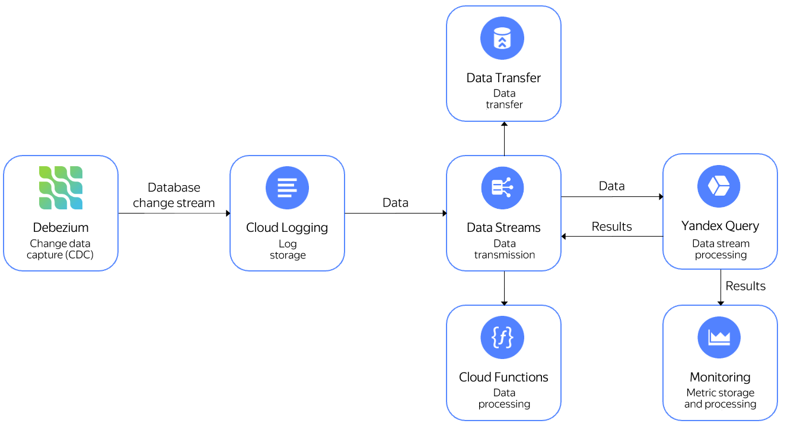

# Analyzing CDC Debezium streams

[Debezium](https://debezium.io) is a change data capture service for streaming DB changes to other systems for processing. You can use {{ yds-full-name }} to capture these changes and {{ yq-full-name }} to process them.

Processed data can be sent:
- To {{ monitoring-name }} to add it to charts and use it in alerting.
- Write it to a different {{ yds-full-name }} stream and send the data for processing to {{ sf-name }} or {{ data-transfer-name }} [to send the data to different storage systems](../../data-streams/tutorials/data-ingestion.md) from that stream.

See below the solution architecture:
.

Sample query for getting the number of changes in DB tables broken down by time every 10 seconds:

```sql
$debezium_data =
SELECT
    JSON_VALUE(data,"$.payload.source.table") AS table_name,
    DateTime::FromMilliseconds(cast(JSON_VALUE(data,"$.payload.source.ts_ms") AS uint64)) AS `timestamp`
FROM
(
    SELECT
        CAST(Data AS json) AS data
    FROM yds.`debezium`
    WITH
    (
        format=raw,
        SCHEMA
        (
            Data String
        )
    )
);

SELECT
    table_name,
    HOP_END()
FROM
    $debezium_data
GROUP BY
    HOP(`timestamp`, "PT10S", "PT10S", "PT10S"),
    table_name
 LIMIT 2;
```

To learn how to work with streaming data fetched from {{ yds-full-name }}, see [Reading Data from Data Streams](../sources-and-sinks/data-streams.md).

## Setup {#setup}
To get a data stream:
1. [Create a {{ yds-full-name }} stream](#create_stream).
1. [Set parameters for a connection](#credentials) to {{ yds-full-name }}
1. [Set up and start](#debezium_server) the Debezium Server.
1. [Run a query in {{ yql-full-name }}](#query) to the data being transferred.

### Creating a stream {#create_stream}

Create a {{ yds-full-name }} stream named `debezium`. For detailed information about creating streams, see the [{{ yds-full-name }} documentation](../../data-streams/operations/manage-streams.md).

### Setting {{ yds-full-name }} connection parameters {#credentials}



### Setting up the Debezium Server {#debezium_server}



## Running a {{ yql-full-name }} query {#query}

Follow the steps below to create a connection named `yds-connection`:



Create a [binding](../concepts/glossary.md#binding) to {{ yds-full-name }} data named `debezium` with the only **data** column of the **JSON** type:




Open the query editor in the {{ yq-full-name }} interface and run the query:

```sql
$debezium_data =
SELECT
    JSON_VALUE(data,"$.payload.source.table") AS table_name,
    DateTime::FromMilliseconds(cast(JSON_VALUE(data,"$.payload.source.ts_ms") AS Uint64)) AS `timestamp`
FROM bindings.`debezium`;

SELECT
    table_name,
    HOP_END()
FROM
    $debezium_data
GROUP BY
    HOP(`timestamp`, "PT10S", "PT10S", "PT10S"),
    table_name
LIMIT 2;
```





