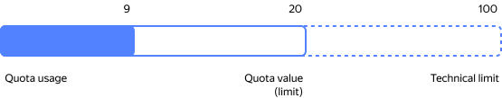

# Getting started with {{ quota-manager-full-name }}



{{ quota-manager-name }} allows you to manage quotas of your {{ yandex-cloud }} services using different interfaces. Some services, such as {{ speechkit-name }} and {{ video-full-name }}, are not available in {{ quota-manager-name }}.

**Quotas** are limits on the amount of resources you can use in cloud. These are organizational limits that can be changed as needed.

The key concepts in quota management are:

* **Quota limit** or just **quota**: Current limit in place for a resource for a cloud or organization.

* **Quota usage**: Amount or size of the actually used resource.

Potentially, you can increase your quotas up to the _limits_.

**Limits** are technical constraints of the {{ yandex-cloud }} architecture, hardware physical characteristics, or external limitations.



You can use the following interfaces to manage quotas: 

* [Console]({{ link-console-quotas }}) and [API](api-ref/authentication.md): Getting info and submitting a quota update request.
* [CLI](cli-ref/): Getting quota info. Quota update request functionality due to be added.

To manage quotas via the CLI and API, you need the quota ID. For the list of IDs, see [this section](../overview/concepts/quotas-limits.md).

## Getting quota info {#get-quota-info}

To view quotas, you need the `quota-manager.viewer` [role](../iam/operations/roles/grant.md).



- Management console {#console}

  1. In the [management console]({{ link-console-main }}), select the cloud to view quotas for.
  1. Select the **{{ ui-key.yacloud.iam.cloud.switch_quotas }}** tab.
     
     The page will display a list of services used in your cloud.
  
  1. Expand a service section and view the values in the **{{ ui-key.yacloud.iam.cloud.quotas.column_usage }}** column.
  
     * Two numbers mean `quota usage / quota value`. For example, `2 / 20` or `1.203 / 5,120 GB`.

     * A single number is a non-adjustable `limit`.

  1. To estimate resource consumption, at the top right, select:
     * **{{ ui-key.yacloud.iam.cloud.quotas.value_status-warning }}**: Resources consuming over a half of the quota.
     * **{{ ui-key.yacloud.iam.cloud.quotas.value_status-error }}**: Resources that are almost exhausted.

- CLI {#cli}

  1. **Configure operations via the CLI.**

      

      

  1. **See the list of services with quotas.**
  
      ```bash
      yc quota-manager quota-limit list-services --resource-type=<resource_type>
      ```

      Where `--resource-type` is the [resource type](concepts/index.md#resources-types): 
      * `resource-manager.cloud`: Cloud.
      * `organization-manager.organization`: Organization.
      * `billing.account`: Billing account.

      **Example command**

      ```bash
      yc quota-manager quota-limit list-services --resource-type=resource-manager.cloud
      ```

      In the output, you will get a list of cloud-level services with quotas available.

  1. **View the values and usage of all quotas in a service.**
  
      ```bash
      yc quota-manager quota-limit list \
         --service=<service_name> \
         --resource-type=<resource_type> \
         --resource-id=<resource_ID>
      ```

      Where:
      * `--service`: Service name you obtained at the previous step.
      * `--resource-id`: [Resource](../resource-manager/concepts/resources-hierarchy.md) ID, i.e., organization, cloud, or billing account ID.
      * `--resource-type`: Resource type, `resource-manager.cloud`, `organization-manager.organization`, or `billing.account`.

      **Example command**

      ```bash
      yc quota-manager quota-limit list --service=iam --resource-type=resource-manager.cloud --resource-id=b1gflhy********
      ``` 

      In the output, you will get the IDs of the quotas in place in {{ iam-short-name }} within the `b1gflhy********` cloud, their values ​and usage figures.

  1. **View value and usage info for a particular quota.**
  
      ```bash
      yc quota-manager quota-limit get \
         --quota-id=<quota_ID> \
         --resource-id <resource_ID> \
         --resource-type <resource_type>
      ```

      Where:
      * `--quota-id`: Quota ID. You can look up the ID in [{#T}](../overview/concepts/quotas-limits.md#quotas-limits-default).
      * `--resource-id`: ID of the resource (organization, cloud, or billing account).
      * `--resource-type`: Resource type, `resource-manager.cloud`, `organization-manager.organization`, or `billing.account`.

      **Example command**

      ```bash
      yc quota-manager quota-limit get --quota-id=iam.apiKeys.count --resource-id=b1gflhy********  --resource-type=resource-manager.cloud
      ```

      In the output, you will get quota value and usage info for the number of API keys in the `b1gflhy********` cloud.

      ```bash
      quota_id: iam.apiKeys.count
      limit: 1000
      usage: 27
      ```

      Where:
      * `limit`: Quota value.
      * `usage`: Quota usage.

- API {#api}

  1. **Configure API operations.**

      
  
  1. **View the list of services with quotas.**
  
      Use the [listServices](api-ref/QuotaLimit/listServices.md) REST API method for the [QuotaLimit](api-ref/QuotaLimit/) resource or the [QuotaLimitService/ListServices](api-ref/grpc/QuotaLimit/listServices.md) gRPC API call.

      To test the REST API method, send this request:

      ```bash
      curl -X GET \
      --header "Authorization: Bearer <IAM_token>" \
      "https://{{ api-host-quota-manager }}/quota-manager/v1/quotaLimits/services?resourceType=<resourceType>"
      ```

      Where:

      * `<resourceType>`: [Resource type](concepts/index.md#resources-types), `resource-manager.cloud`, `organization-manager.organization`, or `billing.account`.
      * `<IAM_token>`: Service account IAM token or the environment variable containing the token.

      **Request example**

      ```bash
      curl -X GET \
      --header "Authorization: Bearer ${IAM_TOKEN?}" \
      'https://{{ api-host-quota-manager }}/quota-manager/v1/quotaLimits/services?resourceType=resource-manager.cloud'
      ```

  1. **View the values and usage of all quotas in a service.**
  
      Use the [list](api-ref/QuotaLimit/list.md) REST API method for the [QuotaLimit](api-ref/QuotaLimit/) resource or the [QuotaLimitService/List](api-ref/grpc/QuotaLimit/list.md) gRPC API call.

      To test the REST API method, send this request:

      ```bash
      curl -X GET \
      --header "Authorization: Bearer <IAM_token>" \
      "https://{{ api-host-quota-manager }}/quota-manager/v1/quotaLimits?service=<serviceName>&resource.id=<resourceId>&resource.type=<resourceType>"
      ```

      Where:

      * `<resourceId>`: ID of the resource: organization, cloud, or billing account.
      * `<resourceType>`: Resource type, `resource-manager.cloud` or `organization-manager.organization`.
      * `<serviceName>`: Service name you obtained at the previous step.
      * `<IAM_token>`: Service account IAM token or the environment variable containing the token.
         
      **Request example**

      

  1. **View value and usage info for a particular quota.**
  
      Use the [get](api-ref/QuotaLimit/get.md) REST API method for the [QuotaLimit](api-ref/QuotaLimit/) resource or the [QuotaLimitService/Get](api-ref/grpc/QuotaLimit/get.md) gRPC API call.

      To test the REST API method, send this request:

      ```bash
      curl -X GET \
      --header "Authorization: Bearer <IAM_token>" \
      "https://{{ api-host-quota-manager }}/quota-manager/v1/quotaLimits/<quotaId>?resource.id=<resourceId>&resource.type=<resourceType>"
      ```

      Where:

      * `<quotaId>`: Quota ID. You can look up the ID in [{#T}](../overview/concepts/quotas-limits.md#quotas-limits-default).
      * `<resourceId>`: ID of the resource (organization, cloud, or billing account).
      * `<resourceType>`: Resource type, `resource-manager.cloud`, `organization-manager.organization`, or `billing.account`.
      * `<IAM_token>`: Service account IAM token or the environment variable containing the token.
         
      **Request example**

      



## Requesting quota changes {#request-quota-change}







- Management console {#console}

  

- REST API {#api}

  1. **Create a quota update request.**

      [View the quota ID](../overview/concepts/quotas-limits.md#quotas-limits-default) and use the [Create](api-ref/QuotaRequest/create.md) REST API method for the [QuotaRequest](api-ref/QuotaRequest/) resource:

      ```bash
      curl -X POST \
      --header "Authorization: Bearer <IAM_token>" \
      --data '{"resource": {"id": "<resourceId>", "type": "<resourceType>"}, "desired_quota_limits": [{"quota_id": "<quotaId>", "desired_limit": "<new_quota_value>"}]}' \
      'https://{{ api-host-quota-manager }}/quota-manager/v1/quotaRequests'
      ```

      Where:

      * `<quotaId>`: ID of the quota to update.
      * `<resourceId>`: ID of the resource (organization, cloud, or billing account).
      * `<resourceType>`: Resource type, `resource-manager.cloud`, `organization-manager.organization`, or `billing.account`.
      * `<IAM_token>`: Service account IAM token or the environment variable containing the token.
         
      **Request example**

      
   
   1. **View the list of quota update requests.**

      Use the [List](api-ref/QuotaRequest/list.md) REST API method for the [QuotaRequest](api-ref/QuotaRequest/) resource:

      ```bash
      curl -X GET \
      --header "Authorization: Bearer <IAM_token>" \
      "https://{{ api-host-quota-manager }}/quota-manager/v1/quotaRequests?page_size=<page_size>&resource.id=<resourceId>&resource.type=<resourceType>"
      ```

      Where:

      * `<resourceId>`: ID of the resource (organization, cloud, or billing account).
      * `<resourceType>`: Resource type, `resource-manager.cloud`, `organization-manager.organization`, or `billing.account`.
      * `<IAM_token>`: Service account IAM token or the environment variable containing the token.
      * `<page_size>`: Number of items per page.
         
      **Request example**

      

   1. **View the status of your quota update request.**

      Use the [Get](api-ref/QuotaRequest/get.md) REST API method for the [QuotaRequest](api-ref/QuotaRequest/) resource:

      ```bash
      curl -X GET \
      --header "Authorization: Bearer <IAM_token>" \
      "https://{{ api-host-quota-manager }}/quota-manager/v1/quotaRequests/<requestId>"
      ```

      Where `<requestId>` is the request ID obtained in the previous step.

      **Request example**

      

- gRPC API {#grpc-api}

  1. **Create a quota update request.**

      [View the quota ID](../overview/concepts/quotas-limits.md#quotas-limits-default) and create a request using the [QuotaRequest/create](api-ref/grpc/QuotaRequest/create.md) gRPC API call:

      ```bash
      grpcurl \
      -H "Authorization: Bearer <IAM_token>" \
      -d '{"resource": {"id": "<resourceId>", "type": "<resourceType>"}, "desired_quota_limits": [{"quota_id": "<quotaId>", "desired_limit": "<new_quota_value>"}]}' \
      {{ api-host-quota-manager }}:443 yandex.cloud.quotamanager.v1.QuotaRequestService/Create
      ```

      Where:

      * `<quotaId>`: ID of the quota to update.
      * `<resourceId>`: ID of the resource (organization, cloud, or billing account).
      * `<resourceType>`: Resource type, `resource-manager.cloud`, `organization-manager.organization`, or `billing.account`.
      * `<IAM_token>`: Service account IAM token or the environment variable containing the token.
         
      **Request example**

      ```bash
      grpcurl \
      -H "Authorization: Bearer ${IAM_TOKEN?}" \
      -d '{"resource": {"id": "b1gflhy********", "type": "resource-manager.cloud"}, "desired_quota_limits": [{"quota_id": "iam.accessKeys.count", "desired_limit": "100000"}]}' \
      {{ api-host-quota-manager }}:443 yandex.cloud.quotamanager.v1.QuotaRequestService/Create
      ```
   
  1. **View the list of quota update requests.**

      Use the [QuotaRequest/List](api-ref/grpc/QuotaRequest/list.md) gRPC API call:

      ```bash
      grpcurl -X GET \
      -H "Authorization: Bearer <IAM_token>" \
      -d '{"resource": {"id": "<resourceId>", "type": "<resourceType>"}}'  \
      {{ api-host-quota-manager }}:443 yandex.cloud.quotamanager.v1.QuotaRequestService/List
      ```

      Where:

      * `<resourceId>`: ID of the resource (organization, cloud, or billing account).
      * `<resourceType>`: Resource type, `resource-manager.cloud`, `organization-manager.organization`, or `billing.account`.
      * `<IAM_token>`: Service account IAM token or the environment variable containing the token.
      * `<page_size>`: Number of items per page.
         
      **Request example**

      ```bash
      grpcurl -X GET \
      -H "Authorization: Bearer ${IAM_TOKEN?}" \
      -d '{"resource": {"id": "b1gflhy********", "type": "resource-manager.cloud"}}'  \
      {{ api-host-quota-manager }}:443 yandex.cloud.quotamanager.v1.QuotaRequestService/List
      ```

  1. **View the status of your quota update request.**

      Use the [QuotaRequest/Get](api-ref/grpc/QuotaRequest/get.md) gRPC API call:

      ```bash
      grpcurl -X GET \
      -H "Authorization: Bearer <IAM_token>" \
      -d '{"quota_request_id":"<requestId>"}' \
      {{ api-host-quota-manager }}:443 yandex.cloud.quotamanager.v1.QuotaRequestService/Get
      ```

      Where `<requestId>` is the request ID obtained in the previous step.

      **Request example**

      ```bash
      grpcurl -X GET \
      -H "Authorization: Bearer ${IAM_TOKEN?}" \
      -d '{"quota_request_id":"atd1sftc071****"}' \
      {{ api-host-quota-manager }}:443 yandex.cloud.quotamanager.v1.QuotaRequestService/Get
      ```


