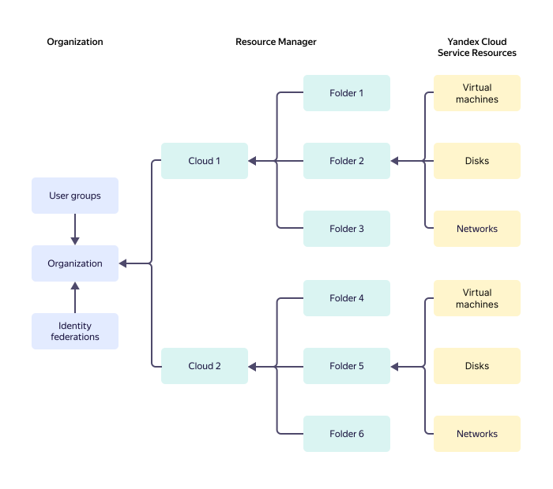

# {{ yandex-cloud }} resource hierarchy

The {{ resmgr-name }} resource model is shown in the chart. Most {{ yandex-cloud }} services are based on this model.

All {{ yandex-cloud }} resources, such as [VMs](../../compute/concepts/vm.md), [disks](../../compute/concepts/disk.md), or [networks](../../vpc/concepts/network.md#network), are placed in [folders](#folder). When creating a resource, its folder is specified.

Each folder belongs to a single [cloud](#cloud). There are no folders outside a cloud. You cannot create a folder inside another folder.

A [cloud](#cloud) belongs to an organization.

Organizations do not interact with each other. The resources of an organization cannot interact with the resources of another organization using {{ yandex-cloud }} tools. Organization management is performed by [{{ org-full-name }}](../../organization/).

Within your organization, you can configure access permissions for a resource at the following [levels](#access-rights-inheritance):
* Organization.
* Cloud.
* Folder.
* Individual resource if the service supports access control at this level.

By default, a new user (organization member) has no access to the resources residing in the organization's clouds. Access permissions must be granted explicitly by assigning a role specifically for a resource or its folder, cloud, or organization.

## {{ resmgr-name }} Resources {#rm-resources}

### Cloud {#cloud}

A _cloud_ is an isolated space where folders are created.

By default, clouds are isolated from each other. You cannot move resources from one cloud to another. For resources that support cross-cloud interaction, you can configure it separately.

#### Cloud owner {#owner}

A newly created cloud gets an owner assigned. A _cloud owner_ is a user with the `{{ roles-cloud-owner }}` role assigned for the cloud.

An owner can perform any operation with the cloud and the resources within it.

An owner can grant access to the cloud to other users: assign and revoke various [roles](../../iam/concepts/access-control/roles.md). Only a cloud owner can assign and revoke the `resource-manager.clouds.owner` role. Cloud owners can also revoke this role from themselves.

A cloud must have at least one owner. The user creating a cloud becomes its owner automatically. Sole cloud owners cannot revoke the `resource-manager.clouds.owner` role from themselves.

#### Cloud member {#member}

The `{{ roles-cloud-member }}` role does not grant any rights to handle resources. This role is used in combination with other roles.



### Folder {#folder}

A _folder_ is a space where {{ yandex-cloud }} resources are created and grouped.

Just like folders in your file system, {{ yandex-cloud }} folders make resource management simpler. You can group your resources into folders by the resource type, project, or department that uses those resources, or any other criteria of your choice.

## Inheriting access permissions {#access-rights-inheritance}

When a user ([subject](../../iam/concepts/access-control/index.md#subject)) performs an operation with a resource, {{ iam-name }} check the user's access permissions for the resource.

Resource access permissions are inherited as follows:
* Organization access permissions apply to the organization's resources:
   * [Federations](../../iam/concepts/federations.md).
   * Groups.
   * Organization clouds.
* Permissions to access the cloud apply to all folders within the cloud.
* Folder access permissions apply to all resources in the folder.

> For example, for an organization named `myorganization` with the following hierarchy:
> * `Mycloud` cloud:
>    * `Robots` folder:
>       * `Alice` service account.
>       * `Bob` service account.
>
> If you assign a user the `resource-manager.viewer` role for the organization, they can view a list of all clouds, folders, and resources in the organization, but cannot manage them.
>
> If you additionally assign them the `{{ roles-editor }}` role for the `mycloud` cloud, they can manage all the cloud resources, including the `Alice` and `Bob` service accounts, but cannot grant other users access to them.
>
> The `{{ roles-admin }}` role for the `robots` folder allows the user to manage all the resources in the folder, including the `Alice` and `Bob` service accounts.

For certain resources, you cannot assign a role directly. In this case, a role is assigned for a folder, cloud, or organization. If the folder access permissions are missing, {{ iam-name }} checks the cloud and organization access permissions.

#### See also {#see-also}

* [{#T}](../operations/cloud/set-access-bindings.md)
* [{#T}](../operations/folder/create.md)
* [{#T}](../operations/folder/set-access-bindings.md)