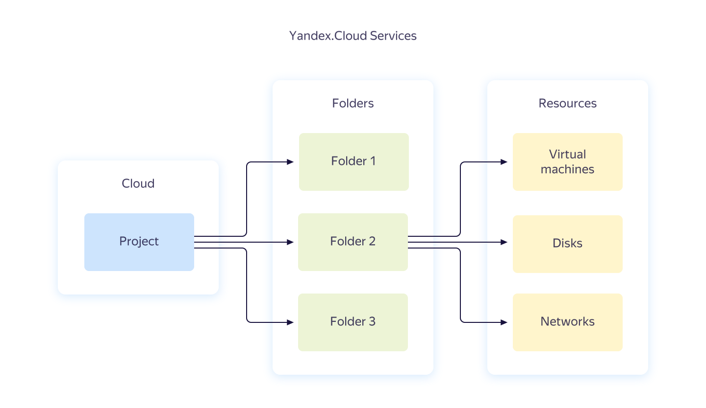

# {{ yandex-cloud }} resource hierarchy



At the [Preview](../../overview/concepts/launch-stages.md) stage, there is a restriction: only 1 organization and 1 cloud are available.



When you get access to {{ yandex-cloud }}, you are allocated a separate workspace: a _cloud_. This is where you will create folders.

Folders contain resources such as virtual machines, disks, and others. When you create a resource, you specify a folder where it is created. Nested folders are not supported for now.

{{ resmgr-name }} provides the standard resource model shown in the following image. This model is used in most of the Yandex Cloud services.

All resources inside the cloud are isolated from outside users by default. The cloud owner can manage access rights for the cloud and its resources.

Resource access rights are inherited within the cloud. Rights to access the cloud apply to all resources within the cloud. Folder access rights apply to all resources in the folder. For more information, see [{#T}](#access-rights-inheritance).

Some types of resources are not created in folders, so they have a separate logic for verifying access rights. For example, when a user manages access keys for a service account, the rights to access this service account are verified.

## Cloud as a {{ yandex-cloud }} resource {#cloud}

A _cloud_ is an isolated space where folders are created.

When a resource is created within the cloud, no one except the cloud members and owners may access the resource.

### Cloud owner {#owner}

When a cloud is created, the owner is assigned to it. The cloud owner is the user assigned the `{{ roles-cloud-owner }}` role for this cloud.

The owner can perform any operation with the cloud and its resources.

The owner can grant access to the cloud to other users: assign roles or revoke them. For example, the owner can appoint other cloud owners or denounce their owner role.

A cloud must have at least one owner. The sole owner of a cloud may not give up this role.

### Cloud member {#member}

The cloud member is a user assigned the `{{ roles-cloud-member }}` role for this cloud.

A user with a Yandex account requires the cloud member role to manipulate perform operations in a cloud not owned by the organization. The exception is resources with [public access](#public-access).

> For example, if a cloud member is assigned the `{{ roles-editor }}` role for a folder inside the cloud, such user can create resources in that folder. If the cloud member role is revoked for a user, the user can no longer perform any operations.

The `{{ roles-cloud-member }}` role itself doesn't grant any rights to handle resources. This role is used in combination with other roles.



The `{{ roles-cloud-member }}` role isn't necessary for cloud owners and service accounts.



### Public access to the cloud {#public-access}

You can make your cloud (and any of its resources) public by [assigning a role to the system group](../../iam/operations/roles/grant.md#access-to-all). Then to access a resource, you don't have to be a cloud member. You just need to know the resource ID. Learn more about [system groups](../../iam/concepts/access-control/system-group.md).

## Folders as a {{ yandex-cloud }} resource {#folder}

_A folder_ is an isolated space where {{ yandex-cloud }} resources are created and grouped.

Just like folders in your file system, folders in {{ yandex-cloud }} make resource management easier for you. You can group your resources into folders by the resource type, project, department that uses those resources, or any other criteria of your choice.

You can manage access rights for all resources in the folder at once. Let's say your company has employees working with virtual machines only. You can create a folder containing virtual machines only and grant employees access to this folder.

You can view the contents of the folder in the management console. To find out which folder hosts a given resource, use the API or CLI `Get` method for this resource (the `get` command in the CLI).

## Inheritance of access rights {#access-rights-inheritance}

When a user (subject) performs an operation with a resource,  {{ iam-full-name }} ({{ iam-short-name }}) service checks whether the user has the applicable access rights for this resource.

Rights to access resources inside the cloud are inherited based on the following hierarchy: Cloud → Folder → Resource.

> For example: in the `mycloud` cloud, the `robots` folder contains the `Alice` and `Bob` service accounts.
>
> If a `mycloud` user is assigned the `{{ roles-cloud-member }}` and `{{ roles-viewer }}` roles, the user can list all the folders in the cloud and view their contents.
>
> If a user is assigned the `{{ roles-editor }}` role for `Alice`, the user can manage `Alice`, but not `Bob`.
>
> If a user is assigned the `{{ roles-admin }}` role for the `robots` folder, this user gets administrator permission to manage this folder and all its resources, including `Alice` and `Bob`.

You can't assign roles for some resources because all their permissions are inherited from the folder. For example, currently you can't assign a role for a virtual machine. When someone tries to obtain information about the virtual machine, IAM checks their access rights for the folder hosting this virtual machine. If access rights have not been set for the folder, IAM checks that the subject has the applicable access rights for this cloud.

#### See also {#see-also}

- [{#T}](../operations/cloud/set-access-bindings.md)
- [{#T}](../operations/folder/create.md)
- [{#T}](../operations/folder/set-access-bindings.md)

