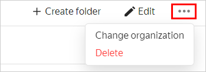

# Changing an organization for a cloud



In the [management console]({{ link-console-main }}), you can select the interface of navigating resources and services. To switch to another navigation mode: in the account information section, click , then select  **Experiments** and enable **New navigation**.



To change the organization assigned to the cloud:



- Old navigation

  1. In the [management console]({{ link-console-main }}) click  next to the appropriate cloud and select **Change organization**.

      

  1. Select a new organization from the list and click **Change**.

- New navigation

  1. In the [management console]({{ link-console-main }}), select the cloud from the list on the left.
  1. In the upper-right corner, click and select **Change organization**.

   

  1. Select a new organization from the list and click **Change**.

