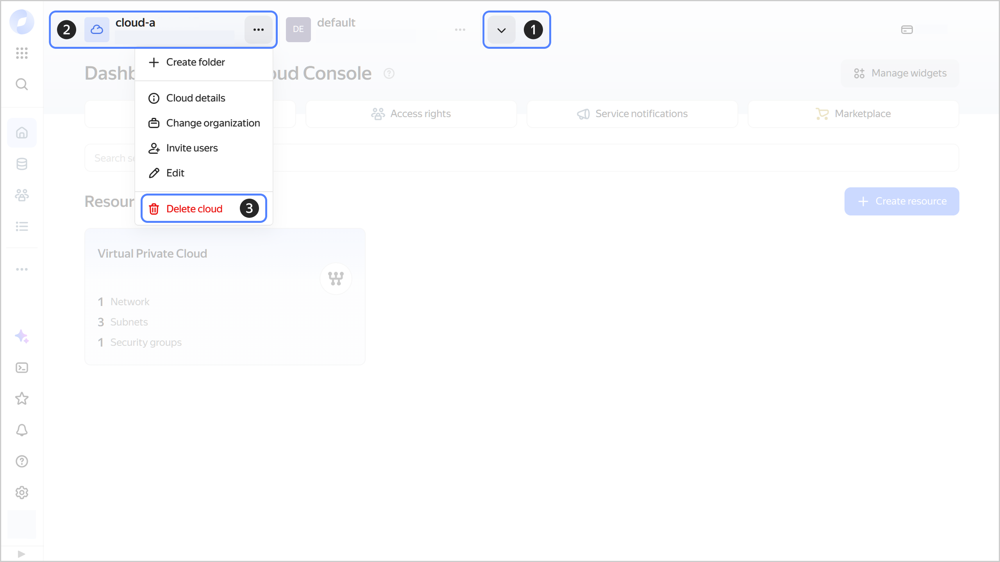
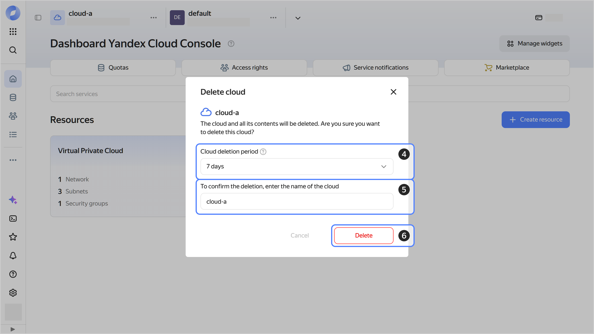

# Deleting a cloud

To delete a [cloud](../../concepts/resources-hierarchy.md#cloud), you must have the [{{ roles-resource-manager-editor }}](../../security/index.md#resource-manager-editor) role or higher for that cloud. If you cannot perform this operation, contact the [cloud owner](../../concepts/resources-hierarchy.md#owner).



Deleting a cloud may not be allowed if that cloud or its parent [organization](*organization) is subject to a `resourceManager.denyCloudRemoval` [authorization policy](*access_policies). This restriction still applies even if the user has a [role](*roles) that allows deleting clouds.

Also, if the `resourceManager.denyFolderRemoval` access policy is created for a cloud or at least one of the folders in a cloud, you cannot delete such a cloud. If the `resourceManager.denyFolderRemoval` policy is created for an organization, you cannot delete any cloud in such an organization.





- Management console {#console}

  1. In the [management console]({{ link-console-main }}), click  or  in the top panel and select the cloud.
  1. To the right of the cloud name, click .
  1. Select  **{{ ui-key.yacloud.components.CloudActions.button_action-delete-cloud_3simi }}**.

     

  1. Select a cloud deletion delay, after which the cloud will be deleted. Select one of the suggested periods or `{{ ui-key.yacloud_billing.component.iam-delete-folder-or-cloud-dialog.label_delete-now }}`. The default period is seven days.
  1. Enter the cloud name to confirm deletion.
  1. Click **{{ ui-key.yacloud.common.delete }}**.

     

- CLI {#cli}

  

  1. View a description of the cloud delete command:

      ```bash
      yc resource-manager cloud delete --help
      ```

  1. Get a list of available clouds:

      

  1. Delete the cloud by specifying its name or ID:

      ```bash
      yc resource-manager cloud delete <cloud_name_or_ID> \
        --delete-after <cloud_deletion_delay> \
        --async
      ```

      Where:

      * `--delete-after`: Cloud deletion delay in `HhMmSs` format. Cloud deletion process will start after the specified delay. For example: `--delete-after 22h30m50s`.
      
          Specify `0s` to delete the cloud now.
      * `--async`: Asynchronous deletion flag.
      
          Deleting a cloud can take up to 72 hours. Run the command in asynchronous mode to return to terminal management without waiting for the command to complete.

      Result:

      ```text
      id: b1gqkbbj04d9********
      description: Delete cloud
      created_at: "2024-10-17T05:16:30.648219069Z"
      created_by: ajei280a73vc********
      modified_at: "2024-10-17T05:16:30.648219069Z"
      metadata:
        '@type': type.googleapis.com/yandex.cloud.resourcemanager.v1.DeleteCloudMetadata
        cloud_id: b1g66mft1vop********
        delete_after: "2024-10-18T03:47:19.441433Z"
      ```

      Where `id` is the operation ID you can use to track the operation status later.

  1. (Optional) Get information about the deletion operation status:

      ```bash
      yc operation get <operation_ID>
      ```

      After cloud deletion is complete, the response will contain the `done` field set to `true` (`done: true`).

  For more information about the `yc resource-manager cloud delete` command, see the [CLI reference](../../../cli/cli-ref/resource-manager/cli-ref/cloud/delete.md).

- {{ TF }} {#tf}

  

  To delete a cloud created using {{ TF }}:

  1. Open the {{ TF }} configuration file and delete the fragment with the cloud description.

      

      ```hcl
      ...
      resource "yandex_resourcemanager_cloud" "cloud1" {
        name            = "cloud-main"
        organization_id = "bpf7nhb9hkph********"
      }
      ...
      ```

      

      For more on the properties of the `yandex_resourcemanager_cloud` resource in {{ TF }}, see [this provider guide]({{ tf-provider-resources-link }}/resourcemanager_cloud).

  1. In the command line, change to the folder where you edited the configuration file.
  1. Make sure the configuration file is correct using this command:

      ```bash
      terraform validate
      ```

      If the configuration is valid, you will get this message:
     
      ```bash
      Success! The configuration is valid.
      ```

  1. Run this command:

      ```bash
      terraform plan
      ```

      You will see a list of resources and their properties. No changes will be made at this step. {{ TF }} will show any errors in the configuration.

  1. Apply the configuration changes:

      ```bash
      terraform apply
      ```

  1. Confirm the changes: type `yes` into the terminal and press **Enter**.

      You can check the update using the [management console]({{ link-console-main }}) or this [CLI](../../../cli/quickstart.md) command:

      ```bash
      yc resource-manager cloud list
      ```

- API {#api}

  To delete the cloud, use the [CloudService/Delete](../../api-ref/grpc/Cloud/delete.md) gRPC API call.



Deletion starts from stopping the resources. The cloud enters the `PENDING_DELETION` status. Preparation for deletion starts. The exact time in this status depends on selected deletion delay period. You can [cancel](delete-cancel.md) the deletion of the cloud while it is `PENDING_DELETION`.



As soon as the deletion preparation and delay periods are over, the cloud enters the `DELETING` status. This status means it is being permanently deleted, which can take up to 72 hours. All the cloud's resources will be deleted together with it.

[*organization]: An organization is the highest resource in the resource model hierarchy in {{ yandex-cloud }} that consolidates the resources of all other services. Organizations are also used to manage users and their authentication and authorization settings. For more information, see [{#T}](../../../organization/concepts/organization.md).

[*roles]: A role is a set of permissions that defines the allowed scope of operations with {{ yandex-cloud }} resources. For more information, see [{#T}](../../../iam/concepts/access-control/roles.md).

[*access_policies]: _Access policies_ are a {{ iam-full-name }} mechanism that allows you to manage permissions for specific operations with [{{ yandex-cloud }}](../../../overview/roles-and-resources.md) resources. Access policies complement the [role](../../../iam/concepts/access-control/roles.md) system for more flexible [access management](../../../iam/concepts/access-control/index.md). For more information, see [{#T}](../../../iam/concepts/access-control/access-policies.md).