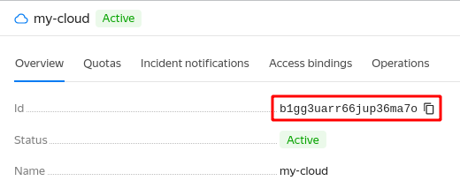

# Retrieving a cloud ID



- Management console

   1. In the [management console]({{ link-console-main }}), click the desired cloud in the list on the left.

      If you are on the service page, expand the cloud and folder list in the top left-hand corner.

      

   1. This will display the selected cloud's info page. Copy the **ID** on the **Overview** tab.

      

- CLI

   If you know the name of the cloud, pass it as a parameter in the `get` command:

   ```
   yc resource-manager cloud get <cloud name>
   ```
   Result:

   ```
   id: b1gd129pp9ha0vnvf5g7
   ...
   ```

   If you don't know the cloud ID, retrieve a list of clouds with their IDs:

   ```
   yc resource-manager cloud list
   ```
   Result:

   ```
   +----------------------+------------+--------------------------+
   |          ID          |    NAME    |      ORGANIZATION ID     |
   +----------------------+------------+--------------------------+
   | b1g66mft1vopnevbn57j | my-cloud-1 |                          |
   | b1gd129pp9ha0vnvf5g7 | my-cloud-2 |                          |
   +----------------------+------------+--------------------------+
   ```

- API

   To get the list of clouds with IDs, use the [list](../../api-ref/Cloud/list.md) REST API method for the [Cloud](../../api-ref/Cloud/index.md) resource or the [CloudService/List](../../api-ref/grpc/cloud_service.md#List) gRPC API call.


