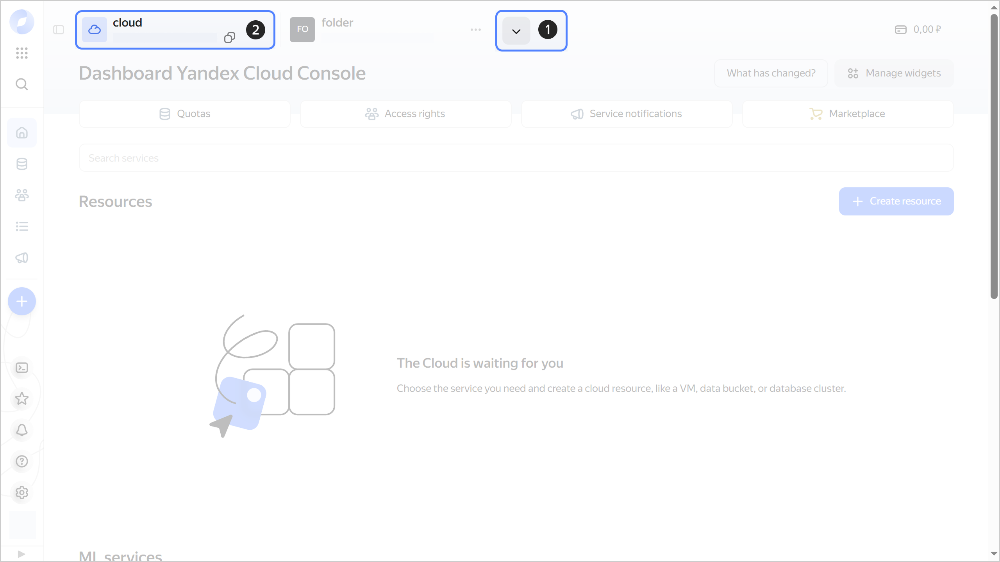
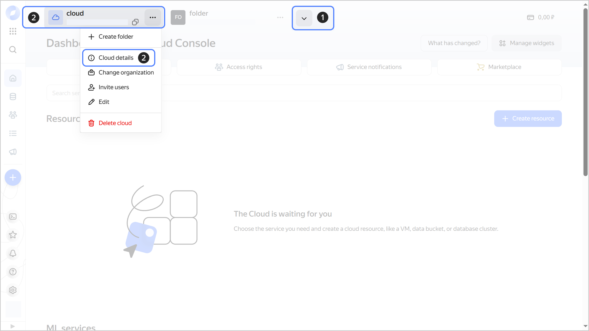
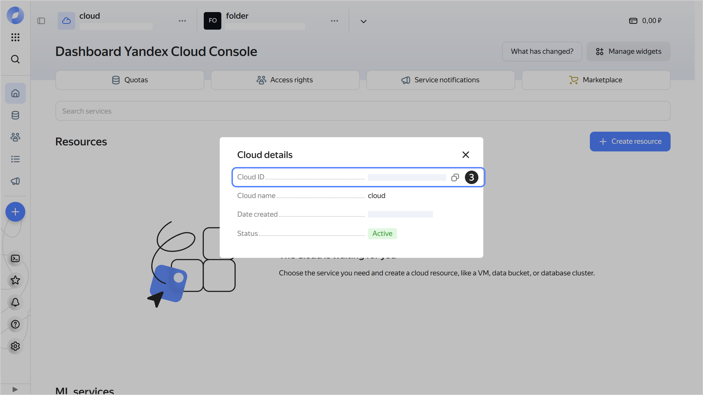

# Getting a cloud ID



- Management console {#console}

  You can get the cloud ID on the dashboard or on the **{{ ui-key.yacloud.dashboard.DashboardPage.CloudInfoDialog.title_cloud-info-dialog_ddcbY }}** tab.

  **Getting ID on the dashboard**

  1. In the [management console]({{ link-console-main }}), in the top panel, click  and select the [cloud](../../concepts/resources-hierarchy.md#cloud).
  1. The cloud ID is specified at the top, below the cloud name. To copy the ID, hover over it and click .

     
    
     

     

  **Getting ID on the {{ ui-key.yacloud.dashboard.DashboardPage.CloudInfoDialog.title_cloud-info-dialog_ddcbY }} tab**

  1. In the [management console]({{ link-console-main }}), in the top panel, click  and select the [cloud](../../concepts/resources-hierarchy.md#cloud).
  1. To the right of the cloud name, click  and select **{{ ui-key.yacloud.common.resource-acl.button_cloud-info }}**.
  1. In the window that opens, you will find the cloud ID in the **{{ ui-key.yacloud.dashboard.DashboardPage.CloudInfoTooltip.cloud-id_rncSU }}** field. To copy the ID, hover over it and click .

     

     
    
     

     

- CLI {#cli}

  If you know the [cloud's](../../concepts/resources-hierarchy.md#cloud) name, set it as a `get` command parameter:

  ```
  yc resource-manager cloud get <cloud_name>
  ```
  Result:

  ```
  id: b1gd129pp9ha********
  ...
  ```

  If you do not know the cloud ID, retrieve a list of clouds with their IDs:

  

- API {#api}

  To get a list of [clouds](../../concepts/resources-hierarchy.md#cloud) with their IDs, use the [list](../../api-ref/Cloud/list.md) REST API method for the [Cloud](../../api-ref/Cloud/index.md) resource or the [CloudService/List](../../api-ref/grpc/Cloud/list.md) gRPC API call.


