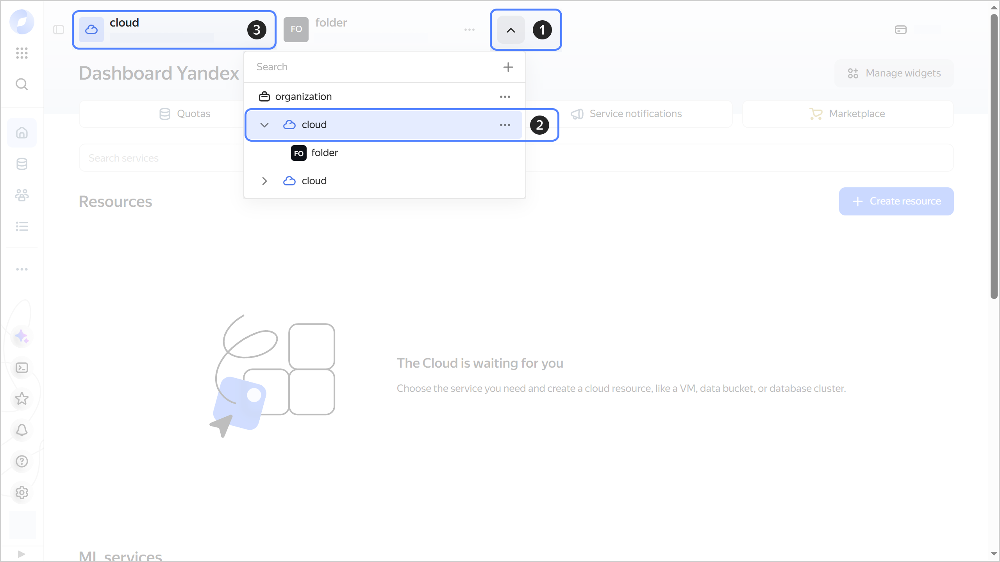

# Switch clouds



- Management console {#console}

  1. In the [management console]({{ link-console-main }}), in the top panel, click .
  1. In the list that opens, select the cloud or folder within that cloud.
  1. The dashboard shows general cloud and folder information. The cloud [ID](./get-id.md) is specified at the top, below the cloud name.

     

- CLI {#cli}

  There are two ways to choose the cloud that is used in the CLI by default:
  * Select a cloud when [creating a profile](../../../cli/operations/profile/profile-create.md).
  * Change the `cloud-id` parameter in the profile configuration.

  To change the `cloud-id` parameter for the current profile:

  1. See the description of the command to change configuration parameters:

      ```
      yc config set --help
      ```

  1. Find out the ID of the cloud you want to use. To do this, get a list of available clouds:

      ```
      yc resource-manager cloud list
      +--------------------------+----------------------+-------------------------------+
      |            ID            |         NAME         |          DESCRIPTION          |
      +--------------------------+----------------------+-------------------------------+
      | <ID_of_cloud_1> | <name_of_cloud_1>       | ...                           |
      | <ID_of_cloud_2> | <name_of_cloud_2>       | ...                           |
      +--------------------------+----------------------+-------------------------------+
      ```

      

      If the list contains only one cloud, it means you don't have access to any other clouds. To access the cloud, ask the [owner](../../concepts/resources-hierarchy.md#owner) to [add](../../../organization/operations/add-account.md) you to it.

      

  1. Specify the ID of the cloud to be used by default:

      ```
      yc config set cloud-id <cloud_ID>
      ```

- API {#api}

  Currently, you cannot switch to another cloud using the API.


