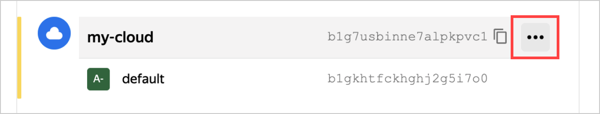
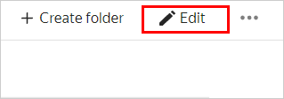

# Rename a cloud

To be able to rename a cloud, you must have the [`editor`](../../../iam/concepts/access-control/roles.md#editor) role or a higher role in that cloud. You can't rename a suspended cloud. If you can't do this, please contact the cloud [administrator](../../../iam/concepts/access-control/roles.md#admin) or [owner](../../concepts/resources-hierarchy.md#owner).




In the [management console]({{ link-console-main }}), you can select the interface of navigating resources and services. To switch to another navigation mode: in the account information section, click , then select  **Experiments** and enable **New navigation**.





- Old navigation

   1. In the [management console]({{ link-console-main }}), select the cloud from the list.
   1. Click  and select **Edit**.

      

   1. In the window that opens, enter a new cloud name. Naming requirements:

      

   1. Click **Save**.

- New navigation


   1. In the [management console]({{ link-console-main }}), select the cloud from the list on the left.
   1. Click   **Edit** in the upper-right corner.

      

   1. In the window that opens, enter a new cloud name. Naming requirements:

      

   1. Click **Save**.

- {{ TF }}

   For more information about {{ TF }}, [see the documentation](../../../tutorials/infrastructure-management/terraform-quickstart.md#install-terraform).

   To rename a cloud created using {{ TF }}:

   1. Open the {{ TF }} configuration file and edit the value of the `name` parameter in the fragment with the cloud description.

      

      ```hcl
      ...
      resource "yandex_resourcemanager_cloud" "cloud1" {
        name            = "cloud-main"
        organization_id = "bpf7nhb9hkphksfevi77"
      }
      ...
      ```

      

      For more detailed information about the `yandex_resourcemanager_cloud` resource parameters in {{ TF }}, see the [provider documentation]({{ tf-provider-link }}/resourcemanager_cloud).
   1. In the command line, change to the folder where you edited the configuration file.
   1. Make sure the configuration file is correct using the command:

      ```bash
      terraform validate
      ```

      If the configuration is correct, the following message is returned:

      ```bash
      Success! The configuration is valid.
      ```

   1. Run the command:

      ```bash
      terraform plan
      ```

      The terminal will display a list of resources with parameters. No changes are made at this step. If there are errors in the configuration, {{ TF }} points them out.
   1. Apply the configuration changes:

      ```bash
      terraform apply
      ```

   1. Confirm the changes: type `yes` in the terminal and press **Enter**.

      You can verify the updated cloud name in the [management console]({{ link-console-main }}) or the following [CLI](../../../cli/quickstart.md) command:

      ```bash
      yc resource-manager cloud list
      ```

