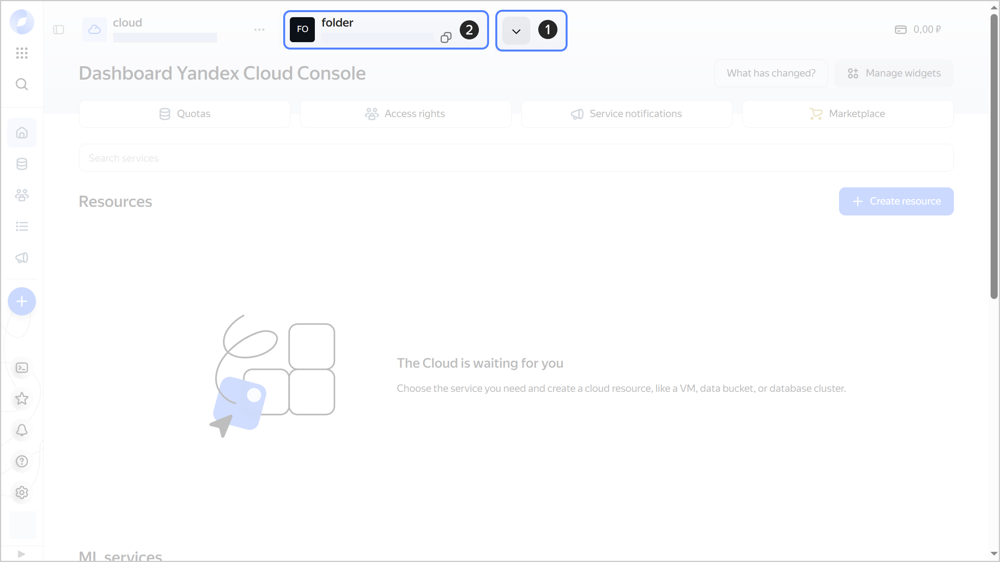
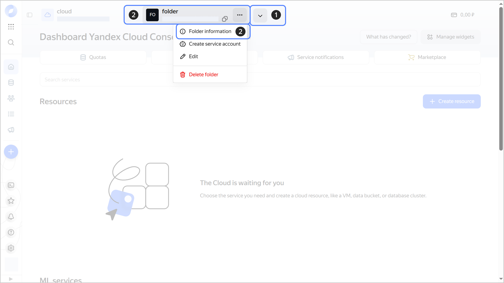
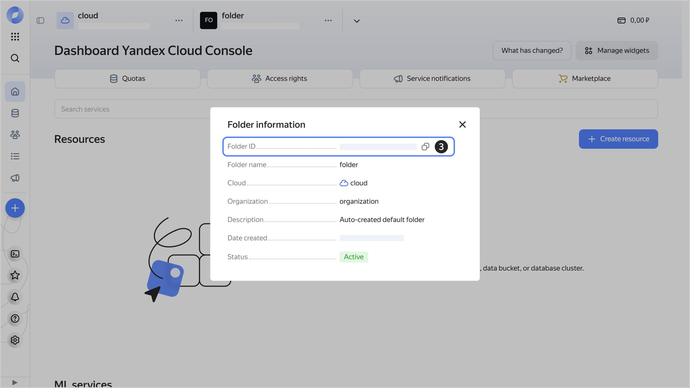

# Getting the folder ID



- Management console {#console}

  You can get the folder ID from the dashboard or the **{{ ui-key.yacloud.dashboard.FoldersSelector.FolderInfoTooltip.title_folder-info-dialog_c4F7i }}** tab.

  **Getting the ID on the dashboard**

  1. In the [management console]({{ link-console-main }}), click  in the top panel and select the [folder](../../concepts/resources-hierarchy.md#folder).
  1. You will find the folder ID at the top, below the folder name. To copy the ID, hover over it and click .

     
    
     

     

  **Getting ID on the {{ ui-key.yacloud.dashboard.FoldersSelector.FolderInfoTooltip.title_folder-info-dialog_c4F7i }} tab**

  1. In the [management console]({{ link-console-main }}), click  in the top panel and select the [folder](../../concepts/resources-hierarchy.md#folder).
  1. To the right of the folder name, click  and select **{{ ui-key.yacloud.common.resource-acl.button_folder-info }}**.
  1. In the window that opens, you will find the folder ID in the **{{ ui-key.yacloud.dashboard.FoldersSelector.FolderInfoDialog.folder-id_6KQJv }}** field. To copy the ID, hover over it and click .

     

     
    
     

     
  
  You can also get the folder ID from the folder page URL in the management console:
  
  ```text
  {{ link-console-main }}/folders/<folder_ID>
  ```

- CLI {#cli}

  

  If you know the [folder](../../concepts/resources-hierarchy.md#folder) name, get its ID using the `get` command:

  ```bash
  yc resource-manager folder get my-folder
  ```

  Result:

  ```text
  id: b1gd129pp9ha********
  ...
  ```

  If you don't, get a list of folders with IDs for the default cloud:

  ```bash
  yc resource-manager folder list
  ```

  Result:

  ```text
  +----------------------+--------------------+------------------+--------+
  |          ID          |        NAME        |      LABELS      | STATUS |
  +----------------------+--------------------+------------------+--------+
  | b1gd129pp9ha******** | my-folder          |                  | ACTIVE |
  | b1g66mft1vop******** | default            |                  | ACTIVE |
  +----------------------+--------------------+------------------+--------+
  ```

  To view the list of folders in a different cloud, specify the folder ID in `cloud-id`:

  ```bash
  yc resource-manager folder list --cloud-id b1glku4lgd6g********
  ```

- API {#api}

  To get the list of [folders](../../concepts/resources-hierarchy.md#folder) with IDs, use the [list](../../api-ref/Folder/list.md) REST API method for the [Folder](../../api-ref/Folder/index.md) resource or the [FolderService/List](../../api-ref/grpc/Folder/list.md) gRPC API call.


