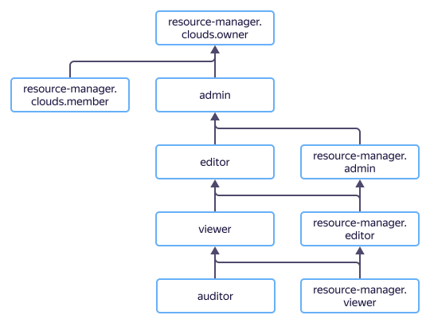

# Access management in {{ resmgr-name }}

In this section, you will learn:
* [Which resources you can assign roles to](#resources).
* [Which roles exist in the service](#roles-list).
* [Which roles are required](#required-roles) for particular actions.



## What resources you can assign roles to {#resources}



## What roles exist in the service {#roles-list}

The chart below shows which roles are available in the service and how they inherit each other's permissions. For example, the `editor` role includes all `viewer` role permissions. You can find the description of each role under the chart.

Active roles in the service:

* Service roles:
   * 
   * 
   * 
   * 
   * 
   * 

* Primitive roles:
   * 
   * 
   * 

## What roles do I need {#required-roles}

The table below lists the roles needed to perform a particular action. You can always assign a role granting more permissions than the role specified. For example, you can assign the `editor` role instead of the `viewer` one.

| Action | Methods | Required roles |
----- | ----- | -----
| **View data** | |
| View information about any resource | `get`, `list` | `viewer` for this resource |
| View information about a folder or cloud | `get`, `list` | `resource-manager.viewer` for the folder or cloud |
| View metadata about a folder or cloud | `get`, `list` | `resource-manager.auditor` for the folder or cloud |
| **Manage resources** | |
| [Create a cloud](../operations/cloud/create.md) | | To create your first cloud, no roles are required. You only need to authenticate (a user is automatically assigned the `resource-manager.clouds.owner` role in the created organization). Afterwards, the `resource-manager.editor` or `editor` role for the organization is required. |
| [Update a cloud](../operations/cloud/update.md) | `update` | `editor` or `resource-manager.editor` for the cloud |
| [Deleting a cloud](../operations/cloud/delete.md) | `delete` | `resource-manager.clouds.owner` for a cloud |
| [Create a folder in the cloud](../operations/folder/create.md) | `create` | `editor` or `resource-manager.editor` for the cloud |
| [Updating a folder](../operations/folder/update.md) | `update` | `editor` or `resource-manager.editor` for the folder |
| [Deleting a folder](../operations/folder/delete.md) | `delete` | `editor` or `resource-manager.editor` for the folder |
| **Manage resource access** | |
| [Add a new user to the cloud](../../iam/operations/users/create.md) | `setAccessBindings` | `admin` for the cloud if it has no organization |
| [Make a new user the owner of the cloud](../operations/cloud/set-access-bindings.md) | `setAccessBindings`, `updateAccessBindings` | `resource-manager.clouds.owner` for the cloud |
| View roles granted for a resource | `listAccessBindings` | `viewer` for this resource |
| View roles granted for the folder or cloud | `listAccessBindings` | `resource-manager.viewer` for the folder or cloud |
| [Assign a role](../../iam/operations/roles/grant.md) and [revoke a role](../../iam/operations/roles/revoke.md) for the folder or cloud | `setAccessBindings`, `updateAccessBindings` | `admin` or `resource-manager.admin` for the folder or cloud |

#### What's next {#what-is-next}

* [How to assign a role](../../iam/operations/roles/grant.md).
* [How to revoke a role](../../iam/operations/roles/revoke.md).
* [Learn more about access management in {{ yandex-cloud }}](../../iam/concepts/access-control/index.md).
* [Learn more about inheriting roles](../../resource-manager/concepts/resources-hierarchy.md#access-rights-inheritance).
