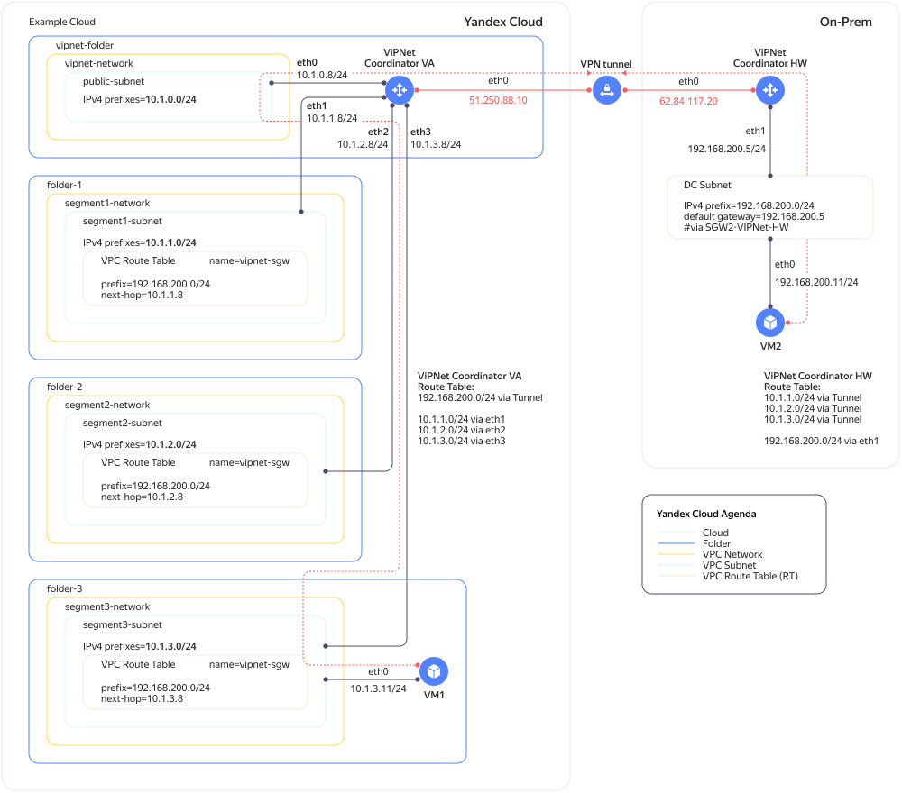

# ViPNet Coordinator VA in {{ yandex-cloud }}

You can install [ViPNet Coordinator VA](https://infotecs.ru/product/vipnet-coordinator-va.html#soft) in your cloud and use it as a VPN gateway for a site-to-site [VPN](../../glossary/vpn.md)VPN between cloud and on-premises resources.

ViPNet Coordinator VA is installed on a VM along with four network interfaces. One interface is assigned a [public](../../vpc/concepts/address.md#public-addresses) IP address for a tunnel to an on-premises gateway. The other interfaces can have [internal](../../vpc/concepts/address.md#internal-addresses) addresses and be connected to different [subnets](../../vpc/concepts/network.md#subnet) of the same availability zone.

Used in the cloud, ViPNet Coordinator VA doesn't support the following functions:
* Export and import of keys and settings in `vbe`.
* Failover cluster.
* Interface aggregation.
* DHCP server.
* VLAN.
* L2OverIP.
* Export of a system log and IP packet log to a USB flash drive or over TFTP.
* Adding a backup set of personal keys.
* Local software updates.
* Certificate import using a USB flash drive.
* Authentication using a token.

To deploy ViPNet Coordinator VA in {{ yandex-cloud }}:
1. [View a solution description](#description).
1. [Before you start](#before-begin).
1. [Prepare the environment](#environment-preparing).
1. [Create images of ViPNet Coordinator VA disks](#create-coordinator-images).
1. [Create a VM with ViPNet Coordinator VA in the cloud](#create-vipnet-cloud).
1. [Configure ViPNet Coordinator VA](#set-up-vipnet).

If you no longer need these resources, [delete them](#clear-out).


## Solution description {#description}

A VPN tunnel works between two ViPNet solutions: Coordinator VA on the cloud infrastructure's side and Coordinator HW on the on-premises site.



Cloud configuration:

* ViPNet Coordinator VA:

   | Interface | Internal address | Public address | Subnet | Comment |
   --- | --- | --- | --- | ---
   | `eth0` | 10.1.0.8 | `Automatically` | `public-subnet` | A public address is mapped to the internal one over One-to-One NAT. |
   | `eth1` | 10.1.1.8 | `No address` | `segment1-subnet` | - |
   | `eth2` | 10.1.2.8 | `No address` | `segment2-subnet` | - |
   | `eth3` | 10.1.3.8 | `No address` | `segment3-subnet` | - |

* All the traffic to the on-premises resources is routed to the ViPNet Coordinator VA internal interfaces using static routes:

   | Subnet | Destination prefix | Next hop |
   --- | --- | ---
   | `segment1-subnet` | 192.168.200.0/24 | 10.1.1.8 |
   | `segment2-subnet` | 192.168.200.0/24 | 10.1.2.8 |
   | `segment3-subnet` | 192.168.200.0/24 | 10.1.3.8 |

On the on-premises site:

* ViPNet Coordinator HW:

   | Interface | Address | Subnet |
   --- | --- | ---
   | `eth0` | Public address | - |
   | `eth1` | 192.168.200.5 | 192.168.200.0/24 |

* The traffic to the cloud resources is routed to the ViPNet Coordinator HW internal interface using a static route:

   | Subnet | Destination prefix | Next hop |
   --- | --- | ---
   | 192.168.200.0/24 | 10.1.1.0/24, 10.1.2.0/24, 10.1.3.0/24 | 192.168.200.5 |


## Before you begin {#before-begin}





To create a VM with several network interfaces, [have technical support]({{ link-console-support }}/create-ticket) enable the `MULTI_INTERFACE_INSTANCES_ALPHA` parameter for the cloud.


## Required paid resources {#paid-resources}

The cost of the infrastructure includes:
* A fee for VM computing resources, disks, and images (see [{{ compute-full-name }} pricing](../../compute/pricing.md)).
* A fee for data storage in a bucket and operations with data (see [{{ objstorage-full-name }} pricing](../../storage/pricing.md)).
* A fee for a public IP address and outgoing traffic (see [{{ vpc-full-name }} pricing](../../vpc/pricing.md)).


## Prepare the environment {#environment-preparing}


### Install the solution on a local machine {#local-software}

* [Oracle VM VirtualBox](https://www.oracle.com/virtualization/technologies/vm/downloads/virtualbox-downloads.html).
* [qemu-img](https://www.qemu.org/docs/master/tools/qemu-img.html).
* [jq](https://stedolan.github.io/jq/download/).


### Create a cloud network {#create-network}

If you don't have a [cloud network](../../vpc/concepts/network.md#network) yet, create one in the folder for ViPNet Coordinator VA, such as `vipnet-folder`:



- Management console

   1. In the [management console]({{ link-console-main }}), go to `vipnet-folder`.
   1. In the list of services, select **{{ vpc-name }}**.
   1. Click **Create network**.
   1. Enter a network name, such as `vipnet-network`.
   1. Disable the **Create subnets** option.
   1. Click **Create network**.

- CLI

   To create a cloud network, run the command:

   ```
   yc vpc network create --name vipnet-network --folder-id <ID_of_vipnet-folder>
   ```

   Where:
   * `name`: Name of the cloud network.
   * `folder-id`: ID of the folder where the network will be created.




### Create subnets {#create-subnets}

Create a [subnet](../../vpc/concepts/network.md#subnet) named `public-subnet` for the ViPNet Coordinator VA external interface:



- Management console

   1. In the [management console]({{ link-console-main }}), go to `vipnet-folder`.
   1. In the list of services, select **{{ vpc-name }}**.
   1. Choose the `vipnet-network` cloud network.
   1. Click **Add subnet**.
   1. Name the subnet, such as `public-subnet`.
   1. Select an [availability zone](../../overview/concepts/geo-scope.md), such as `{{ region-id }}-a`.
   1. Enter the subnet **CIDR**, such as `10.1.0.0/24`.
   1. Click **Create subnet**.

   Similarly, create subnets for `vipnet-network` or any other network:
   * `segment1-subnet`, CIDR – `10.1.1.0/24`;
   * `segment2-subnet`, CIDR – `10.1.2.0/24`;
   * `segment3-subnet`, CIDR – `10.1.3.0/24`.

   

   All the subnets must be in the same availability zone.

   

- CLI

   1. Create `public-subnet`:

      ```
      yc vpc subnet create \
      --name public-subnet \
      --folder-id <ID_of_vipnet-folder> \
      --network-name vipnet-network \
      --zone <availability_zone> \
      --range 10.1.0.0/24
      ```

      Where:
      * `name`: Name of the subnet.
      * `folder-id`: ID of the folder where the cloud network is located.
      * `network-name`: Cloud network name.
      * `zone`: [Availability zone](../../overview/concepts/geo-scope.md), for example `{{ region-id }}-a`.
      * `range`: The subnet CIDR.

   1. Similarly, create subnets for cloud resources:
      * `segment1-subnet`, CIDR – `10.1.1.0/24`;
      * `segment2-subnet`, CIDR – `10.1.2.0/24`;
      * `segment3-subnet`, CIDR – `10.1.3.0/24`.

   

   All the subnets must be in the same availability zone.

   




### Create route tables {#create-subnets}

Create the `segment1-rt`, `segment2-rt`, and `segment3-rt` route tables:



- Management console

   1. In the [management console]({{ link-console-main }}), go to `vipnet-folder`.
   1. In the list of services, select **{{ vpc-name }}**.
   1. Choose the `vipnet-network` cloud network.
   1. On the left-hand panel, select  **Route tables**.
   1. Click **Create**.
   1. Set the **name**: `segment1-rt`.
   1. Click **Add route** and specify:
      * **Destination prefix**: `192.168.200.0/24`.
      * **Next hop**: `IP address`.
      * **IP address**: `10.1.1.8`.
   1. Click **Add**.
   1. Click **Create route table**.

   Similarly, create the `segment2-rt` and `segment3-rt` tables, specifying the IP addresses `10.1.2.8` and `10.1.3.8`, respectively.



Link the route tables to the subnets:



- Management console

   1. In the [management console]({{ link-console-main }}), go to `vipnet-folder`.
   1. In the list of services, select **{{ vpc-name }}**.
   1. Choose the `vipnet-network` cloud network.
   1. On the left-hand panel, select  **Route tables**.
   1. Select the `segment1-subnet` subnet and click  → **Link routing table**.
   1. Select the `segment1-rt` table.
   1. Click **Link**.

   Similarly, link the `segment2-rt` and `segment3-rt` tables to the `segment2-subnet` and `segment3-subnet` subnets, respectively.




## Create disk images for the VM with ViPNet Coordinator VA {#create-coordinator-images}


### Create a VM with ViPNet Coordinator VA on a local machine {#create-vipnet-local}

The VM is created from the disk image prepared for {{ compute-name }}. Image requirements:
* Keys are installed in the system.
* Key authentication type: `Password`.
* Image format: `qcow2`.


#### Download a ViPNet Coordinator VA image {#download-image}

1. Request a ViPNet Coordinator VA image on the [infotecs page](https://infotecs.ru/product/vipnet-coordinator-va.html#soft).
   1. Under **Downloads** on the **Software** tab, choose the demo version of **ViPNet Coordinator VA (for the VMWare ESX and Oracle VM environments)**.
   1. On the page that opens, specify your details.
   1. Agree to the personal data processing policy and click **SUBMIT REQUEST**.
1. Wait for an email with the download link to ViPNet Coordinator VA, file size details, and the MD5 checksum. The link expires five days after you complete the form on the website.
1. Download the ViPNet Coordinator VA archive and check its integrity:

   

   - Linux / macOS

      1. Create the `vipnet` folder and upload the archive:

         ```bash
         mkdir vipnet
         cd vipnet
         curl -O <download_link_to_ViPNet_Coordinator_VA>
         ```

      1. Find out the archive name:

         ```bash
         ls -la
         ```

         Result:

         ```bash
         -rw-r--r--   1 user  457853789 Aug 21 12:28 va_vipnet_base_x86_64_4.5.1-5668.ova.zip
         ```

      1. Find out the archive MD5 checksum:

         ```bash
         md5 <archive_name>
         ```

         Result:

         ```bash
         MD5 (va_vipnet_base_x86_64_4.5.1-5668.ova.zip) = 42c0f1401aa77fc5366e7eff8cc8ed4a
         ```

         Compare the checksum against the one in the email: If the values differ, repeat the download.

      1. Unpack the archive:

         ```bash
         unzip <filename>
         ```

         Result:

         ```bash
         Archive:  va_vipnet_base_x86_64_4.5.1-5668.ova.zip
           inflating: va_vipnet_base_x86_64_4.5.1-5668.ova
         ```

   - PowerShell

      1. Create the `vipnet` folder and upload the archive:

         ```powershell
         mkdir vipnet
         cd vipnet
         curl.exe -O <download_link_to_ViPNet_Coordinator_VA>
         ```

      1. Find out the archive name:

         ```powershell
         Get-ChildItem
         ```

         Result:

         ```powershell
         Mode            LastWriteTime       Length    Name
         ----            -------------       ------    ----
         ------    8/24/2022   2:07 PM    457853789    va_vipnet_base_x86_64_4.5.1-5668.ova.zip
         ```

      1. Find out the archive MD5 checksum:

         ```powershell
         Get-FileHash <archive_name> -Algorithm MD5
         ```

         Result:

         ```powershell
         Algorithm    Hash                                Path
         ---------    ----                                ----
         MD5          42C0F1401AA77FC5366E7EFF8CC8ED4A    C:\Users\User1\vipnet\va_vipnet_base_x86_64_4.5.1-5668.ova.zip
         ```

         Compare the checksum against the one in the email: If the values differ, repeat the download.

      1. Unpack the archive:

         ```powershell
         Expand-Archive <archive_name>
         ```

   


#### Prepare a USB flash drive with the keys {#prepare-usb-drive}

The tutorial uses the demo versions of the keys.



- Linux / macOS

   1. Insert your USB flash drive in a port on a computer and format it using the operating system tools. Format the USB flash drive to FAT32.
   1. Upload the file with the keys to the USB flash drive:

      ```bash
      curl -O https://files.infotecs.ru/_dl/sess/vipnet_demokeys/vipnet_demokeys.zip
      unzip vipnet_demokeys.zip
      cp Coordinator\ 4\ MOBILE/Coordinator\ 4\ MOBILE/abn_0004.dst <path_to_root_on_USB_flash_drive>
      ```

   1. Make sure the keys are written to the USB flash drive:

      ```bash
      ls <path_to_root_on_USB_flash_drive>
      ```

      Result:

      ```bash
      abn_0004.dst
      ```

   1. Using operating system tools, disconnect the USB flash drive from the computer but don't remove it from the USB port.

- PowerShell

   1. Insert your USB flash drive in a port on a computer and format it using the operating system tools. Format the USB flash drive to FAT32.
   1. Upload the file with the keys to the USB flash drive:

      ```powershell
      curl.exe -O https://files.infotecs.ru/_dl/sess/vipnet_demokeys/vipnet_demokeys.zip
      Expand-Archive vipnet_demokeys.zip
      Copy-Item -Path "<path_to_vipnet_directory>\vipnet_demokeys\Coordinator 4 MOBILE\Coordinator 4 MOBILE\abn_0004.dst" -Destination <path_to_root_on_USB_flash_drive>
      ```

   1. Make sure the keys are written to the USB flash drive:

      ```powershell
      Get-ChildItem <path_to_root_on_USB_flash_drive>
      ```

      Result:

      ```powershell
      Mode            LastWriteTime    Length Name
      ----            -------------    ------ ----
      -a----    1/26/2022   5:38 PM     27456 abn_0004.dst
      ```

   1. Using operating system tools, disconnect the USB flash drive from the computer but don't remove it from the USB port.




#### Create a VM with ViPNet Coordinator VA in VirtualBox {#create-vm-virtualbox}

1. Using Oracle VM VirtualBox, open the ViPNet Coordinator VA image file in `ova`.
1. In the window that opens, click **Import** and wait for the setting import to finish.
1. Choose a VM called `vm` and click **Start**.


#### Configure ViPNet Coordinator VA on a local VM {#configure-vm-virtualbox}

1. In the VM startup selection window, select `VA`.
1. Wait for the `va login:` invitation to appear in the VM console.
1. Add the USB flash drive with the keys to the VM: at the top left, open **Devices** → **USB** and choose the USB flash drive.
1. In the `va login` field, type `user`.
1. In the `Password` field, type `user`.
1. Answer `2` (full screen interface) to the `Please select setup wizard operating mode` prompt.
1. Accept the license agreement: select `Yes` and click `Next`.
1. Select the continent `Europe`, country `Russia`, time zone `MSK+00`, and click `Yes`.
1. If necessary, set the current date and time.
1. Select `usb` as the source of downloading information about the keys. After reading the USB flash drive, information about the discovered files is listed with key details. Click `Next`.
1. Enter the password `11111111` and click `Next`. Data from the file is uploaded to the VM.
1. Configure the `eth0` and `eth1` network interfaces:
   * `Activate interface on boot`.
   * `Get IP-address automatically on boot (via DHCP)`.
1. Configure the `eth2` and `eth3` network interfaces: `Don't activate interface on boot`.
1. Configure the following parameters:
   * In the `Enable/Disable NTP server mode` field, select `Disable starting the DNS server on boot`.
   * In the `Enter hostname` field, enter `yc-vipnet-1`.
   * Answer the `Do you want to specify custom virtual IP address range?` prompt with `Leave the default setting`.
   * Answer the `Do you want to probe VPN-connection with some host in order to verify the configuration you've just made?` prompt with `No`.
   * Answer the prompt `Do you want to start VPN services before leaving the installation wizard?` with `No`.
1. Click `FINISH` and wait for the VM to restart.
1. Remove the USB flash drive with the keys: at the top left, open **Devices** → **USB** and choose the USB flash drive.
1. Shut down your VM: at the top left, open the **Machine** → **ACPI Shutdown** menu.
1. Wait until the VirtualBox logo appears in the VM console window and close the window. Click **Power off** to confirm the VM's shutdown.


#### Convert disk images to qcow2 {#prepare-image}



- Linux / macOS

   1. Go to the directory with the VM files and find out the names of `vdi` files:

      ```bash
      cd <path_ to_VirtualBox_VMs_directory>/vm
      ls -ogh *.vdi
      ```

      Result:

      ```bash
      -rw-------  1    272M Aug 21 15:22 va_vipnet_base_x86_64-disk1.vdi
      -rw-------  1    311M Aug 21 15:22 va_vipnet_base_x86_64-disk2.vdi
      ```

   1. Convert the disks to `qcow2` format using the `qemu-img` utility:

      ```bash
      qemu-img convert -f vdi -O qcow2 <name_of_VDI_file_with_disk_1> va_vipnet_base_x86_64-disk1.qcow2
      qemu-img convert -f vdi -O qcow2 <name_of_VDI_file_with_disk_2> va_vipnet_base_x86_64-disk2.qcow2
      ```

   1. Make sure the disks are saved in `qcow2` format:

      ```bash
      ls -ogh *.qcow2
      ```

      Result:

      ```bash
      -rw-r--r--  1    236M Aug 21 15:32 va_vipnet_base_x86_64-disk1.qcow2
      -rw-r--r--  1    246M Aug 21 15:32 va_vipnet_base_x86_64-disk2.qcow2
      ```

- PowerShell

   1. Go to the directory with the VM files and find out the names of `vdi` files:

      ```powershell
      cd <path_to_VirtualBox_VMs_directory>/vm
      Get-ChildItem *.vdi
      ```

      Result:

      ```powershell
      Mode            LastWriteTime       Length Name
      ----            -------------       ------ ----
      ------    8/24/2022  10:42 PM    324009984 va_vipnet_base_x86_64-disk2.vdi
      ------    8/24/2022  10:42 PM    286261248 va_vipnet_base_x86_64-disk1.vdi
      ```

   1. Convert the disks to `qcow2` format using the `qemu-img` utility:

      ```powershell
      qemu-img.exe convert -f vdi -O qcow2 <name_of_VDI_file_with_disk_1> va_vipnet_base_x86_64-disk1.qcow2
      qemu-img.exe convert -f vdi -O qcow2 <name_of_VDI_file_with_disk_2> va_vipnet_base_x86_64-disk2.qcow2
      ```

   1. Make sure the disks are saved in `qcow2` format:

      ```powershell
      Get-ChildItem -Name *.qcow2
      ```

      Result:

      ```powershell
      ------    8/24/2022  10:52 PM    324009984 va_vipnet_base_x86_64-disk2.qcow2
      ------    8/24/2022  10:52 PM    286261248 va_vipnet_base_x86_64-disk1.qcow2
      ```




### Upload disk images to {{ objstorage-name }} {#upload-image-s3}



- Management console

   1. Create a bucket:
      1. In the [management console]({{ link-console-main }}), select the folder where you want to create a bucket.
      1. Select **{{ objstorage-name }}**.
      1. Click **Create bucket**.
      1. Set the bucket parameters:
         * **Name**: `my-vipnet-images`.
         * **Max size**: `No limit`.
         * **Object read access**: `Limited`.
         * **Object listing access**: `Limited`.
         * **Read access to settings**: `Limited`.
         * **Storage class**: `Cold`.
      1. Click **Create bucket**.
   1. Upload `qcow2` disk images to the bucket:
      1. Select the created bucket.
      1. Click **Upload**.
      1. In the window that opens, select the files and click **Open**.
      1. Click **Upload**.
      1. Refresh the page.
   1. Get the links to the uploaded objects:
      1. Click the object name.
      1. Click **Get link**.
      1. Set the link **Lifetime** in hours or days (up to 7 days).
      1. Click **Get link**.
      1. Copy the links.




### Create disk images in {{ compute-name }} {#create-image-compute}



- Management console

   1. In the [management console]({{ link-console-main }}), select `example_folder`.
   1. Select **{{ compute-name }}**.
   1. On the left-hand panel, select  **Images**.
   1. Click **Upload image**.
   1. Specify the image name: `vipnet-va-disk1`.
   1. Insert the link to the first disk image in {{ objstorage-name }}.
   1. Click **Upload**.
   1. Create again for the second image `vipnet-va-disk2`.

- CLI

   To create disk images in {{ compute-name }}, run the following commands:

   ```bash
   yc compute image create vipnet-va-disk1 --source-uri="<link_to_first_disk_image>"
   yc compute image create vipnet-va-disk2 --source-uri="<link_to_second_disk_image>"
   ```




## Create a VM with ViPNet Coordinator VA in the cloud {#create-vipnet-cloud}



- CLI

   1. Configure the variables for creating a VM:

      ```bash
      VM_NAME=vipnet-va
      ZONE_ID={{ region-id }}-a
      DISK1_NAME=vipnet-va-disk1
      DISK2_NAME=vipnet-va-disk2
      ETH0_SUBNET=public-subnet
      ETH1_SUBNET=segment1-subnet
      ETH2_SUBNET=segment2-subnet
      ETH3_SUBNET=segment3-subnet
      ```

   1. Run the command to create a VM:

      ```bash
      yc compute instance create \
        --name=$VM_NAME \
        --hostname=$VM_NAME \
        --zone $ZONE_ID \
        --create-boot-disk name=$DISK1_NAME,type=network-hdd,image-name=$DISK1_NAME\
        --create-disk name=$DISK2_NAME,type=network-hdd,image-name=$DISK2_NAME,auto-delete=true\
        --cores=2 \
        --memory=4G \
        --core-fraction=100 \
        --network-interface subnet-name=$ETH0_SUBNET,ipv4-address=10.1.0.8,nat-ip-version=ipv4 \
        --network-interface subnet-name=$ETH1_SUBNET,ipv4-address=10.1.1.8 \
        --network-interface subnet-name=$ETH2_SUBNET,ipv4-address=10.1.2.8 \
        --network-interface subnet-name=$ETH3_SUBNET,ipv4-address=10.1.3.8 \
        --metadata serial-port-enable=1
      ```

      Where:
      * `name`: VM name.
      * `hostname`: The VM's host name.
      * `zone`: Availability zone that corresponds to the selected subnet for the VM.
      * `create-boot-disk`: Boot disk parameters.
      * `create-disk`: Parameters of an additional disk.
      * `cores`: Number of cores (vCPU).
      * `memory`: Amount of memory (RAM).
      * `core-fraction`: Level of vCPU performance.
      * `network-interface`: Network interface parameters.
      * `metadata`: VM metadata.




## Configure ViPNet Coordinator VA {#set-up-vipnet}


### Connect to ViPNet Coordinator VA using the serial console {#serial-console}



- Management console

   Go to the serial console of the created VM:
   1. In the [management console]({{ link-console-main }}), select `vipnet-folder`.
   1. Go to **{{ compute-name }}** and select the VM `vipnet-va`.
   1. Go to the **Serial console** tab.
   1. Enter the username `user` and demo version password `11111111`.

   After successful authorization, the ViPNet Coordinator VA command line opens for you:

   ```text
   yc-vipnet-1> version
   Product: ViPNet Coordinator VA
   Platform: VA VIRTUALBOX
   License: VA500
   Software version: 4.5.1-5668
   yc-vipnet-1>
   ```




### Enable SSH {#enable-ssh}



- Management console

   1. Switch to admin mode:

      ```text
      yc-vipnet-1> enable
      Type the administrator password:
      ```

   1. Enter the admin password `11111111` for the demo version:

      ```text
      yc-vipnet-1#
      ```

   1. Enable ICMP and [SSH](../../glossary/ssh-keygen.md)SSH:

      ```text
      firewall service-object add name @ICMP icmp
      firewall local add 1 rule LICMP src @any dst @any service @ICMP pass
      firewall local add 1 rule LSSH  src @any dst @any service @SSH pass
      ```

   1. Exit admin mode and the serial console:

      ```text
      exit
      exit
      ```




### Connect to ViPNet Coordinator VA over SSH {#connect-ssh}

1. Get ViPNet Coordinator VA's public address:

   ```bash
   VIPNET_IP=$(yc compute instance get \
     --name=$VM_NAME \
     --format=json | jq -r '.network_interfaces[0].primary_v4_address.one_to_one_nat.address')
   ```

1. Run the SSH client:

   ```bash
   ssh user@$VIPNET_IP
   ```


## How to delete created resources {#clear-out}

To stop paying for the resources created:
* [Delete](../../compute/operations/vm-control/vm-delete.md) the VM with ViPNet Coordinator VA.
* [Delete](../../compute/operations/image-control/delete.md) the disk images.
* [Delete](../../storage/operations/buckets/delete.md) the respective bucket.
