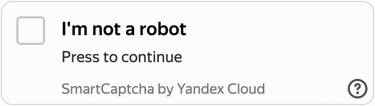
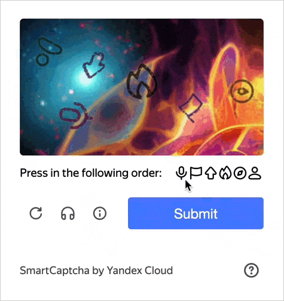

# Challenge types

[User validation](./validation.md) consists of two steps. The first step includes a basic check where the user is asked to complete the [main challenge](#main-task). After completing the main challenge, the user's request is automatically sent to {{ captcha-name }}. If the service considers the request suspicious, it will prompt the user to solve an [additional challenge](#additional-task).

If you set the maximum [difficulty level](#additional-task-difficulty) for the captcha, the service will always offer the user an additional high difficulty challenge regardless of the main challenge results.

## Main challenge {#main-task}

The basic check is carried out when the main challenge is performed.

You can choose between these two types of main challenges in {{ captcha-name }}:

* **{{ ui-key.yacloud.smartcaptcha.value_pre-check-checkbox }}**: User must click **I am not a robot**.
  
  

  

  

* **{{ ui-key.yacloud.smartcaptcha.value_pre-check-slider }}**: User must move the slider from left to right.
  
  

  The slider is in the [Preview](../../overview/concepts/launch-stages.md) stage, so it may not work correctly on some types of devices. For example, on TV sets.

  
  
  

  

  

## Additional challenge {#additional-task}

If the service regards the result of the main challenge seems suspicious, or if the captcha is set to the maximum [difficulty level](#additional-task-difficulty), the user will be offered an additional challenge. In this case, the service analyzes user behavior in more detail.

### Types of additional challenges {#additional-task-types}

There are several types of additional challenges in {{ captcha-name }}:

*  **Text recognition**: The user has to type a distorted text from the picture into a special field.
  
  

  

  

*  **Silhouettes**: The user has to mark several icons from the picture in a particular order.
  
  

  The silhouettes are at the [Preview](../../overview/concepts/launch-stages.md) stage, so they may not work correctly on some types of devices. For example, on TV sets.

  
  
  

  

  

*  **Kaleidoscope**: The user has to build a picture from individual parts by shuffling them using a slider. To complete the challenge, the user has to move the slider to a position in which the image parts are arranged correctly.
  
  

  The Kaleidoscope is in the [Preview](../../overview/concepts/launch-stages.md) stage, so it may not work correctly on some types of devices. For example, on TV sets.

  
  
  

  

  

## Difficulty levels of captcha challenges {#task-difficulty}

There are several difficulty levels in {{ captcha-name }} affecting the main and additional challenges, as well as the [invisible captcha](invisible-captcha.md) show threshold.

Difficulty levels: 

* **{{ ui-key.yacloud.smartcaptcha.value_complexity-easy }}**. Low level main challenge threshold. When completing an additional challenge, users will be offered simple images for recognition of text, silhouettes, or kaleidoscope.
* **{{ ui-key.yacloud.smartcaptcha.value_complexity-medium }}**. Medium level main challenge threshold. When completing an additional challenge, users will be offered medium level images for recognition of text, silhouettes, or kaleidoscope.
* **{{ ui-key.yacloud.smartcaptcha.value_complexity-hard }}**. High level main challenge threshold. When completing an additional challenge, users will be offered high level images for recognition of text, silhouettes, or kaleidoscope.
* **{{ ui-key.yacloud.smartcaptcha.value_complexity-force_hard }}**. The additional challenge is required regardless of the results of the main one. The main challenge threshold and the difficulty level of the additional challenge images are the same as for the **{{ ui-key.yacloud.smartcaptcha.value_complexity-hard }}** value.