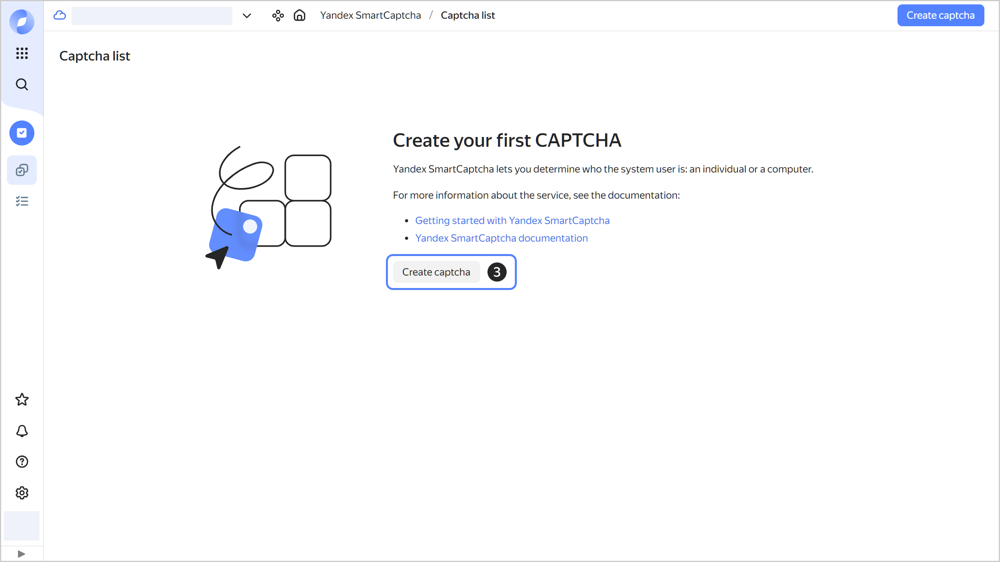
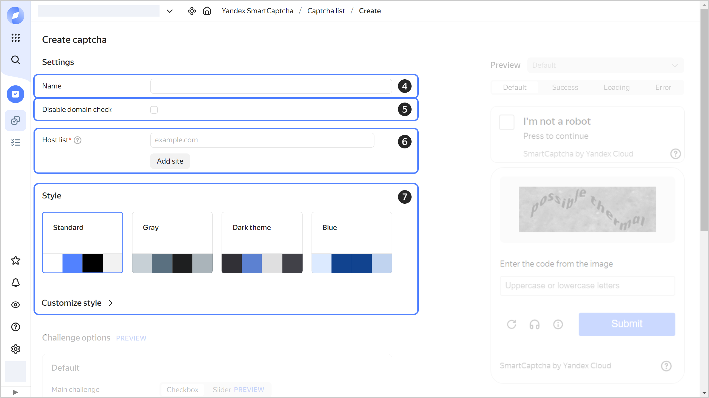
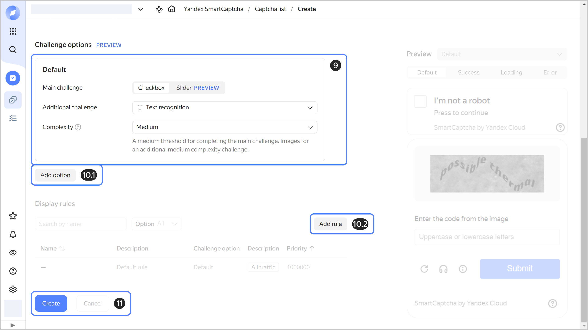

# Creating a CAPTCHA

{{ captcha-name }} allows you to create [CAPTCHAs](../concepts/validation.md) of multiple difficulty levels for various incoming requests. The difficulty level is determined by the basic properties of the incoming traffic.

When creating a CAPTCHA, you can:

* Connect a CAPTCHA to multiple websites.
* Set up the CAPTCHA appearance, such as background, states, errors, and the **I'm not a robot** button style.
* Select the type and difficulty level of a CAPTCHA challenge.
* Show various CAPTCHA options based on the incoming request properties, such as use different CAPTCHA for the users from different countries.



- Management console {#console}

  1. In the [management console]({{ link-console-main }}), select the folder.
  1. Select **{{ ui-key.yacloud.iam.folder.dashboard.label_smartcaptcha }}**.
  1. Click **{{ ui-key.yacloud.smartcaptcha.button_captcha-settings-create }}**.

     

  1. Specify the **{{ ui-key.yacloud.common.name }}** of the CAPTCHA you are creating:

      

  1. Optionally, select [**{{ ui-key.yacloud.smartcaptcha.label_no-hostname-check }}**](../concepts/domain-validation.md).
  1. Specify **{{ ui-key.yacloud.smartcaptcha.label_allowed-sites }}** as IP addresses or domain names without `http`/`https` or`/` at the end, e.g., `example.com`.

     The CAPTCHA will also be valid for all subdomains of the specified domain names.

  1. Set up the **{{ ui-key.yacloud.smartcaptcha.label_section-style }}** of the **I'm not a robot** button and the challenge window:
     * `{{ ui-key.yacloud.smartcaptcha.value_config-standard }}`: Default appearance
     * `Gray`
     * `Dark theme`
     * `Blue`

      Under **{{ ui-key.yacloud.smartcaptcha.label_section-customization }}**, you can set custom properties for the challenge window and other elements through the form or style description in `JSON` format.

      All changes will be displayed in the preview window.

     

  1. Configure the **Challenge options**. You can only specify the default CAPTCHA or add other [options](../concepts/captcha-variants.md) if you want to show different CAPTCHAs for different requests.
  
  1. For the **Default** option, specify:
      * **{{ ui-key.yacloud.smartcaptcha.label_main-challenge }}**: Type of the [main challenge](../concepts/tasks.md#main-task) to complete by the user.
      * **{{ ui-key.yacloud.smartcaptcha.label_additional-challenge }}**: Type of the [additional challenge](../concepts/tasks.md#additional-task) to complete by the user.
      * **{{ ui-key.yacloud.smartcaptcha.label_complexity }}**: [Difficulty level](../concepts/tasks.md#task-difficulty) of the challenge the user will be offered:
      * `{{ ui-key.yacloud.smartcaptcha.value_complexity-easy }}`: Simple challenge.
      * `{{ ui-key.yacloud.smartcaptcha.value_complexity-medium }}`: Medium level challenge.
      * `{{ ui-key.yacloud.smartcaptcha.value_complexity-hard }}`: Difficult challenge.
      * `{{ ui-key.yacloud.smartcaptcha.value_complexity-force_hard }}`: Difficult challenge with an additional question. The user is required to solve an additional challenge, regardless of the results of the main one.

        You can see a sample challenge in the preview window.

        

  1. To show different CAPTCHAs for different requests:
     1. Click **Add option** and configure the settings as you would do for default CAPTCHA.

        To delete an option, click . If an option is used in the show rule, you cannot delete it.

     1. Add the [rules for incoming traffic](../concepts/captcha-variants.md#captcha-view-rules) that will determine which CAPTCHA option to show:
         * Click **Add rule**.
         * Specify the rule name and description.
         * Select a CAPTCHA option.
         * Specify the rule priority from `1` to `999999`.
          
            Rules are checked in the ascending priority order, starting from `1`, `2`, etc. If the traffic matches multiple rules, the first rule to trigger will apply.
          
         * Specify one or more [conditions for the incoming traffic](../concepts/captcha-variants.md#traffic-conditions):
            * `IP`: IP address, IP address range, or IP address region.
            * `HTTP header`: HTTP header string.
            * `URI`: Path of the incoming request to the website.
            * `Host`: Domain receiving the request.
           
         * Click **Add**.
          
            To delete a rule, click . You cannot delete a default rule.

     1. Add other CAPTCHA options and rules for incoming traffic in a similar way.

  1. Click **{{ ui-key.yacloud.common.create }}**.
   
     

  The CAPTCHA will appear on the service page under **{{ ui-key.yacloud.smartcaptcha.label_captcha-settings-list }}**.


