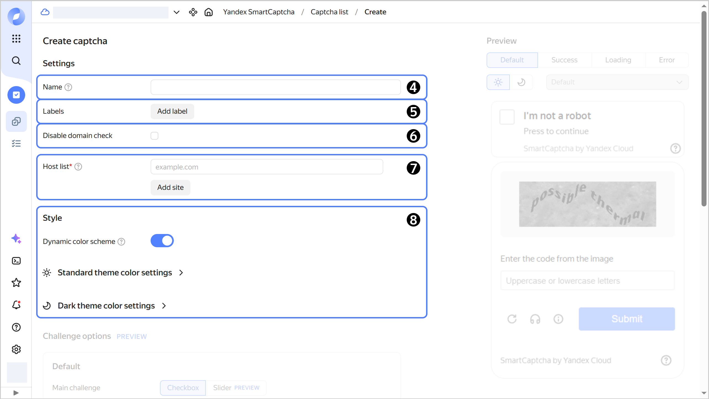
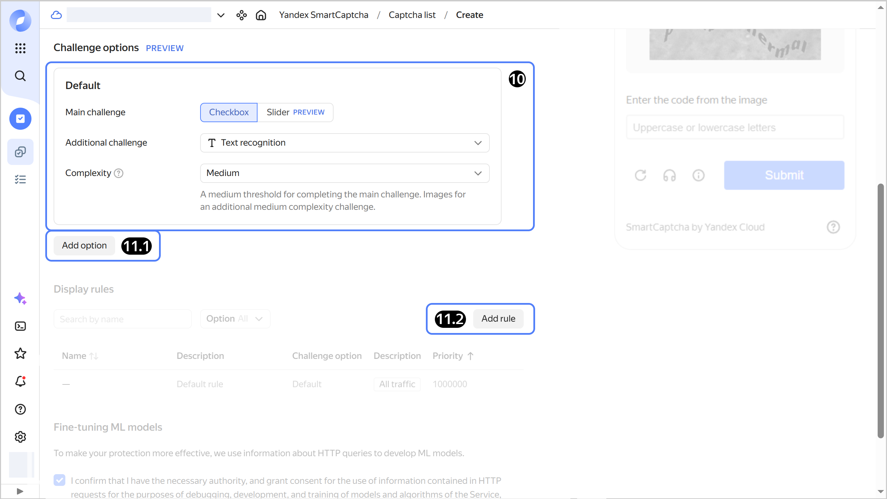
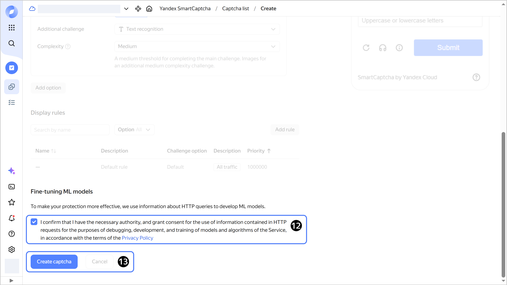

# Creating a CAPTCHA

{{ captcha-name }} allows you to create [CAPTCHAs](../concepts/validation.md) of multiple difficulty levels for various incoming requests. The difficulty level is determined by the incoming request parameters.

When creating a CAPTCHA, you can:

* Integrate a CAPTCHA on multiple websites.
* Customize the CAPTCHA appearance, including its background, states, errors, light and dark color themes, and the **I'm not a robot** button style.
* Select the CAPTCHA challenge type and difficulty level.
* Show various CAPTCHA options based on the incoming request parameters, for example, use different CAPTCHA for the users from different countries.





- Management console {#console}

  1. In the [management console]({{ link-console-main }}), select a folder.
  1. [Navigate](../../console/operations/select-service.md#select-service) to **{{ ui-key.yacloud.iam.folder.dashboard.label_smartcaptcha }}**.
  1. Click **{{ ui-key.yacloud.smartcaptcha.button_captcha-settings-create }}**.

  1. Specify the **{{ ui-key.yacloud.common.name }}** of the CAPTCHA you are creating:

      

  1. Optionally, add [labels](../../resource-manager/concepts/labels.md):

     1. Click **{{ ui-key.yacloud.component.label-set.button_add-label }}**.
     1. Add a label in `key: value` format.
     1. Press **Enter**.
  1. Optionally, select [**{{ ui-key.yacloud.smartcaptcha.label_no-hostname-check }}**](../concepts/domain-validation.md).
  1. Specify **{{ ui-key.yacloud.smartcaptcha.label_allowed-sites }}** as IP addresses or domain names without `http`/`https` at the beginning and `/` at the end, e.g., `example.com`.

     The CAPTCHA will also work on all subdomains of the specified domains.

  1. Set up the **{{ ui-key.yacloud.smartcaptcha.label_section-style }}** of the **I'm not a robot** button and the challenge window:
     * Optionally, enable **{{ ui-key.yacloud.smartcaptcha.CaptchaSettingsForm.PresetsSection.label_enable-dynamic-theme_tme9P }}** if you want to automatically adjust the CAPTCHA’s color theme according to your browser’s theme.

     * Under **{{ ui-key.yacloud.smartcaptcha.CaptchaSettingsForm.StyleSection.label_section-customization-light_tL96w }}** and **{{ ui-key.yacloud.smartcaptcha.CaptchaSettingsForm.StyleSection.label_section-customization-dark_dMJ2m }}**, you can add custom properties for various CAPTCHA elements, e.g., the challenge window, either via the form or by describing styles in `JSON` format.

      All changes will be displayed in the preview window.

     

  1. Configure the **Challenge options**. You can either specify the default CAPTCHA, or add extra [challenge options](../concepts/captcha-variants.md) if you want to show different CAPTCHAs for different requests.
  
  1. For the **Default** option, specify:
      * **{{ ui-key.yacloud.smartcaptcha.label_main-challenge }}**: Type of the [main challenge](../concepts/tasks.md#main-task) shown to the user.
      * **{{ ui-key.yacloud.smartcaptcha.label_additional-challenge }}**: Type of the [additional challenge](../concepts/tasks.md#additional-task) shown to the user.
      * **{{ ui-key.yacloud.smartcaptcha.label_complexity }}**: [Difficulty level](../concepts/tasks.md#task-difficulty) of the challenge shown to the user:
      * `{{ ui-key.yacloud.smartcaptcha.value_complexity-easy }}`: Easy challenge.
      * `{{ ui-key.yacloud.smartcaptcha.value_complexity-medium }}`: Medium challenge.
      * `{{ ui-key.yacloud.smartcaptcha.value_complexity-hard }}`: Hard challenge.
      * `{{ ui-key.yacloud.smartcaptcha.value_complexity-force_hard }}`: Hard challenge with an additional question. The user is required to solve an additional challenge, regardless of the outcome of the main challenge.

        You can see a challenge example in the preview window.

        

  1. To show different CAPTCHAs for different requests:
     1. Click **Add option** and configure the settings the same way as you did for the default CAPTCHA.

        To delete an option, click . If this option is used in a display rule, you cannot delete it.

     1. Add [incoming traffic rules](../concepts/captcha-variants.md#captcha-view-rules) that will determine which CAPTCHA option to display:
         * Click **Add rule**.
         * Specify the rule name and description.
         * Select a CAPTCHA option.
         * Specify the rule priority from `1` to `999999`.
          
            Rules are processed from lowest to highest priority, e.g., `1`, `2`, etc. If the request matches multiple rules, the first matching rule will apply.
          
         * Specify one or more [conditions for the incoming traffic](../concepts/captcha-variants.md#traffic-conditions):
            * `IP`: IP address, CIDR, or IP region.
            * `HTTP header`: HTTP header string.
            * `URI`: Requested website path.
            * `Host`: Domain that received the request.
            * `Metadata`: [Additional data](../concepts/captcha-variants.md#metadata) received from the frontend.
           
         * Click **Add**.
          
            To delete a rule, click . You cannot delete a default rule.

     1. Add other CAPTCHA options and incoming traffic rules in the same way.

     

  1. Optionally, under **{{ ui-key.yacloud.component.disallow-data-processing.title_ml-model-training }}**, you can enable or disable the use of HTTP request data for improving machine learning models.
   
  1. Click **{{ ui-key.yacloud.common.create }}**.

     

  The CAPTCHA will appear on the service’s page under **{{ ui-key.yacloud.smartcaptcha.label_captcha-settings-list }}**.

- CLI {#cli}

  

  

  1. See the description of the CLI command for creating a CAPTCHA:

     ```bash
     yc smartcaptcha captcha create --help
     ```

  1. Create a CAPTCHA:

     ```bash
     yc smartcaptcha captcha create \
       --name <captcha_name> \
       --turn-off-hostname-check \
       --allowed-site <first_host>,<second_host> \
       --pre-check-type <main_challenge_type> \
       --challenge-type <additional_challenge_type> \
       --style-json '{"light":"<json_object>", "dark":"<json_object>"}' \
       --complexity <challenge_difficulty> \
       --security-rules-file <path_to_file_with_options>.yaml \
       --override-variants-file <path_to_file_with_rules>.yaml
     ```
 
     Where:
     * `--name`: CAPTCHA name.
     * `--turn-off-hostname-check`: [Disable domain check](../concepts/domain-validation.md). This is an optional setting.
     * `--allowed-site`: List of hosts, specified as IP addresses or domain names without `http`/`https` at the beginning and `/` at the end, e.g., `example.com`. The CAPTCHA will also work on all subdomains of the specified domains. This is an optional setting.
     * `--pre-check-type`: Type of the default [main challenge](../concepts/tasks.md#main-task) given to the user. The possible values are:
       * `CHECKBOX`: Checkbox.
       * `SLIDER`: Slider.
     * `--challenge-type`: Type of the default [additional challenge](../concepts/tasks.md#additional-task) shown to the user. The possible values are:
       * `IMAGE_TEXT`: Text recognition.
       * `SILHOUETTES`: Silhouettes.
       * `KALEIDOSCOPE`: Kaleidoscope.
     * `--style-json`: Color theme settings in `JSON` format. To set a dynamic color scheme, use the `light` and `dark` keys with values as separate JSON objects. You can configure the color scheme for both types in the [management console]({{ link-console-main }}) and copy it in JSON format on the `JSON` tab. This is an optional setting. For more information, see [this example](#with-rules).
     * `--complexity`: Default challenge [difficulty](../concepts/tasks.md#task-difficulty). The possible values are:
       * `EASY`: Easy challenge.
       * `MEDIUM`: Medium challenge.
       * `HARD`: Hard challenge.
       * `FORCE_HARD`: Hard challenge with an additional question. The user is required to solve an additional challenge, regardless of the outcome of the main challenge.
 
       
 
     * `--override-variants-file`: Path to a `YAML` file with challenge [options](../concepts/captcha-variants.md). This is an optional argument.
 
       
 
       ```yaml
       - uuid: <option_1_ID>
         description: <option_1_description>
         complexity: <challenge_difficulty>
         pre_check_type: <main_challenge>
         challenge_type: <additional_challenge>
       - uuid: <option_2_ID>
         description: <option_2_description>
         complexity: <challenge_difficulty>
         pre_check_type: <main_challenge>
         challenge_type: <additional_challenge>
       ```
 
       Where:
       * `uuid`: Challenge option’s unique identifier.
       * `description`: Challenge option description. 
       * `complexity`: Difficulty level of the challenge shown to the user.
       * `pre_check_type`: Type of the main challenge shown to the user.
       * `challenge_type`: Type of the additional challenge shown to the user.
 
       
     
     * `--security-rules-file`: Path to a `YAML` file containing [incoming traffic rules](../concepts/captcha-variants.md#captcha-view-rules) that determine which CAPTCHA option to display. This is an optional argument.
 
       
 
       ```yaml
       - name: <rule_1_name>
         priority: "<rule_1_priority>"
         description: <rule_1_description>
         override_variant_uuid: <challenge_option_ID>
         condition:
           host:
             hosts:
               - exact_match: example.com
               - exact_match: example.net
       - name: <rule_2_name>
         priority: "<rule_2_priority>"
         description: <rule_2_description>
         override_variant_uuid: <challenge_option_ID>
         condition:
           source_ip:
             geo_ip_match:
               locations:
                 - ru
                 - kz
       ```
 
       Where:
       * `name`: Rule name.
       * `priority`: Rule priority, from `1` to `999999`.
         
         Rules are processed from lowest to highest priority, e.g., `1`, `2`, etc. If the request matches multiple rules, the first matching rule will apply.
 
       * `description`: Rule description. This is an optional argument.
       * `override_variant_uuid`: ID of the challenge option that will appear if the request matches the rule. If this argument is not specified, the system will display the default challenge.
       * `condition`: One or more [conditions for the incoming traffic](../concepts/captcha-variants.md#traffic-conditions). This is an optional argument.
 
       

  

- {{ TF }} {#tf}

  

  

  To create a CAPTCHA:

  1. In the {{ TF }} configuration file, describe the resources you want to create:

     

     Where:
     * `name`: CAPTCHA name.
     * `turn_off_hostname_check`: [Disable domain check](../concepts/domain-validation.md). This is an optional setting.
     * `complexity`: [Difficulty](../concepts/tasks.md#task-difficulty) level of the default challenge shown to the user. The possible values are:
       * `EASY`: Easy challenge.
       * `MEDIUM`: Medium challenge.
       * `HARD`: Hard challenge.
       * `FORCE_HARD`: Hard challenge with an additional question. The user is required to solve an additional challenge, regardless of the outcome of the main challenge.

       

     * `pre_check_type`: Type of the default [main challenge](../concepts/tasks.md#main-task) shown to the user. The possible values are:
       * `CHECKBOX`: Checkbox.
       * `SLIDER`: Slider.
     * `challenge_type`: Type of the default [additional challenge](../concepts/tasks.md#additional-task) shown to the user. The possible values are:
       * `IMAGE_TEXT`: Text recognition.
       * `SILHOUETTES`: Silhouettes.
       * `KALEIDOSCOPE`: Kaleidoscope.
     * `style_json`: Color theme settings in `JSON` format. To set a dynamic color scheme, use the `light` and `dark` keys with values as separate JSON objects. You can configure the color scheme for both types in the [management console]({{ link-console-main }}) and copy it in JSON format on the `JSON` tab. This is an optional setting.
     * `allowed_sites`: List of hosts, specified as IP addresses or domain names without `http`/`https` at the beginning and `/` at the end, e.g., `example.com`. The CAPTCHA will also work on all subdomains of the specified domains. This is an optional setting.
     * `override_variant`: Section containing the challenge [option](../concepts/captcha-variants.md) description. This is an optional setting.
       * `uuid`: Unique challenge option ID.
       * `description`: Challenge option description. This is an optional setting.
       * `complexity`: Difficulty level of the challenge shown to the user:
       * `pre_check_type`: Type of the main challenge shown to the user.
       * `challenge_type`: Type of the additional challenge shown to the user.
     * `security_rule`: Section describing [incoming traffic rules](../concepts/captcha-variants.md#captcha-view-rules) that determine which CAPTCHA option to display. This is an optional setting.
       * `name`: Rule name.
       * `priority`: Rule priority, from `1` to `999999`.

         Rules are processed from lowest to highest priority, e.g., `1`, `2`, etc. If the request matches multiple rules, the first matching rule will apply.

       * `description`: Rule description. This is an optional setting.
       * `override_variant_uuid`: ID of the challenge option that will appear if the request matches the rule. If this argument is not specified, the system will display the default challenge.
       * `condition`: One or more [conditions for the incoming traffic](../concepts/captcha-variants.md#traffic-conditions). This is an optional setting.

     To learn more about `yandex_smartcaptcha_captcha` properties, see [this provider guide]({{ tf-provider-resources-link }}/smartcaptcha_captcha).

  1. Create the resources:

     

     {{ TF }} will create all the required resources. You can check the new resources in the [management console]({{ link-console-main }}) or using this [CLI](../../cli/) command:

     ```bash
     yc smartcaptcha captcha list
     ```

- API {#api}

  To create a CAPTCHA, use the [create](../../smartcaptcha/api-ref/Captcha/create.md) REST API method for the [Captcha](../../smartcaptcha/api-ref/Captcha/index.md) resource or the [Captcha/Create](../../smartcaptcha/api-ref/grpc/Captcha/create.md) gRPC API call.



## Examples {#examples}

### Creating a CAPTCHA for all requests {#without-rules}

Create a CAPTCHA named `simple-captcha` that does not use any incoming traffic rules.



- CLI {#cli}

  Run this command:

  ```bash
  yc smartcaptcha captcha create simple-captcha
  ```

  Result:
  ```text
  id: bpn7pri980fs********
  folder_id: b1g0ijbfaqsn********
  cloud_id: b1gia87mbaom********
  client_key: ysc1_BFhJblC4DfttmEV6ORqfZK99DuaTQyYxPoF4V6yp********
  created_at: "2025-05-29T05:29:05.373420Z"
  name: simple-captcha
  complexity: MEDIUM
  pre_check_type: CHECKBOX
  challenge_type: IMAGE_TEXT
  ```

- {{ TF }} {#tf}

  1. Describe the resource’s properties in the configuration file:

     ```hcl
     resource "yandex_smartcaptcha_captcha" "simple-captcha" {
       name           = "simple-captcha"
       complexity     = "HARD"
       pre_check_type = "SLIDER"
       challenge_type = "IMAGE_TEXT"
     }
     ```

     To learn more about `yandex_smartcaptcha_captcha` resource properties, see [this provider guide]({{ tf-provider-resources-link }}/smartcaptcha_captcha).

  1. Create a CAPTCHA:

     

- API {#api}

  Call the [create](../../smartcaptcha/api-ref/Captcha/create.md) API method and provide the folder ID and CAPTCHA name in the request body:

  ```json
  {
    "folderId": "b1g0ijbfaqsn********",
    "name": "simple-captcha"
  }
  ```



### Creating a CAPTCHA that uses incoming traffic rules and a customized color scheme {#with-rules}

Create a CAPTCHA with incoming traffic rules using the following test specifications:

* Name: `advanced-captcha`.
* Domain check: Disabled.
* Appearance, as described in `style.json`:

  * Standard color scheme:

    ```json
    {
        "text-color-primary": "#1e1f20",
        "base-background-color": "#c7d0d6",
        "popup-image-container-background-color": "#aab4ba",
        "base-checkbox-background-color": "#5a7080",
        "base-checkbox-background-color-checked": "#5a7080",
        "base-checkbox-border": "2px solid #5a7080",
        "base-checkbox-spin-color": "#5a7080",
        "popup-textinput-background-color": "#c7d0d6",
        "popup-action-button-background-color": "#5a7080",
        "popup-action-button-background-color-hover": "#485863"
    }
    ```

  * Dynamic color scheme:
  
    ```json
    {
      "light": {
        "text-color-primary": "#1e1f20",
        "base-background-color": "#c7d0d6",
        "popup-image-container-background-color": "#aab4ba",
      },
      "dark": {
        "text-color-primary": "#e6e8eb",
        "base-background-color": "#2b2f34",
        "popup-image-container-background-color": "#1f2328",
      }
    }
    ```

* List of hosts: `example.ru`, `example.kz`.
* The default challenge settings are as follows:
  * Challenge difficulty: `HARD`.
  * Main challenge type: `SLIDER`.
  * Additional challenge type: `IMAGE_TEXT`.
* First challenge option settings:
  * Challenge option ID: `variant-1`.
  * Challenge option description: `Simple variant`.
  * Challenge difficulty: `EASY`.
  * Main challenge type: `CHECKBOX`.
  * Additional challenge type: `SILHOUETTES`.
* Second challenge option settings:
  * Challenge option ID: `variant-2`.
  * Challenge option description: `Hard variant`.
  * Challenge difficulty: `HARD`.
  * Main challenge type: `SLIDER`.
  * Additional challenge type: `KALEIDOSCOPE`.
* Settings for the first incoming traffic rule:
  * Rule name: `rule-1`.
  * Rule priority: `11`.
  * Rule description: `My first security rule`.
  * Challenge option ID: `variant-1`.
  * Incoming traffic conditions: host matches `example.com` or `example.net`.
* Settings for the second incoming traffic rule:
  * Rule name: `rule-2`.
  * Rule priority: `12`.
  * Rule description: `My second security rule`.
  * Challenge option ID: `variant-2`.
  * Incoming traffic conditions: IP belongs to the `ru` or `kz` region.



- CLI {#cli}

  Run this command:

  ```bash
  yc smartcaptcha captcha create \
    --name advanced-captcha \
    --turn-off-hostname-check \
    --allowed-site example.ru,example.kz \
    --style-json "$(cat ./style.json)" \
    --pre-check-type CHECKBOX \
    --challenge-type IMAGE_TEXT \
    --complexity HARD \
    --override-variants-file captcha-variants.yaml \
    --security-rules-file captcha-rules.yaml
  ```

  

  ```yaml
  - uuid: variant-1
    description: Simple variant
    complexity: EASY
    pre_check_type: CHECKBOX
    challenge_type: SILHOUETTES
  - uuid: variant-2
    description: Hard variant
    complexity: HARD
    pre_check_type: SLIDER
    challenge_type: KALEIDOSCOPE
  ```

  
  
  

  ```yaml
  - name: rule1
    priority: "11"
    description: My first security rule
    override_variant_uuid: variant-1
    condition:
      host:
        hosts:
          - exact_match: example.com
          - exact_match: example.net
  - name: rule2
    priority: "12"
    description: My second security rule
    override_variant_uuid: variant-2
    condition:
      source_ip:
        geo_ip_match:
          locations:
            - ru
            - kz
  ```

  

- {{ TF }} {#tf}

  1. In the {{ TF }} configuration file, describe the resource properties, including challenge options and incoming traffic rules:

     ```hcl
     resource "yandex_smartcaptcha_captcha" "advanced-captcha" {
       name                    = "advanced-captcha"
       turn_off_hostname_check = true
       style_json              = "${file("style.json")}"
       complexity              = "HARD"
       pre_check_type          = "SLIDER"
       challenge_type          = "IMAGE_TEXT"
     
       allowed_sites = [
         "example.ru",
         "example.kz"
       ]
     
       override_variant {
         uuid        = "variant-1"
         description = "Simple variant"
     
         complexity     = "EASY"
         pre_check_type = "CHECKBOX"
         challenge_type = "SILHOUETTES"
       }
     
       override_variant {
         uuid        = "variant-2"
         description = "Hard variant"
     
         complexity     = "HARD"
         pre_check_type = "SLIDER"
         challenge_type = "KALEIDOSCOPE"
       }
     
       security_rule {
         name                  = "rule-1"
         priority              = 11
         description           = "My first security rule"
         override_variant_uuid = "variant-1"
     
         condition {
           host {
             hosts {
               exact_match = "example.com"
             }
             hosts {
               exact_match = "example.net"
             }
           }
         }
       }
     
       security_rule {
         name                  = "rule-2"
         priority              = 12
         description           = "My second security rule"
         override_variant_uuid = "variant-2"
     
         condition {
           source_ip {
             geo_ip_match {
               locations = ["ru", "kz"]
             }
           }
         }
       }
     }
     ```

     To learn more about `yandex_smartcaptcha_captcha` resource properties, see [this provider guide]({{ tf-provider-resources-link }}/smartcaptcha_captcha).

  1. Create a CAPTCHA:

     

- API {#api}

  Call the [create](../../smartcaptcha/api-ref/Captcha/create.md) API method, providing the following information in the request body:
  
  ```json
  {
    "folderId": "b1g0ijbfaqsn********",
    "name": "advanced-captcha",
    "allowedSites": [
      "example.ru",
      "example.kz"
    ],
    "complexity": "HARD",
    "styleJson": "styleJson": "{\"text-color-primary\": \"#1e1f20\", \"base-background-color\": \"#c7d0d6\", \"popup-image-container-background-color\": \"#aab4ba\", \"base-checkbox-background-color\": \"#5a7080\", \"base-checkbox-background-color-checked\": \"#5a7080\", \"base-checkbox-border\": \"2px solid #5a7080\", \"base-checkbox-spin-color\": \"#5a7080\", \"popup-textinput-background-color\": \"#c7d0d6\", \"popup-action-button-background-color\": \"#5a7080\", \"popup-action-button-background-color-hover\": \"#485863\" }",
    "turnOffHostnameCheck": "TRUE",
    "preCheckType": "SLIDER",
    "challengeType": "IMAGE_TEXT",
    "securityRules": [
      {
        "name": "rule-1",
        "priority": "11",
        "description": "My first security rule",
        "condition": {
          "host": {
            "hosts": [
              { "exactMatch": "example.com" },
              { "exactMatch": "example.net" }
            ]
          }
        },
        "overrideVariantUuid": "variant-1"
      },
      {
        "name": "rule-2",
        "priority": "12",
        "description": "My second security rule",
        "condition": {
          "geoIpMatch": {
            "ipRangesMatch": {
              "locations": [
                "ru",
                "kz"
              ]
            }
          }
        },
        "overrideVariantUuid": "variant-2"
      }
    ],
    "overrideVariants": [
      {
        "uuid": "variant-1",
        "description": "Simple variant",
        "complexity": "EASY",
        "preCheckType": "CHECKBOX",
        "challengeType": "SILHOUETTES"
      },
      {
        "uuid": "variant-2",
        "description": "Hard variant",
        "complexity": "HARD",
        "preCheckType": "SLIDER",
        "challengeType": "SILHOUETTES"
      }
    ]
  }
  ```

