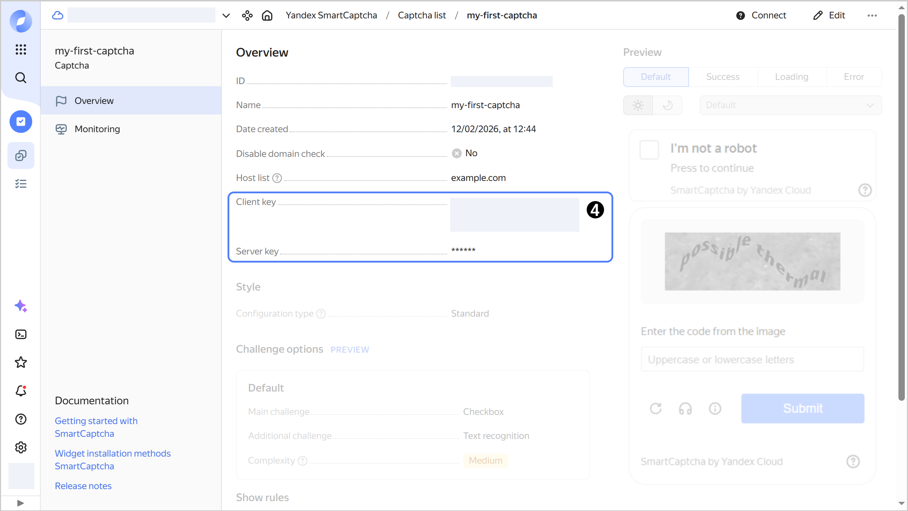

# Retrieving CAPTCHA keys 

In this section, you will learn how to retrieve the [CAPTCHA keys](../concepts/keys.md). With the client key, you can [add a {{ captcha-name }} widget](../quickstart.md#add-widget) to your page. You will need the server key to [check the user response](../quickstart.md#check-answer).



- Management console {#console}

    1. In the [management console]({{ link-console-main }}), select a folder.
    1. [Go](../../console/operations/select-service.md#select-service) to **{{ ui-key.yacloud.iam.folder.dashboard.label_smartcaptcha }}**.
    1. Click the name of the CAPTCHA or [create](../quickstart.md#creat-captcha) a new one.
    1. In the **{{ ui-key.yacloud.common.overview }}** tab, copy the **{{ ui-key.yacloud.smartcaptcha.label_client-key }}** and **{{ ui-key.yacloud.smartcaptcha.label_server-key }}** field values.

       

- API {#api}

  To get a [server key](../concepts/keys.md), use the [GetSecretKey](../api-ref/Captcha/getSecretKey.md) REST API method for the [Captcha](../api-ref/Captcha/index.md) resource or the [CaptchaService/GetSecretKey](../api-ref/grpc/Captcha/getSecretKey.md) gRPC API call.


