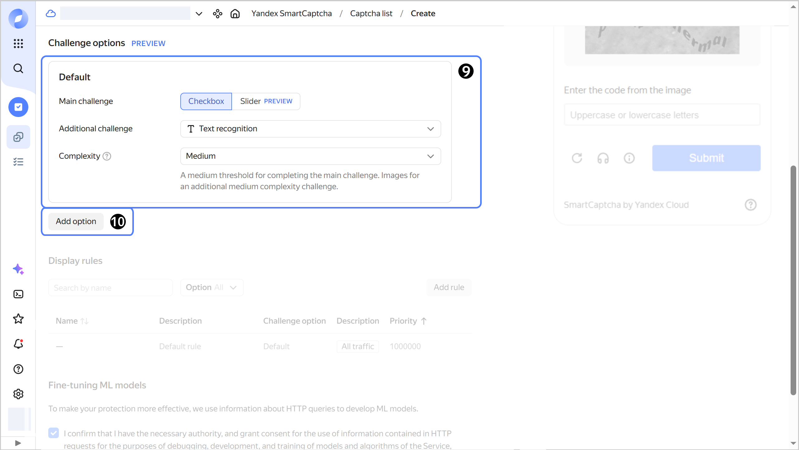

# Getting started with {{ captcha-full-name }}

{{ captcha-full-name }}: Service for protection against bots and automated attacks.

To add a CAPTCHA to your HTML page:

1. [Create a CAPTCHA](#create-captcha) in {{ yandex-cloud }}.
1. [Copy keys](#get-keys) from the CAPTCHA info page.
1. [Add the CAPTCHA widget code](#add-widget) to your HTML page.
1. [Check the user's response](#check-answer) by sending a POST request.

If having problems configuring {{ captcha-name }}:

* For the Business and Premium [support plans](../support/pricing.md), contact [support]({{ link-console-support }}).
* In other cases, ask your account manager to contact the service’s support team.

## Getting started {#before-begin}

1. Navigate to the [management console]({{ link-console-main }}). Log in to {{ yandex-cloud }} or register if you do not have an account yet.
1. On the [**{{ ui-key.yacloud_billing.billing.label_service }}**]({{ link-console-billing }}) page, make sure you have a [billing account](../billing/concepts/billing-account.md) linked and its status is `ACTIVE` or `TRIAL_ACTIVE`. If you do not have a billing account, [create one](../billing/quickstart/index.md).


## Create a CAPTCHA {#create-captcha}





- Management console {#console}

    1. In the [management console]({{ link-console-main }}), select a folder.
    1. [Navigate](../console/operations/select-service.md#select-service) to **{{ ui-key.yacloud.iam.folder.dashboard.label_smartcaptcha }}**.
    1. Click **{{ ui-key.yacloud.smartcaptcha.button_captcha-settings-create }}**.

    1. Enter a name for the CAPTCHA, e.g., `sm-captcha`.
    1. List the sites the CAPTCHA will be on, e.g., `my-shop.com`.
    1. Do not edit the **{{ ui-key.yacloud.smartcaptcha.label_section-style }}** field.
    1. Select the default CAPTCHA settings (or leave the current ones):
       1. [Main challenge](./concepts/tasks.md#main-task): The challenge the user will see first.
       1. [Additional challenge](./concepts/tasks.md#additional-task): The challenge the user will be offered if the service finds the results of the main one suspicious, or if the CAPTCHA is at maximum difficulty.
       1. Select the [difficulty level](./concepts/tasks.md#task-difficulty), `{{ ui-key.yacloud.smartcaptcha.value_complexity-medium }}`.

         You can add [challenge options](concepts/captcha-variants.md) and configure incoming traffic rules to show different CAPTCHAs to different users. In this example, you will configure a single default CAPTCHA for all users.

       

    1. Click **{{ ui-key.yacloud.common.create }}**.




## Retrieve the CAPTCHA keys {#get-keys}



- Management console {#console}
    
    After creating a CAPTCHA, select it from the list and copy the two keys:
    * **{{ ui-key.yacloud.smartcaptcha.label_client-key }}**: To add a {{ captcha-name }} widget to the your website or HTML page.
    * **{{ ui-key.yacloud.smartcaptcha.label_server-key }}**: To [check the user response](#check-answer).

    Store them in a secure place.

    



## Add the widget to the page {#add-widget}

Add the widget automatically:

1. Add the JS script to your HTML page. To do this, place the following code anywhere on the page, e.g., inside the `<head>` tag:

    ```html
    <script src="https://{{ captcha-domain }}/captcha.js" defer></script>
    ```

    The `captcha.js` script will automatically find all `div` elements with the `smart-captcha` class and install the widget in them.

1. Add an empty container (`div` element) for the CAPTCHA widget to the page:

    ```html
    <div
        id="captcha-container"
        class="smart-captcha"
        data-sitekey="<client_key>"
    ></div>
    ```

    Where `<client_key>` is the key you copied after creating the CAPTCHA.

    

The **I’m not a robot** button will appear on the page. When a user clicks the button, {{ captcha-name }} will validate their request.
If the request seems suspicious, {{ captcha-name }} will ask the user to solve a CAPTCHA challenge.

## Check the user response {#check-answer}

After the CAPTCHA verification, the user is issued a unique token placed into the CAPTCHA widget container on the HTML page as `<input>`:

```html
<div id="captcha-container" class="smart-captcha" ...>
    <input type="hidden" name="smart-token" value="<token>">
    ...
</div>
```

To validate the token, send a POST request to `https://{{ captcha-domain }}/validate` providing the following parameters in `x-www-form-urlencoded` format:

```
secret=<server_key>&token=<token>&ip=<user_IP_address>
```

Where:



Example of the token validation function:



- cURL {#curl}

    ```bash
    curl -X POST https://{{ captcha-domain }}/validate \
      -d "secret=<server_key>" \
      -d "token=<token_from_form>" \
      -d "ip=<user_IP_address>"
    ```

- Node.js {#node}

    ```js
    const https = require('https'),
        querystring = require('querystring');

    const SMARTCAPTCHA_SERVER_KEY = "<server_key>";


    function check_captcha(token, callback) {
        const postData = querystring.stringify({
            secret: SMARTCAPTCHA_SERVER_KEY,
            token: token,
            ip: '<user_IP_address>', // Method for retrieving the user IP address depends on your framework and proxy.
        });
    
        const options = {
            hostname: '{{ captcha-domain }}',
            port: 443,
            path: '/validate',
            method: 'POST',
            headers: {
                'Content-Type': 'application/x-www-form-urlencoded',
                'Content-Length': Buffer.byteLength(postData),
            },
        };
    
        const req = https.request(options, (res) => {
            let content = '';
    
            res.on('data', (chunk) => {
                content += chunk;
            });
    
            res.on('end', () => {
                if (res.statusCode !== 200) {
                    console.error(`Allow access due to an error: code=${res.statusCode}; message=${content}`);
                    callback(true);
                    return;
                }
    
                try {
                    const parsedContent = JSON.parse(content);
                    callback(parsedContent.status === 'ok');
                } catch (err) {
                    console.error('Error parsing response: ', err);
                    callback(true);
                }
            });
        });
    
        req.on('error', (error) => {
            console.error(error);
            callback(true);
        });
    
        // Writing the POST data to the request body
        req.write(postData);
        req.end();
    }


    let token = "<token>";
    check_captcha(token, (passed) => {
        if (passed) {
            console.log("Passed");
        } else {
            console.log("Robot");
        }
    });
    ```

- PHP {#php}

    ```php
    define('SMARTCAPTCHA_SERVER_KEY', '<server_key>');

    function check_captcha($token) {
        $ch = curl_init("https://{{ captcha-domain }}/validate");
        $args = [
            "secret" => SMARTCAPTCHA_SERVER_KEY,
            "token" => $token,
            "ip" => "<user_IP_address>", // You need to provide the user IP address.
                        // Method for retrieving the user IP depends on your proxy.
        ];
        curl_setopt($ch, CURLOPT_TIMEOUT, 1);
        curl_setopt($ch, CURLOPT_POST, true);
        curl_setopt($ch, CURLOPT_POSTFIELDS, http_build_query($args));
        curl_setopt($ch, CURLOPT_RETURNTRANSFER, true);
    
        $server_output = curl_exec($ch); 
        $httpcode = curl_getinfo($ch, CURLINFO_HTTP_CODE);
        curl_close($ch);
    
        if ($httpcode !== 200) {
            echo "Allow access due to an error: code=$httpcode; message=$server_output\n";
            return true;
        }
     
        $resp = json_decode($server_output);
        return $resp->status === "ok";
    }

    $token = "<token>"; // For example, $_POST['smart-token'];
    if (check_captcha($token)) {
        echo "Passed\n";
    } else {
        echo "Robot\n";
    }
    ```

- Python {#python}

    ```py
    import requests
    import sys
    import json

    SMARTCAPTCHA_SERVER_KEY = "<server_key>"

    def check_captcha(token):
        resp = requests.post(
           "https://{{ captcha-domain }}/validate",
           data={
              "secret": SMARTCAPTCHA_SERVER_KEY,
              "token": token,
              "ip": "<user_IP_address>"   # Method for retrieving the IP address depends on your framework and proxy.
                                                # In Flask, for example, this can be `request.remote_addr`
           },
           timeout=1
        )
        server_output = resp.content.decode()
        if resp.status_code != 200:
           print(f"Allow access due to an error: code={resp.status_code}; message={server_output}", file=sys.stderr)
           return True
        return json.loads(server_output)["status"] == "ok"

    token = "<token>"  # For example, request.form["smart-token"]
    if check_captcha(token):
        print("Passed")
    else:
        print("Robot")
    ```



In its response, the service will return a JSON object containing the following fields:

* `status`: Validation result, `ok` or `failed`. If the validation is successful, the JSON object is updated with the `host` field indicating the website where validation took place.
* `message`: Validation message, e.g., `Invalid or expired Token`.

To process responses correctly, refer to their `status` field. Use the `message` field for diagnostic purposes only.
  
For response examples and processing details, see [User validation](concepts/validation.md#service-response).

## FAQ {#faq}

**How do I test a CAPTCHA?**

Open the CAPTCHA page in incognito mode or use a VPN to increase the chance of getting a challenge.

**How do I customize the CAPTCHA appearance?**

See [Advanced widget settings](./concepts/widget-methods.md).

**What should I do if a CAPTCHA does not appear?**

Make sure the domain is listed among the allowed websites in the CAPTCHA settings.

## Useful links {#links}

* [Widget rendering methods](./concepts/widget-methods.md)
* [Style customization options](./concepts/captcha-variants.md)
* [API Reference](./api-ref/)