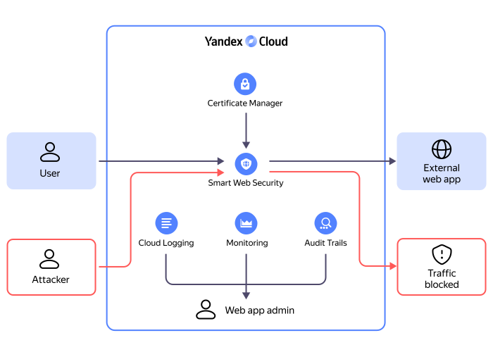

# Protecting web applications in an external infrastructure



{{ sws-name }} enables protection of web applications deployed both in and beyond {{ yandex-cloud }}, e.g., in your internal infrastructure or on another hosting service. {{ sws-name }} provides various means to protect your infrastructure against cybersecurity threats at the application layer (L7) of the OSI model. These may include DDoS attacks, [bot](https://ru.wikipedia.org/wiki/Ботнет) attacks, [SQL injections](https://ru.wikipedia.org/wiki/Внедрение_SQL-кода), [cross-site scripting](https://ru.wikipedia.org/wiki/Межсайтовый_скриптинг), etc.

## External resource protection: how it works {#scheme-protect}

All external requests to a web application go through {{ sws-name }}. To decrypt and analyze HTTPS traffic, you need to upload the private key and certificate of the server the web application is running on to [{{ certificate-manager-name }}](../../certificate-manager/). After analysis, malicious requests are blocked, while the others are redirected to the web application.

The web application admin has access to real-time traffic statistics, such as the total number of requests, number of requests blocked by different profiles, etc.

## Domain protection components {#components}

Incoming traffic is filtered with reverse proxying. All HTTP requests from website visitors or a web app are redirected to the target resource via a {{ sws-name }} proxy server. One or more domains of the protected resource connect to the proxy server. You can assign a domain a [security profile](profiles.md) where you will set up anti-DDoS protection, a web application firewall (WAF) and, if you need to, limit the app load using Advanced Rate Limiter (ARL).

Essentially, to implement protection of web applications or backends, you need to configure a proxy server and a domain and also add a certificate for decrypting and checking HTTPS traffic.

### Proxy server {#proxy}

The _proxy server_ acts as an intermediary for all user requests to your website or application. It has a dedicated IP address for receiving requests, so your server’s IP address will be hidden from external users. The proxy server has a preconfigured load balancer, which ensures stable performance in case there are many external requests, and active basic [DDoS protection](../../vpc/ddos-protection/).



The proxy server has an MTU limit of 1,450 bytes for all packets.



For the proxy server to receive requests sent to your domain, you need to set up redirection. To do this, add an A record for the DNS in the following format: `<proxy_server_IP_address> : <domain_address>`. The proxy server’s IP address will become available once it is created in the proxy server parameters. You can add an A record via your hosting provider account or domain registrar account. Also, you can delegate domain management to [{{ dns-full-name }}](../../dns/). In which case A records are set up in {{ yandex-cloud }}.

It usually takes a few minutes to activate redirection. In some cases, this may take up to 24 hours.

You can add multiple proxy servers, for example, to separate the application's stable version from a version under development.

You can configure logging for each proxy server. You can write all logs or filter them to save space in the storage.

You can connect multiple domains to a proxy server. For details on the number of domains, see [{#T}](limits.md).

### Domain {#domain}

When setting up the domain, you need to specify:

* _Domain address_, which is your website or web application address purchased from your DNS or hosting provider. You must be authorized to manage DNS A records.

* _Connection type_ used by your website, HTTPS or HTTP. The recommended option is HTTPS as it establishes an encrypted connection between a user and your application.

    When selecting the HTTPS protocol, you need to add a TLS certificate and private key in PEM format. {{ sws-name }} checks the validity period and whether the added certificate matches the key. An invalid certificate will not be uploaded.

    The certificate and key are used for terminating a TLS connection from a user to your web app. To verify traffic security, {{ sws-name }} will encrypt and analyze traffic.

    If HTTPS is not yet configured for your web application, you can get a Let's Encrypt certificate in [{{ certificate-manager-full-name }}](../../certificate-manager/operations/managed/cert-create.md). You can do this in advance or when adding the domain.

    To obtain the Let's Encrypt certificate, you need to confirm your domain ownership. To do this, you need access to your account on your registrar’s website or to the host the domain is linked to.

    Also, you can use the unprotected HTTP, but we recommend using it for test purposes only. Normally, when users visit such websites, browsers warn them the website is not secure.
  
* _Target resources_, which are web servers or backends to receive verified and secure traffic. For target resources, you must specify the IP address and port used by your web application.

    To send encrypted traffic from {{ sws-name }} to your application, enable HTTPS and add a TLS certificate. The certificate’s validity is not checked, so you need to control it yourself.

After setting up the domain, you can connect a [security profile](profiles.md) to it. A security profile contains rules for checking and filtering requests to your web application.

## Additional security measures {#security-rule}

To make sure your website or application gets only verified and secure requests from {{ sws-name }}:

* Block all incoming requests.
* Add only [{{ yandex-cloud }} addresses](../../overview/concepts/public-ips.md) to the list of allowed ones. The list of addresses will also be available in domain parameters under **How to activate protection**.