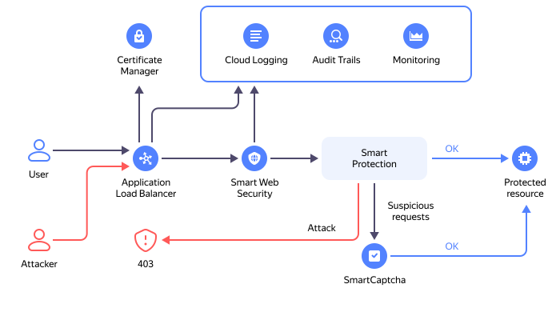

# {{ sws-full-name }} overview

{{ sws-full-name }} is a service for protection against DDoS attacks and bots at the [OSI model](https://en.wikipedia.org/wiki/OSI_model) L7 application level.

{{ sws-name }} is at the [Preview stage](../../overview/concepts/launch-stages.md). At this stage, you can connect the service to [{{ alb-full-name }}](../../application-load-balancer/) [virtual hosts](../../application-load-balancer/concepts/http-router.md#virtual-host).



In a nutshell, the service checks whether HTTP requests sent to the protected resource via the L7 load balancer's virtual host comply with the [rules](rules.md) set in the [security profile](profiles.md). Depending on the check results, the requests are routed to the virtual host, denied, or sent to [{{ captcha-full-name }}](../../smartcaptcha/) for additional verification.

{{ sws-name }} logs are sent to [{{ cloud-logging-full-name }}](../../logging/).

{{ sws-name }} metrics are sent to [{{ monitoring-full-name }}](../../monitoring/).

{{ sws-name }} audit logs are sent to [{{ at-full-name }}](../../audit-trails/).
