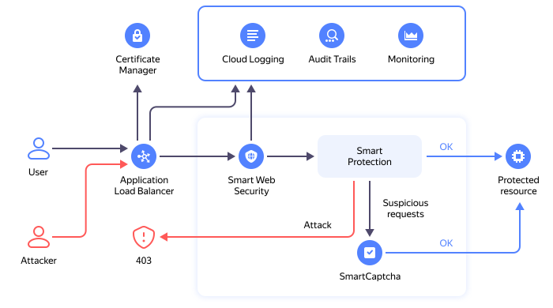

# {{ sws-full-name }} overview



## How it works {#how-it-works}

{{ sws-name }} checks HTTP requests addressed to the protected resource for compliance with the [rules](rules.md) configured in a [security profile](profiles.md). You can connect your security profile to a [virtual host of an L7 load balancer](../operations/host-connect.md#host), [domain](../operations/host-connect.md#domain), or API gateway. Depending on the results of the check, requests are routed to the resource, blocked, or sent to [{{ captcha-full-name }}](../../smartcaptcha/) for additional verification.





## Monitoring and audit {#monitoring-audit}

{{ sws-name }} logs are sent to [{{ cloud-logging-full-name }}](../../logging/).

{{ sws-name }} metrics are sent to [{{ monitoring-full-name }}](../../monitoring/).

{{ sws-name }} audit logs are sent to [{{ at-full-name }}](../../audit-trails/).



## {{ alb-name }} setup recommendations {#alb-settings-recommendation}



