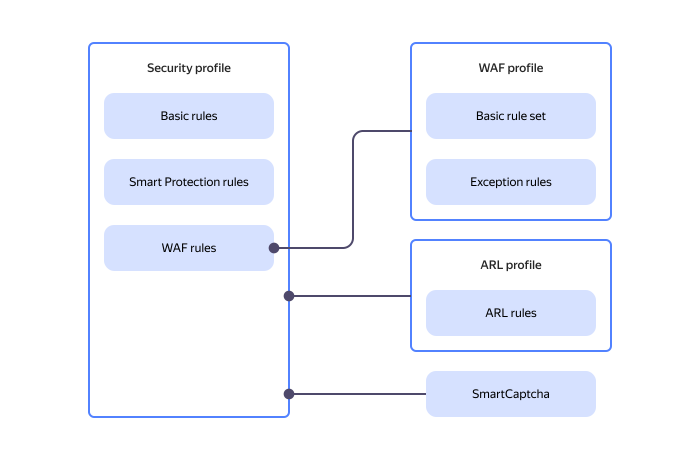

# Creating a security profile







- Management console {#console}

  1. In the [management console]({{ link-console-main }}), select the [folder](../../resource-manager/concepts/resources-hierarchy.md#folder) where you want to create your [security profile](../concepts/profiles.md).
  1. From the list of services, select **{{ ui-key.yacloud.iam.folder.dashboard.label_smartwebsecurity }}**.
  1. Click **{{ ui-key.yacloud.smart-web-security.action_empty }}**.
  1. Select one of the creation options:
      * **{{ ui-key.yacloud.smart-web-security.title_default-template }}** (recommended). A preset profile includes:

        * [Basic default rule](../concepts/rules.md#base-rules) enabled for all traffic with the `{{ ui-key.yacloud.smart-web-security.overview.cell_sec-action-deny }}` [action type](../concepts/rules.md#rule-action).
        * [Smart Protection rule](../concepts/rules.md#smart-protection-rules) enabled for all traffic with the `{{ ui-key.yacloud.smart-web-security.overview.cell_mode-full }}` action type.
      * **{{ ui-key.yacloud.smart-web-security.title_no-template }}**. This profile includes only the basic default rule enabled for all traffic.

  1. Enter the profile name.
  1. (Optional) Enter a description.
  1. (Optional) Add [labels](../../resource-manager/concepts/labels.md) for your profile.
  1. In the **{{ ui-key.yacloud.smart-web-security.form.label_default-action }}** field, select an action to apply to traffic not covered by the other rules: `{{ ui-key.yacloud.smart-web-security.form.label_action-deny }}` or `{{ ui-key.yacloud.smart-web-security.form.label_action-allow }}`.
  1. Select or create an [ARL profile](../operations/arl-profile-create.md) to limit the number of requests.
  1. Select or create a [{{ captcha-full-name }}](../../smartcaptcha/) to verify suspicious requests:

        

  1. 
  1. Click  **{{ ui-key.yacloud.smart-web-security.form.button_add-rule }}**.
  1. In the rule creation window:

      

  1. Add all relevant rules to the profile one by one.

      The rules you created will appear under **{{ ui-key.yacloud.smart-web-security.form.section_security-rules }}** in the table.
  1. Optionally, enable or disable the use of HTTP request information to improve machine learning models under **{{ ui-key.yacloud.component.disallow-data-processing.title_ml-model-training }}**.
  1. Click **{{ ui-key.yacloud.common.create }}**.

- CLI {#cli}

  

  

  1. View the description of the [CLI](../../cli/quickstart.md) command for creating a [security profile](../concepts/profiles.md):

     ```bash
     yc smartwebsecurity security-profile create --help
     ```

  1. To create a security profile, run this command:

     ```bash
     yc smartwebsecurity security-profile create \
        --name <security_profile_name> \
        --description "<profile_description>" \
        --labels <label_1_key>=<label_1_value>,<label_2_key>=<label_2_value>,...,<label_n_key>=<label_n_value> \
        --default-action <action> \
        --captcha-id <captcha_ID> \
        --security-rules-file <path_to_file_with_rules>
     ```

     Where:

     * `--name`: Security profile name. This is a required parameter. If you specify only the profile name without additional parameters, a single [basic rule](../concepts/rules.md#base-rules) will be created in the security profile.
     * `--description`: Text description of the security profile. This is an optional parameter.
     * `--labels`: List of [labels](../../resource-manager/concepts/labels.md) to add to the profile in `KEY=VALUE` format. This is an optional parameter. E.g., `--labels foo=baz,bar=baz'`.
     * `--default-action`: Action to apply to traffic not covered by the other rules. This is an optional parameter. The default value is `allow`, which allows all requests to {{ sws-full-name }}. To block requests, set the parameter to `deny`.
     * `--captcha-id`: ID of the CAPTCHA in [{{ captcha-full-name }}](../../smartcaptcha/) to verify suspicious requests. This is an optional parameter.
      * `--security-rules-file`: Path to the [YAML](https://en.wikipedia.org/wiki/YAML) file with security rule description. This is an optional parameter. For example:

          

     Result:

     ```text
     id: fev6q4qqnn2q********
     folder_id: b1g07hj5r6i********
     cloud_id: b1gia87mbaom********
     name: my-sample-profile
     description: "my description"
     labels: label1=value1,label2=value2
     default_action: DENY
     created_at: "2024-07-25T19:21:05.039610Z"
     ```

  For more information about the `yc smartwebsecurity security-profile create` command, see the [CLI reference](../../cli/cli-ref/smartwebsecurity/cli-ref/security-profile/create.md).

- {{ TF }} {#tf}

  

  

  1. In the {{ TF }} configuration file, define the parameters of the resources you want to create:

      ```hcl
      resource "yandex_sws_security_profile" "demo-profile-simple" {
        name                             = "<security_profile_name>"
        default_action                   = "DENY"
        captcha_id                       = "<captcha_ID>"
        advanced_rate_limiter_profile_id = "<ARL_profile_ID>"

        # Smart Protection rule
        security_rule {
          name     = "smart-protection"
          priority = 99999

          smart_protection {
            mode = "API"
          }
        }

        # Basic rule
        security_rule {
          name = "base-rule-geo"
          priority = 100000
          rule_condition {
            action = "ALLOW"
            condition {
              source_ip {
                geo_ip_match {
                  locations = ["ru", "kz"]
                }
              }
            }
          }
        }

        # WAF profile rule
        security_rule {
          name     = "waf"
          priority = 88888

          waf {
            mode           = "API"
            waf_profile_id = "<WAF_profile_ID>"
          }
        }
      }
      ```

      Where:
      * `name`: Security profile name.
      * `default_action`: Action for the default basic rule. The action will apply to traffic not covered by the other rules. The possible values are `ALLOW` (allows all requests to the service) and `DENY` (denies them).
      * `captcha_id`: ID of the CAPTCHA in [{{ captcha-full-name }}](../../smartcaptcha/) to verify suspicious requests. This is an optional parameter.
      * `advanced_rate_limiter_profile_id`: [ARL profile security](../concepts/arl.md) ID. This is an optional parameter.
      * `security_rule`: Security [rule](../concepts/rules.md) description:
         * `name`: Security rule name.
         * `priority`: Rule [priority](../concepts/rules.md). Possible values: from 1 to 1,000,000.
         * `smart_protection`: Description of the [Smart Protection rule](../concepts/rules.md#smart-protection-rules) enabled for all traffic with the action type specified in the `mode` parameter.
            * `mode`: [Rule action](../concepts/rules.md#rule-action). The possible values are `FULL`, which means full protection (suspicious requests are sent to CAPTCHA), or `API`, which means API protection (suspicious requests are blocked).
         * `waf`: Web Application Firewall rule description. To add a WAF rule, you must first [create a WAF profile](waf-profile-create.md). The optional parameter block contains:
            * `waf_profile_id`: [WAF profile](../concepts/waf.md) ID.

      If you do not specify the `smart_protection` or `waf` rule type, a basic rule will be created with simple filtering based on conditions specified under `rule_condition`.

      For more information about the `yandex_sws_security_profile` parameters in {{ TF }}, see the [relevant {{ TF }} article]({{ tf-provider-resources-link }}/sws_security_profile).

  1. Create the resources:

       

  {{ TF }} will create all the required resources. You can check the new resources using the [management console]({{ link-console-main }}) or this [CLI](../../cli/) command:

  ```bash
  yc smartwebsecurity security-profile get <security_profile_ID>
  ```

- API {#api}

  Use the [create](../api-ref/SecurityProfile/create.md) REST API method for the [SecurityProfile](../api-ref/SecurityProfile/) resource or the [SecurityProfileService/Create](../api-ref/grpc/SecurityProfile/create.md) gRPC API call.



### See also {#see-also}

* [{#T}](host-connect.md)
* [{#T}](profile-update.md)
* [{#T}](profile-delete.md)
