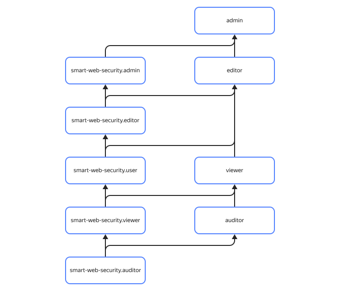

# Access management in {{ sws-name }}

In this section, you will learn:

* [Which resources you can assign a role for](#resources).
* [Which roles exist in the service](#roles).



Roles for a resource can be assigned by users who have the `smart-web-security.admin` role or one of the following roles for that resource:



## Which resources you can assign a role for {#resources}

You can assign a role for an [organization](../../organization/), [cloud](../../resource-manager/concepts/resources-hierarchy.md#cloud), or [folder](../../resource-manager/concepts/resources-hierarchy.md#folder). Roles assigned for an organization, cloud, or folder also apply to security profiles in them.

## Which roles exist in the service {#roles-list}



### Service roles {#service-roles}

#### smart-web-security.auditor {#smart-web-security-auditor}



#### smart-web-security.viewer {#smart-web-security-viewer}



#### smart-web-security.user {#smart-web-security-user}



#### smart-web-security.editor {#smart-web-security-editor}



#### smart-web-security.admin {#smart-web-security-admin}



### Primitive roles {#primitive-roles}



