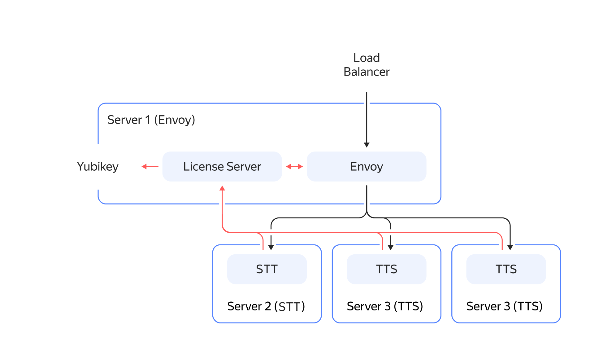
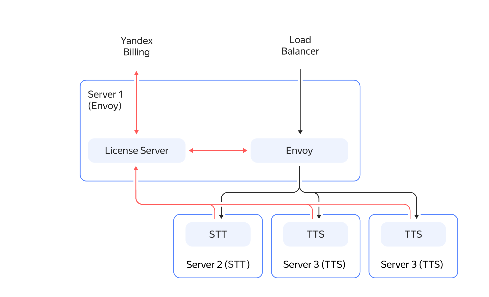

# {{ sk-hybrid-name }} service architecture

The {{ sk-hybrid-name }} service includes the following components:

* **[Envoy](https://www.envoyproxy.io/docs)**: Routing server that receives incoming gRPC requests and determines the {{ sk-hybrid-name }} components to handle them.
* **License server**: Envoy dynamic configuration server for accounting Yubikey licenses or providing data for billing.
* **STT server**: Speech recognition server.
* **TTS server**: Speech synthesis server.

## Relationship between {{ sk-hybrid-name }} components {#components-interaction}

Component relationships depend on the licensing model selected by a partner.

### Yubikey {#yubikey}

The License server limits the maximum number of speech recognition sessions and maximum performance (requests per second) for speech synthesis. These parameters are read from a [Yubikey hardware authentication device](https://yubico.com). To increase their values, purchase additional Yubikey hardware authentication devices. The component relationships are shown on the diagram below:

### Cloud Billing {#billing}

No limit on the number of sessions and requests per second. Information about each service request is sent to Yandex Billing. Total service usage fees are specified in a payment invoice issued to a partner in their billing account. The component relationships are shown on the diagram below:

