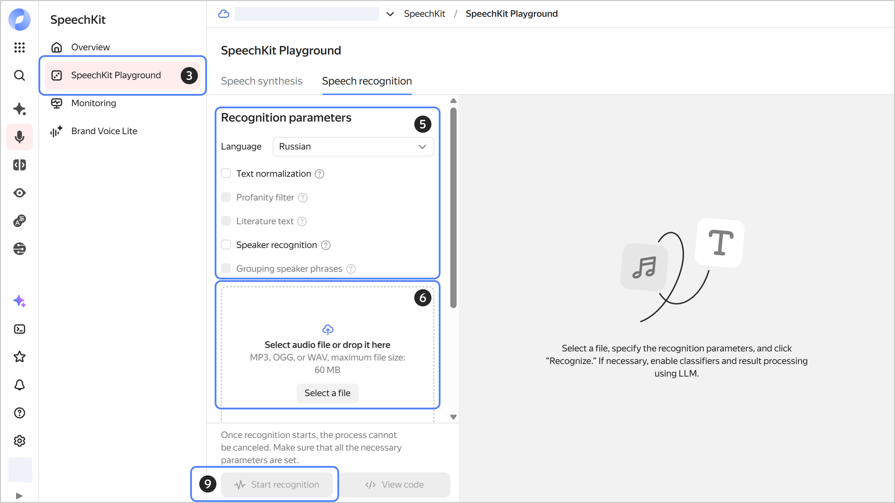

# Speech recognition using Playground

To recognize speech from an audio file via the {{ speechkit-name }} Playground:



- Management console {#console}

  1. In the [management console]({{ link-console-main }}), select the [folder](../../resource-manager/concepts/resources-hierarchy.md#folder) you are going to use to work with {{ speechkit-name }}.
  1. [Go](../../console/operations/select-service.md#select-service) to **{{ ui-key.yacloud.iam.folder.dashboard.label_speechkit }}**.
  1. In the left-hand panel, select  **{{ ui-key.yacloud.speechkit.label_playground }}**.
  1. Navigate to the **{{ ui-key.yacloud.yagpt.speechkit.services.stt.title }}** tab.
  1. Under **{{ ui-key.yacloud.speechkit.speech-to-text-v2.recognition-params-section_title_1EDuy }}**:
  
     * **{{ ui-key.yacloud.speechkit.speech-to-text.field_language }}**: Select the language or leave `{{ ui-key.yacloud.speechkit.speech-to-text.label_language-auto }}`.
     * **{{ ui-key.yacloud.speechkit.speech-to-text.field_text-normalization }}**: Presents dates and times in numerical format, converts numbers from text to digits, and provides access to additional settings.
     * **{{ ui-key.yacloud.speechkit.speech-to-text.field_profanity-filter }}**: Masks profanity.
     * **{{ ui-key.yacloud.speechkit.speech-to-text.field_literature-text }}**: Adds capital letters and punctuation marks.
     * **{{ ui-key.yacloud.speechkit.SpeechToTextFormV2.SpeakerLabelingForm.field_speaker-splitting_dqi2d }}**: Attributes each recognized phrase to a particular speaker.
     * **{{ ui-key.yacloud.speechkit.SpeechToTextFormV2.SpeakerLabelingForm.field_speaker-grouping_2eSt9 }}**: Divides phrases into two groups by speaker.
  
  1. Click **Select file** or drag the audio file to the loading area.

     
   
     Convert the file to a supported [audio format](../formats.md) beforehand: MP3, WAV, or OGG with the OPUS audio codec. Maximum file size: 60 MB.
     
     

  1. **{{ ui-key.yacloud.speechkit.SpeechToTextFormV2.ClassificationField.classification-label_6C7VV }}**: Finds phrases of a given category in the text, e.g., greetings, negative or obscene language. This works only for Russian.
  1. **{{ ui-key.yacloud.speechkit.SpeechToTextFormV2.SummarizationField.summarization-label_rm8oc }}**: Processing of results with the help of an LLM:
  
     * **Model**: Select a model for processing. The processing [cost](../../ai-studio/pricing.md) depends on the model you select.
     * **{{ ui-key.yacloud.speechkit.SpeechToTextFormV2.InstructionField.label_htJqL }}**:
        * Enter a prompt in the input field or select a ready-made one.
        * **{{ ui-key.yacloud.speechkit.SpeechToTextFormV2.InstructionField.type-select-label_cLWcs }}**: Specify your preferred recognition result format.
        *  **{{ ui-key.yacloud.speechkit.SpeechToTextFormV2.SummarizationField.add-instruction-button_kdko4 }}**: Add another instruction. You can add up to five instructions in total.
  
  1. Click  **{{ ui-key.yacloud.speechkit.speech-to-text-v2.label_button_start-recognition }}** to start speech recognition for the audio file.

     Recognition may take from a few seconds to a few minutes depending on the audio file size.

  1. Click  **View code** to get the request code for Python REST or Python gRPC.

  
  
  {{ speechkit-name }} Playground features basic speech recognition options. For more flexible recognition settings, use the [API](../stt/index.md).

