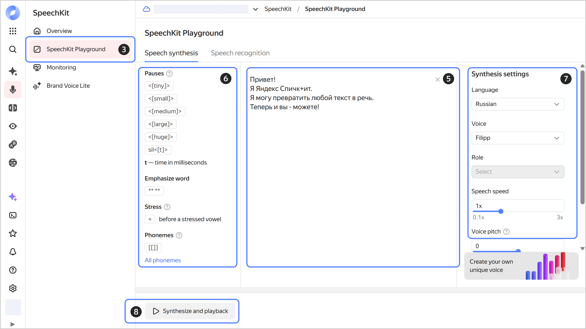

# Getting started with {{ speechkit-name }}

You can test speech recognition and synthesis on the {{ speechkit-name }} [demo page](https://yandex.cloud/en/services/speechkit#demo). For information on pricing, see [{#T}](../pricing.md).

## Getting started {#before-you-begin}



- Management console {#console}

  1. Navigate to the [management console]({{ link-console-main }}) and log in to {{ yandex-cloud }} or sign up if not signed up yet. For information on how to get started with {{ yandex-cloud }}, see [Getting started with {{ yandex-cloud }}](../../getting-started/).
  1. Accept the user agreement.
  1. In [{{ billing-name }}]({{ link-console-billing }}), make sure you have a [billing account](../../billing/concepts/billing-account.md) linked and its status is `ACTIVE` or `TRIAL_ACTIVE`. If you do not have a billing account yet, [create one](../../billing/quickstart/index.md#create_billing_account).



## Speech recognition {#stt}



- Management console {#console}

  1. In the [management console]({{ link-console-main }}), select the [folder](../../resource-manager/concepts/resources-hierarchy.md#folder) you are going to use to work with {{ speechkit-name }}.
  1. [Go](../../console/operations/select-service.md#select-service) to **{{ ui-key.yacloud.iam.folder.dashboard.label_speechkit }}**.
  1. In the left-hand panel, select  **{{ ui-key.yacloud.speechkit.label_playground }}**.
  1. Navigate to the **{{ ui-key.yacloud.yagpt.speechkit.services.stt.title }}** tab.
  1. Under **{{ ui-key.yacloud.speechkit.speech-to-text-v2.recognition-params-section_title_1EDuy }}**:
  
     * **{{ ui-key.yacloud.speechkit.speech-to-text.field_language }}**: Select the language or leave `{{ ui-key.yacloud.speechkit.speech-to-text.label_language-auto }}`.
     * **{{ ui-key.yacloud.speechkit.speech-to-text.field_text-normalization }}**: Presents dates and times in numerical format, converts numbers from text to digits, and provides access to additional settings.
     * **{{ ui-key.yacloud.speechkit.speech-to-text.field_profanity-filter }}**: Masks profanity.
     * **{{ ui-key.yacloud.speechkit.speech-to-text.field_literature-text }}**: Adds capital letters and punctuation marks.
     * **{{ ui-key.yacloud.speechkit.SpeechToTextFormV2.SpeakerLabelingForm.field_speaker-splitting_dqi2d }}**: Attributes each recognized phrase to a particular speaker.
     * **{{ ui-key.yacloud.speechkit.SpeechToTextFormV2.SpeakerLabelingForm.field_speaker-grouping_2eSt9 }}**: Divides phrases into two groups by speaker.
  
  1. Click **Select file** or drag the audio file to the loading area.
  1. **{{ ui-key.yacloud.speechkit.SpeechToTextFormV2.ClassificationField.classification-label_6C7VV }}**: Finds phrases of a given category in the text, e.g., greetings, negative or obscene language. This works only for Russian.
  1. **{{ ui-key.yacloud.speechkit.SpeechToTextFormV2.SummarizationField.summarization-label_rm8oc }}**: Processing of results with the help of an LLM:
  
     * **Model**: Select a model for processing. The processing [cost](../../ai-studio/pricing.md) depends on the model you select.
     * **{{ ui-key.yacloud.speechkit.SpeechToTextFormV2.InstructionField.label_htJqL }}**:
        * Enter a prompt in the input field or select a ready-made one.
        * **{{ ui-key.yacloud.speechkit.SpeechToTextFormV2.InstructionField.type-select-label_cLWcs }}**: Specify your preferred recognition result format.
        *  **{{ ui-key.yacloud.speechkit.SpeechToTextFormV2.SummarizationField.add-instruction-button_kdko4 }}**: Add another instruction. You can add up to five instructions in total.
  
  1. Click  **{{ ui-key.yacloud.speechkit.speech-to-text-v2.label_button_start-recognition }}** to start speech recognition for the audio file.
  1. Click  **View code** to get the request code for Python REST or Python gRPC.

  
  
  For a detailed guide, see [{#T}](../operations/stt-playground.md).
  
  {{ speechkit-name }} Playground features basic speech recognition options. For more flexible recognition settings, use the [API](../stt/index.md).

- API {#api}

  Learn how to recognize [short](stt-quickstart-v1.md) and [long](stt-quickstart-v2.md) pre-recorded audio files in {{ speechkit-name }}. The service also supports voice recognition in [real time](../stt/api/streaming-examples-v3.md).



## Speech synthesis {#tts}



- Management console {#console}

  To convert text to audio via the {{ speechkit-name }} Playground:
  
  1. In the [management console]({{ link-console-main }}), select the [folder](../../resource-manager/concepts/resources-hierarchy.md#folder) you are going to use to work with {{ speechkit-name }}.
  1. [Go](../../console/operations/select-service.md#select-service) to **{{ ui-key.yacloud.iam.folder.dashboard.label_speechkit }}**.
  1. In the left-hand panel, select  **{{ ui-key.yacloud.speechkit.label_playground }}**.
  1. Navigate to the **{{ ui-key.yacloud.yagpt.speechkit.services.speech-synthesys.title }}** tab.
  1. Paste up to 5,000 characters of text into the central part of the window.
  1. In the settings section on the left side of the window:
  
     * **{{ ui-key.yacloud.speechkit.help-speech-synthesis.context_pauses-title }}**: Select the length of pauses between words or specify it yourself.
     * **{{ ui-key.yacloud.speechkit.help-speech-synthesis.context_word-title }}**: Emphasize the essential words.
     * **{{ ui-key.yacloud.speechkit.help-speech-synthesis.context_word-stress-title }}**: Mark the stressed vowels to clarify the correct pronunciation of the words.
     * **{{ ui-key.yacloud.speechkit.help-speech-synthesis.context_phonemes-title }}**: Monitor the correct pronunciation of words using phonemes.
  
  1. Under **{{ ui-key.yacloud.speechkit.speech-synthesis.label_synthesis-settings }}** on the right side of the window:
  
     * **{{ ui-key.yacloud.speechkit.speech-synthesis.field_language }}**: Select the speaker's language.
     * **{{ ui-key.yacloud.speechkit.speech-synthesis.field_voice }}**: Specify the speaker's voice.
     * **{{ ui-key.yacloud.speechkit.speech-synthesis.field_role }}**: Select the speaker's role.
     * **{{ ui-key.yacloud.speechkit.speech-synthesis.field_speed }}**: Set the speaker's speech rate.
     * **{{ ui-key.yacloud.speechkit.speech-synthesis.field_pitch-shift }}**: Adjust the speaker's voice pitch.
     * **{{ ui-key.yacloud.speechkit.speech-synthesis.field_audio }}**: Select the audio format.  

  1. To start synthesis, click  **{{ ui-key.yacloud.speechkit.speech-synthesis.label_button_playback }}**.
  1. To download the result, click .

  
  
  For a detailed guide, see [{#T}](../operations/tts-playground.md).
  
  {{ speechkit-name }} Playground features basic speech synthesis options. For more flexible synthesis settings, use the [API](../tts/index.md).

- API {#api}

  Learn how to convert text to audio using the {{ speechkit-name }} [API v1](tts-quickstart-v1.md) and [API v3](tts-quickstart-v3.md). The API v3 provides more flexibility for speech synthesis setup. For more information about the differences between the API versions, see [{#T}](../tts/index.md#features).



#### See also {#see-also}

* [Read more about speech recognition](../stt/index.md)
* [Read more about speech synthesis](../tts/index.md)
* [Supported audio formats](../formats.md)
* [Roles required for performing operations](../security/index.md)
* [All {{ speechkit-name }} integration examples](../tutorials/index.md)