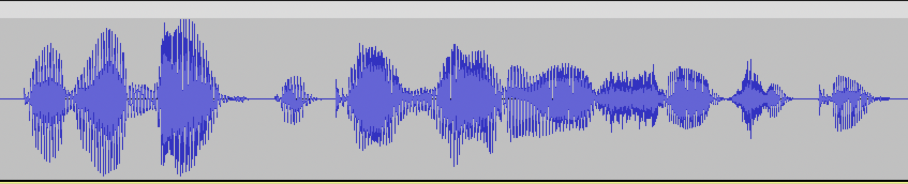

# Data for {{ brand-voice-lite-name }}

{{ brand-voice-lite-name }} allows creating your unique voice based on a minimum of marked-up audio samples. This will get you the ID of a model you will be able to access from your applications via API.

## Data required for training {#data}

To create a {{ brand-voice-lite-name }} voice of your own, you need to prepare a training _dataset_ consisting of audio recordings and the texts they are based on. Each audio must strictly match the text that comes with it.

The size of the training dataset depends on the speaker's articulation and the purpose of the new voice. For example, a voice used to narrate literary fiction would require more data than a voice for a virtual assistant. You need at least 20 minutes of audio, not counting the silence at the beginning and end of each file. The recommended duration is 40 minutes. For best results, use one hour of audio or more. To create a voice with multiple [roles](../index.md#role), you will need a separate dataset for each one.



The result of {{ brand-voice-lite-name }} voice model training directly depends on training data. To get a high-quality {{ brand-voice-lite-name }} voice, adhere to all the recommendations we give for texts and audio.



At least 30% of the training data should contain questions so that the trained voice could reproduce the interrogative tone in texts. You can use ready-made [phrases](https://storage.yandexcloud.net/doc-files/ml/brand_voice_lite_text_example-txt.zip) from the {{ speechkit-name }} team or prepare your texts by yourself. For tips on creating and formatting training texts, see [Text requirements](#text-technical-requirements).

You can upload a dataset with all audio recordings and transcripts [as a single archive](#zip), upload audio files one by one, or record an audio for each phrase [in the management console](#console-record) using your browser. In either case, make sure you follow the [audio recording recommendations](#audiotips) and listen through all your audios to ensure high quality of source data for voice model training. Once you start training, you will no longer be able to edit your dataset. 

## Text requirements {#text-technical-requirements}

The {{ speechkit-name }} team provides a ready-made body of texts you only need to vocalize. It contains narrative, interrogative, and exclamatory phrases you would need in most cases to create voices in Russian. You can also prepare your own texts for audio but make certain they meet the following requirements:

* Your texts must be free of grammatical errors.
* The recommended phrase length is no more than {{ tts-v3-count }}.
* There must not be any incomplete phrases.
  > _ing time! He won't be happy about that. If you hadn't had that argument, you could have asked for anything you wa._



## Audio recording recommendations {#audiotips}

Record in a quiet room without background noise. Fan, AC unit, fridge, street noise, background music, echo – all these will get into the recording and strongly affect the quality of your new voice. A room lined with acoustic panels would be the perfect place for your recording session. If recording at home, you can reduce echo with soft surfaces and furniture, such as a carpet, upholstered sofa, etc.

You do not have to use professional equipment to record audio. If you do not have a studio microphone, use the built-in microphone of your laptop, a smartphone, or a headset. The noise reduction feature of most headsets cuts off the beginning and end of the phrase; therefore, we recommend to turn if off. Do not change the hardware settings until you finish your recording. The distance to the microphone should be the same for all your audios.

Where possible, keep the device you are recording with unplugged from power supply: you may get acoustic interference while the battery is charging. Disable sound notifications and switch your smartphone to airplane mode to avoid sounds you do not want in your recording.

Record using maximum quality without compression. If using special sound recording software, make sure that file compression and extra filters are off.

Before you begin, check that there is no hunger, thirst, excessive salivation, or dry mouth. Remove all rustling objects and try not to move your hands and legs too often during the session. Relax, straighten out your back and neck, breathe deeply and freely. The sounds of you breathing must not drown out the audio.

Make the text sound as smooth and natural as possible. Your emotions should be aligned with the text you are reading. Keep your intonation the same for all samples within a particular role. For detailed recommendations on recording roles, see [{#T}](./roles-records.md).

If you have made a mistake in pronunciation, redo the whole phrase, do not try to correct yourself in the same audio. No inaccuracies, micro repeats, reservations, and word substitutions are allowed. Any articulation defects in the recordings the synthesis models runs on greatly degrade the quality of synthesized speech.

After you record a phrase, listen to the output audio. Make sure all words are clear and distinct, there are small stretches of silence at the beginning and end of the audio, and there is no background noise.

### Requirements for audio recordings {#requirements-audio}

If you are using special sound recording software instead the management console via your browser, make sure it meets the following criteria:

| Requirement | Value |
| --- | --- |
| Sampling frequency | 48 kHz |
| Audio bit depth | 16 bit PCM |
| Number of channels | 1 (mono) |
| Format | [WAV](https://en.wikipedia.org/wiki/WAV) |
| Duration | ≤ 15 seconds |
| Silence intervals at the beginning and end | 100–200 ms |



Each recording should contain a full phrase of one or several sentences. A recording cannot be longer than 15 seconds. The transcripts in the table must exactly match the text in the audio.



Each audio must start and end with an interval of silence; there must be no clipped sounds or words. You cannot simply take a podcast recording an cut into 15-second pieces. If you do so, the segments will have their boundaries in the middle of words or phrases and will not be aligned with logical phrases. You cannot train a high quality model on such data.

> Example of a well-prepared audio: several milliseconds of silence at the beginning and end of the audio, the phrase is complete.

> Example of a poorly made audio: no silence intervals at the beginning and end of the audio, the start and end of the phrase are cut off.

Such audio recordings will have distortions and are not suitable for model training.

## How to create a voice {#create-voice}



- Recording audio via the browser {#record}

  1. In the [management console]({{ link-console-main }}), select the [folder](../../../resource-manager/concepts/resources-hierarchy.md#folder) you are going to use to work with {{ speechkit-name }}.
  1. In the list of services, select **{{ ui-key.yacloud.iam.folder.dashboard.label_speechkit }}**.
  1. In the left-hand panel, click **{{ ui-key.yacloud.speechkit-common.brand-voice_51nd8 }}**.
  1. Click **{{ ui-key.yacloud.speechkit-common.button_create-voice_nkMBz }}**.
  1. Click **{{ ui-key.yacloud.speechkit-common.button_create-dataset_nLanW }}** and select **{{ ui-key.yacloud.speechkit-common.brand-voice_create-dataset_option_title_record-audio_jvUMz }}**.
  1. Select the data you want to record: click **Use a ready-made template** or **Upload your own texts**.
  1. Click **Record audio** ⟶ **Record** next to the text and then read the text aloud.
  1. Click  to listen to the result.
  1. If your recording contains no background noise, the phrase was recorded fully, and you can hear it well, click  **Save**. To rerecord, click  **New record**.
  1. Record audio for the remaining texts.
  1. 
  1. Click **{{ ui-key.yacloud.speechkit-common.button_create-voice_nkMBz }}** to start creating a voice.

- Uploading audio files {#audio}

  1. In the [management console]({{ link-console-main }}), select the [folder](../../../resource-manager/concepts/resources-hierarchy.md#folder) you are going to use to work with {{ speechkit-name }}.
  1. In the list of services, select **{{ ui-key.yacloud.iam.folder.dashboard.label_speechkit }}**.
  1. In the left-hand panel, click **{{ ui-key.yacloud.speechkit-common.brand-voice_51nd8 }}**.
  1. Click **{{ ui-key.yacloud.speechkit-common.button_create-voice_nkMBz }}**.
  1. Click **{{ ui-key.yacloud.speechkit-common.button_create-dataset_nLanW }}** and select **{{ ui-key.yacloud.speechkit-common.brand-voice_create-dataset_option_title_upload-audio_4D15S }}**.
  1. Select the texts used to record your audio files: click **Use a ready-made template** or **Upload your own texts**.
  1. In the row with the text, click **Add audio file**.
  1. Add audio files for the remaining texts.
  1. 
  1. Click **{{ ui-key.yacloud.speechkit-common.button_create-voice_nkMBz }}** to start creating a voice.

- Uploading a ZIP archive {#zip}

  1. In the [management console]({{ link-console-main }}), select the [folder](../../../resource-manager/concepts/resources-hierarchy.md#folder) you are going to use to work with {{ speechkit-name }}.
  1. In the list of services, select **{{ ui-key.yacloud.iam.folder.dashboard.label_speechkit }}**.
  1. Click **{{ ui-key.yacloud.speechkit-common.button_create-voice_nkMBz }}**.
  1. Click **{{ ui-key.yacloud.speechkit-common.button_create-dataset_nLanW }}** and select **{{ ui-key.yacloud.speechkit-common.brand-voice_create-dataset_option_title_upload-zip_nFtBR }}**.
  1. Drag a ZIP archive to the upload area.
  
     A ZIP archive with a fine-tuning dataset must contain:
     
     * Audio recordings in WAV format.
     * UTF-8 encoded [TSV](https://en.wikipedia.org/wiki/Tab-separated_values) table with the transcripts of recordings from the archive. The table should have two columns without headers:
        * Name of the audio file with the speaker's text.
        * Line with a verbatim transcript of the recording.
  
  1. 

  1. Click **{{ ui-key.yacloud.speechkit-common.button_create-voice_nkMBz }}** to start creating a voice.
  
  If using a [template](https://storage.yandexcloud.net/doc-files/ml/brand_voice_lite_text_example-tsv.zip) by the {{ speechkit-name }} team, add the audio file name to the beginning of each line and delete the table header line.

  **Prepared data example**

  The table header is given as an example, it must be excluded from the uploaded file.

  | recordings | text |
  |---|---|
  | 1.wav | Books accumulate pearls of human thought and preserve them for posterity. |
  | 2.wav | We have an amazing book for you! |
  | 3.wav | This book is suitable for children from the age of five. |



## Voice statuses {#statuses}

As soon as you start voice creation, the voice will appear in the list of available voices under **{{ ui-key.yacloud.speechkit-common.brand-voice_51nd8 }}**. The creation process will take several days. During this period, the voice have the `Creating` status. Once the process is complete, the voice will become available for testing and its status will switch to `Trial`. You will have seven days to use the voice for free in {{ speechkit-name }} Playground and synthesize speech via the API, only paying for the requests (see [pricing](../../pricing.md)). Once the trial period expires, the voice will be archived, its status will switch to `Archived`, and you will no longer be able to use it. Hosting archived voices is free of charge.

If you like the voice you created, you can activate it without waiting for the trial period to end. Also, you can activate an archived voice:

1. In the [management console]({{ link-console-main }}), select the [folder](../../../resource-manager/concepts/resources-hierarchy.md#folder) you are going to use to work with {{ speechkit-name }}.
1. In the list of services, select **{{ ui-key.yacloud.iam.folder.dashboard.label_speechkit }}**.
1. In the left-hand panel, click **{{ ui-key.yacloud.speechkit-common.brand-voice_51nd8 }}**.
1. Select a voice and navigate to its page.
1. In the top-right corner, click **{{ ui-key.yacloud.speechkit-common.brand-voice_button_activate_47zAB }}**. 
   Once activated, the voice will switch its status to `Active` and become available via the API and in {{ speechkit-name }} Playground without limitations. The hosting will become chargeable. 

If you no longer need the voice, you can archive it.