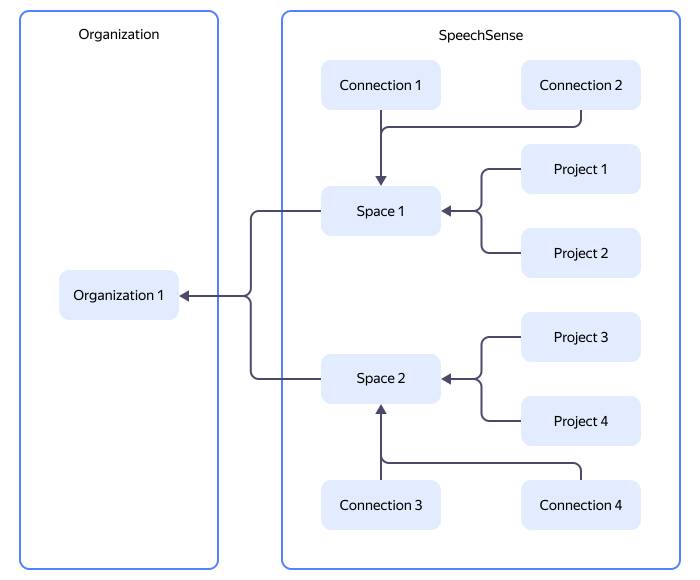

# {{ speechsense-name }} resource hierarchy

To manage dialogs in {{ speechsense-name }}, you can use spaces, connections, and projects. The chart below provides the resource hierarchy overview in {{ speechsense-name }}:

Each project and connection belongs to a single space. There are no projects and connections outside of a space.

Spaces are owned by organizations, and organizations do not interact with one another. The resources of one organization cannot interact with the resources of another one. Organizations are managed by [{{ org-full-name }}](../../organization/index.yaml).

You can [set up access](#access-rights-inheritance) in {{ speechsense-name }} at the space or project level. By default, a new organization member has no access to resources within the organization. Permissions must be granted to new members explicitly.

## {{ speechsense-name }} resources {#resources}

### Space {#space}

A _space_ is an isolated {{ speechsense-name }} entity within which you can create connections and projects. In the {{ yandex-cloud }} [resource hierarchy](../../overview/roles-and-resources.md), {{ speechsense-name }} spaces are at the same level with [{{ ml-platform-name }} communities](../../datasphere/concepts/community.md) and [clouds](../../resource-manager/concepts/resources-hierarchy.md#cloud).

A [billing account is linked](../operations/space/link-ba.md) to each space. You can use one account to [pay for resources](../pricing.md) in multiple spaces or link a separate account to each space.

### Connection {#connection}

A _connection_ is a {{ speechsense-name }} entity that contains:

* Uploaded [voice call recordings](../operations/data/upload-data.md) or [chat transcripts](../operations/data/upload-chat-text.md).
* Record types: audio or text messages.
* Record metadata received from PBXs, chats, CRM systems, or other sources.

   The metadata contains such properties as the names and IDs of the agent, customer, and bot (only for chats), as well as the conversation date and language. You can use this metadata to analyze one or more [conversations](dialogs.md) using [reports](reports/index.md).

   Here are the possible types of metadata:

   * Date in `YYYY-MM-DDTHH:MM:SSZ` format
      
      
   
   * String
   * Number
   * Fractional number
   * Boolean value
   * JSON
   * URL (link to the CRM system)

If various groups of conversations have different metadata or record types, you can create a separate connection for each group.

### Project {#project}

A _project_ is an isolated {{ speechsense-name }} entity within which you can manage dialogs. For example, in a project, you can [view a dialog](../operations/data/manage-dialogs.md#view-dialog) or [build a report](../operations/data/manage-reports.md). In the {{ yandex-cloud }} resource hierarchy, {{ speechsense-name }} projects are on the same level as [{{ ml-platform-name }} projects](../../datasphere/concepts/project.md) and [folders](../../resource-manager/concepts/resources-hierarchy.md#folder).

A project can be viewed as a cross-section of data uploaded to a connection. When [creating a project](../operations/project/create.md), you select a connection and [set up filters for dialogs](dialogs.md#filters). As a result, filtered dialogs from the connection are added to the project.



To link a dialog to a project, the dialog must be 60 days old or less, starting from the current day. If there is a dialog which is more than 60 days old in a new project, it will not be linked to this project.



Use multiple projects to group dialogs. For example, you can designate a separate project for each of your company's customers or products.

## Inheriting access permissions {#access-rights-inheritance}

When a user performs an operation in {{ speechsense-name }}, [{{ iam-full-name }}](../../iam/index.yaml) checks the user's access permissions. Permissions that can be inherited:

* Permissions for an organization extend to the organization's resources, including spaces, connections, and projects.
* Permissions for a space extend to all connections and projects within that space.
* Permissions for a project extend to all dialogs and reports within that project.

No access permissions are granted to connections. Connections are subject to space permissions. To learn more about the roles available in {{ speechsense-name }}, see [{#T}](../security/index.md).

> **Examples**:
>
> * A user with the `speech-sense.spaces.creator` role at the organization level can create a space.
> * A user with the `speech-sense.viewer` (`{{ roles-speechsense-viewer }}` in {{ speechsense-name }}) role at the space level can view data for a space as well as its nested connections and projects.
> * A user with the `speech-sense.admin` (`{{ roles-speechsense-admin }}` in {{ speechsense-name }}) role at the project level can perform any action within this project alone.

A user will not be able to access a space without space or organization level permissions.