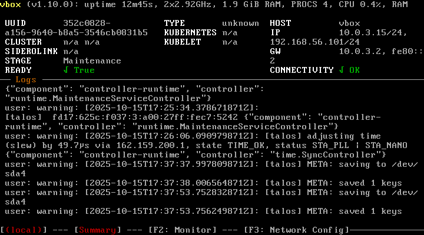
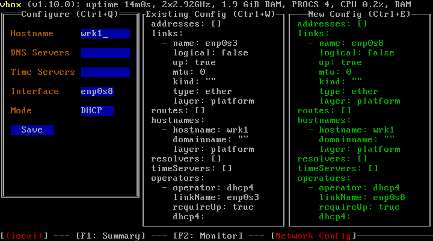

# Installation guide

This page describes how to deploy a {{ stackland-full-name }} cluster on a pre-configured infrastructure.

## Getting started {#prerequisites}

### Infrastructure {#infrastructure}

To deploy {{ stackland-name }}, you need the following minimum infrastructure:

* Three servers or VMs with 32 vCPUs and 64 GB RAM connected via an L2 network.
* Each server must have at least two disks of 100 GB or more: one to install the system and the other, to store data. On `control-plane` servers, make sure to use an SSD to install the system.
* Computer or jump host to access the cluster from.
* Servers that are able to synchronize time: preferably a local NTP or an NTP web server.

{{ stackland-name }} servers may have one of these three roles:
* `control-plane`: Managing server to deploy core {{ stackland-name }} components on.
* `worker`: Server to run user load.
* `combined`: Server that combines the `control-plane` and `worker` functions.

In small clusters (up to three nodes), you may want to use the `combined` role that allows running user loads on managing servers. We recommend using at least three nodes with control plane roles (the `control-plane` or `combined` role) to ensure cluster fault tolerance, and maintaining an odd number of such servers at all times.



For managing servers in the cluster, either use only `control-plane` roles or only `combined` roles, since you cannot use them both.



If the cluster is deployed on more than three servers, the minimum resources of every server may be reduced to 8 vCPUs and 16 GB RAM; however, the total amount of `worker` node resources must be at least 96 vCPUs and 192 GB RAM.



Links and configuration examples use a notation with field and section names. For example, `$cluster.$baseDomain` stands for the `baseDomain` field in the `cluster` section.



### Network settings {#underlay}

{{ stackland-name }} servers must reside in the same L2 domain. Each host can be assigned one (recommended) or multiple IP ranges, and the infrastructure must ensure routing to these ranges (via BGP announcement, OSPF, static routing, etc.).

Specify the address range from which load balancer IP addresses will be allocated. Ensure it does not overlap with any other ranges in the configuration file. To ensure this, split the range allocated to cluster hosts in half. For example, if the `192.168.1.0/24` range is allocated for the cluster, its lower half (`192.168.1.0/25`) may be reserved for host IP addresses, while the upper one (`192.168.1.128/25`), for network load balancers. You can also use a separate subnet (`192.168.2.0/24`) for load balancer addresses.

We strongly recommend allocating one of the host range IP addresses as a virtual IP address for the Kubernetes API server. To avoid conflicts, do not assign this IP address to any host and keep it outside the range allocated to network load balancers. {{ stackland-name }} ensures that the Kubernetes API stays available at the specified address even if some of the `control-plane` servers become temporarily unavailable.

IP addresses may be assigned to cluster hosts statically or via DHCP; however, in either case, they must be stable, i.e., must not change during {{ stackland-name }} installation and cluster operation. In addition, have the MAC addresses of your servers’ network interfaces connected to the host network at hand: you will need them to create the cluster configuration file.

Apart from the physical (host) network ranges, {{ stackland-name }} also uses multiple virtual IPv4 ranges to allocate addresses for Kubernetes pods and services. These can be any ranges from the RFC1918 list. You may want to select wide ranges (`/16` or `/12`) that do not overlap with the ones used in the host network.

### DNS {#dns}

The `$cluster.$baseDomain` DNS zone must be delegated to hosts with the `control-plane` or `combined` role (see the `hosts:` section of the configuration).

If you are unable to delegate the zone, you can use wildcard entries or specify the required entries separately.

The following FQDNs must point to:

* `api.sys.$cluster.$baseDomain`: Virtual IP address of the Kubernetes API (`$virtualIPs.$api`). If this is also impossible, they must point to IP addresses of nodes from the `hosts` section with the `control-plane` or `combined` role.
* `*.sys.$cluster.$baseDomain`: First IP address from the range allocated for load balancers.

If you are unable to use wildcards, then the following FQDNs must point to the first IP address from the range allocated for load balancers:

* `alertmanager.sys.$cluster.$baseDomain`
* `auth.sys.$cluster.$baseDomain`
* `console.sys.$cluster.$baseDomain`
* `dashboard.sys.$cluster.$baseDomain`
* `grafana.sys.$cluster.$baseDomain`
* `prometheus.sys.$cluster.$baseDomain`
* `storage.sys.$cluster.$baseDomain`

## Initial configuration {#configuration}

Before installing {{ stackland-name }}, describe the new cluster infrastructure in configuration files. {{ stackland-name }} configuration files use the YAML format and Kubernetes resource syntax. You can store the configuration in one or more files. The installer automatically loads all files that end with `.yml` or `.yaml` from the specified directory. To include multiple resources in a single configuration file, use `---` as a separator. We recommend defining each resource in a dedicated file. This helps you manage configuration and track changes more easily.

No matter how resources are distributed across files, the {{ stackland-name }} configuration consists of three parts:

* **Cluster configuration** (the `StacklandClusterConfig` resource): Includes general cluster settings, such as domain, network ranges, platform parameters, and load balancer settings.
* **Host configuration** (the `StacklandHostsList` resource): Includes cluster server details, such as host names, roles, and node-specific settings.
* **Secrets** (the `StacklandSecretsConfig` resource): Includes secrets, such as a license key or an internal CA certificate. Use the `sladm secrets` command to manage this resource.

Below is an example of a configuration file that, for simplicity's sake, includes all resources:



### Prior to installation

You must have a license key to get access to the required {{ stackland-name }} components. We recommend deploying {{ stackland-name }} from a machine running Ubuntu 22.04 or higher, or a Linux distribution with similar features.

### Downloading the files {#download-files}

Download `sladm` and the installation image:

```bash
wget https://storage.yandexcloud.net/stackland-public/stackland/26.1.0/sladm-26.1.0-linux-amd64.zip
unzip sladm-26.1.0-linux-amd64.zip
chmod +x sladm

wget https://storage.yandexcloud.net/stackland-public/stackland/26.1.0/images/stackland-amd64-26.1.0.iso
wget https://storage.yandexcloud.net/stackland-public/stackland/26.1.0/images/stackland-amd64-26.1.0.iso.sha256
sha256sum -c stackland-amd64-26.1.0.iso.sha256
```

### Preparing secrets {#prepare-secrets}

Before starting the installation, create a `StacklandSecretsConfig` resource containing the required secrets. Typically, this file is stored separately from other configuration files and not included in the version control system if the latter is used for configuration management. For this reason, the `StacklandSecretsConfig` resource is usually kept in a dedicated file named `secrets.yaml`.

Use the following command to initially create the `StacklandSecretsConfig` resource:

```bash
sladm secrets add --out config/secrets.yaml --license-key key.json
```

Where:
* `--out`: Path to the file to store the `StacklandSecretsConfig` resource.
* `--license-key`: Path to the license key file.

This command creates an internal CA certificate and key for signing {{ stackland-name }} certificates. Your organization security policies might require cross-service communication to be authenticated by the company’s certificate authority. In this case, generate an intermediate CA certificate and key, sign it with your organization's certificate authority, and provide it in `sladm secrets add` as follows:

```bash
sladm secrets add \
  --out config/secrets.yaml \
  --license-key key.json \
  --int-ca-chain ca.crt \
  --int-ca-key ca.key
```

Here, `ca.crt` and `ca.key` stand for the signed intermediate CA certificate and key. For more information about certificate management, see [Certificate Manager](concepts/components/certificate-manager.md).

You can update an existing `StacklandSecretsConfig` resource with the `sladm secrets update` command. Provide a new license key as well as the intermediate CA certificate and key in any combination, using the same flags as in the `sladm secrets add` command. Here is an example:

```bash
sladm secrets update config/secrets.yaml \
  --int-ca-chain ca.crt \
  --int-ca-key ca.key
```

This command will replace the intermediate CA certificate and key in your resource. The `--regenerate` flag forces the system to regenerate all secrets except those you specify explicitly. Here is an example:

```bash
sladm secrets update config/secrets.yaml --license-key key.json --regenerate
```

This command will generate a new self-signed intermediate CA certificate and key. Use `--regenerate` with caution to avoid losing secrets from clusters you have already deployed.

## Pre-configuring servers {#server-installation}

Boot your servers from the installation ISO image. On the boot screen, select **Talos ISO**.

If the cluster's host network does not use DHCP, press F3 after booting and navigate to the server network settings. Fill in the fields according to your configuration:

* **Hostname**: Host name, e.g., `cp1.stackland.internal`.
* **DNS Servers**: `<DNS server address>`, optional during the initial setup.
* **Time Servers**: `<NTP server address>`, optional during the initial setup.
* **Interface**: Interface for which to configure network settings, e.g., `eth0`. This interface must have its MAC address specified in the configuration file.
* **Mode**: `Static`.
* **Addresses**: Server address, e.g., `192.168.23.2/24`. This address must match `installationIP` in the cluster configuration file.
* **Gateway**: Gateway address, e.g., `192.168.23.1`. For a cluster without internet access, you can specify any unoccupied address from the host range.

In the same way, configure the other servers.

## Installing a cluster {#installation}

### Installation with internet access {#installation-online}

Install your cluster using the final configuration file you created in the previous steps:

```bash
sladm install --config config/
```

Where `--config`: Path to the directory with resource configuration files or to a single configuration file containing all resources.

Before starting the installation, the `sladm install` command checks whether nodes are ready and shows an error message if it detects any issues. The cluster remains unchanged in this case. If you want to proceed with installation despite issues, use the `--ignore-checks` flag:

```bash
sladm install --config config/ --ignore-checks
```

You can also run the check separately without starting the {{ stackland-name }} installation:

```bash
sladm validate --config config/
```

### Installation without internet access {#installation-offline}

The air-gapped installation of {{ stackland-name }} targets isolated environments without internet access. It includes three stages: preparing artifacts on an internet-connected machine, transferring them to an isolated machine, and deploying the cluster.

#### Preparing artifacts on an internet-connected machine {#offline-prepare}

On an internet-connected machine, do the following:

1. Pull the container images:

   ```bash
   sladm pull \
     --config config/ \
     --image-bundle full
   ```

   Where:
   * `--config`: Path to the directory with {{ stackland-name }} configuration files.
   * `--image-bundle`: Image bundle type. Use `full` to get all required images.

   The command will create a directory named `stackland-26.1.0-full-oci` with container images in OCI format. The directory takes up 20 to 25 GB.

   

   The `full` package only contains the basic {{ stackland-name }} components. To load images of separately licensed components, such as {{ speechsense-name }}, use a dedicated command with `--image-bundle speechsense`. For more information, see [{#T}](operations/speechsense/install-images.md).

   

1. Prepare the files to move:

   * `stackland-26.1.0-full-oci/`: Directory with container images.
   * `config/`: Directory with configuration files.
   * `stackland-26.1.0-amd64.iso`: Installation ISO image.
   * `sladm`: Installer.

#### Transferring artifacts to an isolated machine {#offline-transfer}

Transfer the artifacts you prepared to the machine that will run the installation. The transfer method depends on the security policies in your organization:

* Removable media (USB and external drives).
* Secure file storage systems.
* Isolated network segments with controlled access.



Make sure the target machine has enough free space to store all artifacts (at least 25 GB).



#### Installing a cluster in an isolated environment {#offline-install}

On your isolated machine, run the installation using the local image package:

```bash
sladm install \
  --config config/ \
  --image-bundle-folder stackland-26.1.0-full-oci \
  --image-bundle full
```

Where:
* `--config`: Path to the directory with {{ stackland-name }} configuration files.
* `--image-bundle-folder`: Path to the directory with pulled container images.
* `--image-bundle`: Image bundle type, which must match the one specified when pulling images.

The installer automatically uses images from the local package rather than pulling them from the registry. The installation process takes about an hour and requires no internet access.



For air-gapped installation, the system will deploy all required components from your local image package.



### General installation info {#installation-common}

Keep in mind that {{ stackland-name }} manages its own infrastructure layer, including the OS. If the servers where you are installing {{ stackland-name }} already have an OS, it will be deleted. {{ stackland-name }} is based on [Talos](https://www.talos.dev/), an open-source minimalistic Linux-based OS. Talos is not a common Linux distribution; in particular, it does not provide remote SSH access or other interactive administration features. {{ stackland-name }} components will apply all required settings automatically.

### Resuming installation {#resume-installation}

If your {{ stackland-name }} installation fails, you do not need to restart it from scratch. After resolving the issue, such as rebooting a faulty node or fixing network settings, you can re-run it using the same `sladm install` command. The installer automatically identifies the stage where the failure occurred and resumes from that point, skipping completed steps.

The default timeout for installing {{ stackland-name }} is one hour. You can override it with the `--installation-timeout` flag as needed:

```bash
sladm install --config config/ --installation-timeout 2h
```

If the installation does not complete within the allotted time, re-run it as described above. To speed up the process, use `--ignore-checks`. In most cases, this is enough to complete the installation successfully.

Once the installation is complete, the system will create a context for the `cluster-admin` role in the deployed cluster. It will be created in the local file the `$KUBECONFIG` environment variable (`$HOME/.kube/config` by default) points to. This is a superuser role that allows performing any operations, including destructive ones. If the access to the kubeconfig file is unlimited on the host from which you ran installation, you may want to specify an alternative path to the created `kubeconfig` file using `--kubeconfig-path`:

```bash
sladm install \
  --config config/ \
  --kubeconfig-path <path to directory with limited access permissions>/kubeconfig
```

By default, the installer does not replace the existing `kubeconfig` file; instead, it adds a new context named `admin@$cluster.$baseDomain` to it. Before running queries to the cluster, use the `kubectl config set-context admin@$cluster.$baseDomain` command to activate that context.

The installer will also create artifacts in the `_out` directory. Once the {{ stackland-name }} cluster is deployed, save the content of this directory, as you might need it when collecting diagnostic data and analyzing potential issues (see [Diagnostics and troubleshooting](operations/troubleshooting.md)).

After the installation is complete, `sladm` will display the cluster connection details, such as the management console address and default credentials.

## Testing the cluster {#verification}

Once the cluster is deployed, you can access its various components:

* `https://console.sys.$cluster.$baseDomain`: Cluster management console.
* `https://dashboard.sys.$cluster.$baseDomain`: Cluster dashboard.
* `https://grafana.sys.$cluster.$baseDomain`: Cluster charts in Grafana.
* `https://prometheus.sys.$cluster.$baseDomain`: Cluster metrics in Prometheus.
* `https://alertmanager.sys.$cluster.$baseDomain`: Cluster alerts in Alertmanager.

Once you make sure the console is available, create a user on whose behalf you will proceed with configuring, and download its `kubeconfig`.

## Installation errors and how to fix them {#troubleshooting}

If the {{ stackland-name }} cluster deployment still fails, resolve the issue and reset all cluster machines to their initial state before re-running the installation. Proceed as follows:

* Boot the server from the {{ stackland-name }} installation image.
* In the menu that opens, select **Reset Talos installation and return to maintenance mode**.
* Wait until the server reboots.
* Make sure you see `Maintenance` under **STAGE** on the dashboard displayed on your server's local console (see the image below).



This reset method preserves network settings, including the server IP address. If you need to change them, you can do so manually via the menu accessed by pressing **F3** (see the image below). Enter the complete configuration (you cannot edit the existing settings), and then, reboot the server.

Alternatively, you can wipe the hard drive using any preferred method, e.g., by:

* Booting the server from [SystemRescueCd](https://www.system-rescue.org/) and erasing the first few megabytes with the `dd` command.
* Deleting and recreating the disk if deploying in a virtual environment.



If re-installation is also unsuccessful, collect diagnostic data as described in [Diagnostics and troubleshooting](operations/troubleshooting.md) and contact the {{ stackland-name }} team for assistance.
