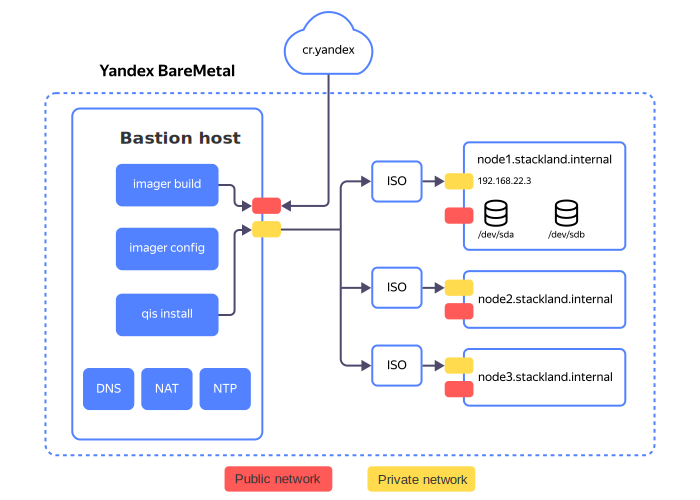
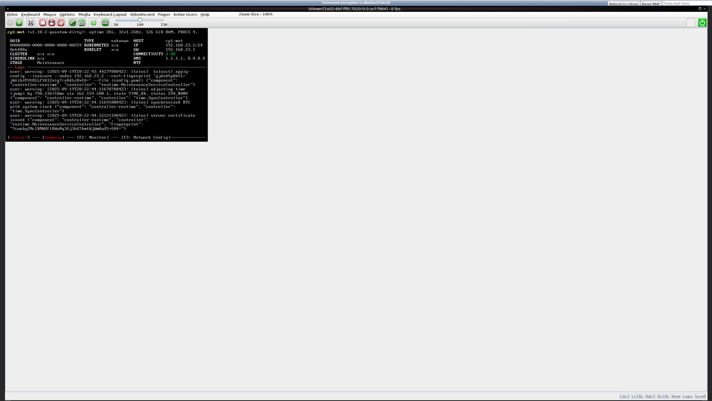

# Installing {{ stackland-name }} on {{ baremetal-full-name }}

[{{ baremetal-full-name }}](https://yandex.cloud/en/services/baremetal) allows you to rent dedicated physical servers, with all their resources only used for your needs. {{ stackland-full-name }} supports {{ baremetal-full-name }} as one of its target environments for deployment.

In this tutorial, you will learn how to rent {{ baremetal-full-name }} servers and get them ready for {{ stackland-name }} deployment, as well as how to prepare a configuration file for installing {{ stackland-name }} on your rented servers. For details as to deploying a {{ stackland-full-name }} cluster on a ready-to-go infrastructure, see our [Installation guide](../quickstart.md).

To configure the environment, this tutorial employs the [Yandex Cloud management console](http://console.yandex.cloud). To use a different {{ baremetal-full-name }} interface, refer to the [relevant articles](https://yandex.cloud/en/services/baremetal).

## Introduction {#introduction}

To deploy {{ stackland-name }}, you will need at least four servers:

* One bastion host (also called a jump host) to deploy your {{ stackland-name }} cluster from and work with it later.

* Three servers for your new {{ stackland-name }} cluster, connected to a single private network. The minimum {{ stackland-name }} configuration requires three servers, each having the `combined` role.

When selecting a server configuration, consider the expected workload of your new cluster. For recommended resource requirements for a cluster, see our [Installation guide](../quickstart.md#infrastructure).

The diagram below provides a high-level overview of the installation process:



## Step 1: Create a private subnet {#create-private-subnet}

For successful deployment, all servers must reside in the same private network. To automatically assign IP addresses to cluster servers, enabling DHCP in this network is a convenient option.

Create a private subnet with a DHCP server:

1. In {{ baremetal-full-name }}, open the private network creation form and enable the **IP addressing and routing** toggle. To open the form, follow this guide: [Creating a private subnet](https://yandex.cloud/en/docs/baremetal/operations/subnet-create).

1. In the **Virtual network segment (VRF)** field, click **Create**.

1. In the **Create virtual network segment** window that opens, click **Create VRF**.

1. Specify a CIDR for the new subnet. The CIDR can be any from the [RFC1918](https://datatracker.ietf.org/doc/html/rfc1918) range; also, you may want to use the `/24` mask. For instance, you can set your CIDR to `192.168.22.0/24`.

1. Specify the first address from the selected CIDR (i.e., `192.168.22.1`) as the default gateway.

1. Enable the **Assign IP addresses via DHCP** option.

1. Specify an IP address range, e.g., `192.168.22.2` to `192.168.22.120`. The range must be wide enough to accommodate all nodes of your future {{ stackland-name }} cluster and one additional host.



IP addresses assigned to servers via DHCP may change. For more information about how DHCP works, see [this {{ baremetal-full-name }} article](https://yandex.cloud/en/docs/baremetal/concepts/dhcp#dhcp-private).

Before installation begins, make sure the DHCP-assigned addresses are valid and match those specified in the DNS configuration in _Step 5_.



## Step 2: Renting servers {#lease-servers}

1. Rent a server for the bastion host as described in [this article](https://yandex.cloud/en/docs/baremetal/operations/servers/server-lease).

    Configure it as follows:

      * Select the minimum stock server configuration if it meets your requirements.
      * Select Ubuntu 24.04 as your OS.
      * In the **Private subnet** field, select the subnet created in Step 1.
      * Assign a **Public address** / **From ephemeral subnet** to provide your bastion with internet access.
      * Set a password for the `root` user and add your SSH key.

    Once the bastion is created, save its **Public IP address** and **Private IP address**, as you will need them later.

    You may use a Yandex Cloud VM as your bastion host. To configure network connectivity between the VM and {{ baremetal-name }} servers, follow [this tutorial](https://yandex.cloud/en/docs/baremetal/tutorials/bm-vrf-and-vpc-interconnect).

    

    Establishing a private connection between the {{ baremetal-name }} cluster and cloud networks may take up to 24 hours.

    

1. Rent at least three servers for your new {{ stackland-name }} cluster.

    Configure it as follows:

      * Select the **No OS** option, as {{ stackland-name }} comes with its own OS.
      * In the **Private subnet** field, select the subnet created in Step 1.
      * Select **No address** for the public address: all interaction with your {{ stackland-name }} cluster will occur via the bastion.


Wait until your servers are rented. Then, open the **Overview** tab for each of the future {{ stackland-name }} cluster servers one by one and save their MAC addresses listed under **Private network** / **MAC address**.

You will need them in Step 6.

## Step 3: Configuring the bastion {#configure-bastion}

The bastion fulfills three primary functions:

* Provides external access to the {{ stackland-name }} cluster, e.g., from the internet or your organization's network.
* Enables {{ stackland-name }} cluster nodes to access the internet.
* Hosts infrastructure services required for {{ stackland-name }} operation, such as DNS and NTP. When deploying within the enterprise environment, they are typically part of the organization's IT infrastructure.

Before you start configuring your bastion, connect to it over SSH using its public IP address incremented by one.

### 3.1. Configuring network access {#net-settings}

To enable external access to your {{ stackland-name }} cluster, we recommend that you install a VPN server, e.g., [OpenVPN](http://www.openvpn.net) or [WireGuard](https://www.wireguard.com). To connect to a virtual network, you can follow the steps from [this Yandex Cloud VPC tutorial](https://yandex.cloud/en/docs/vpc/tutorials/openvpn), adjusting it to your situation.

After installing and configuring the VPN server, configure IPv4 routing and NAT, as your bastion will act as a router for VPN clients. Some VPN servers do this automatically. If required, configure routing manually on the bastion:

1. Install `ufw`: `sudo apt install ufw`.

1. Enable IPv4 routing: uncomment the `net.ipv4.ip_forward=1` line in `/etc/sysctl.conf` and apply the changes with `sudo sysctl -p`.

1. Edit `/etc/default/ufw` and change its `DEFAULT_FORWARD_POLICY`, setting it to `ACCEPT`.

1. Create a file named `/etc/ufw/before.rules` with the following contents:

    ```
    *nat
    :POSTROUTING ACCEPT [0:0]
    -A POSTROUTING -s <CIDR of subnet to allocate VPN client addresses from> -j MASQUERADE
    -A POSTROUTING -s <CIDR of private subnet created in Step 1> -j MASQUERADE
    COMMIT
    ```

    The first `-A POSTROUTING` rule in this file provides NAT translation for VPN clients; the second, handles NAT translation for cluster nodes accessing the Internet (e.g., for downloading container images). Since connections occur via NAT, cluster nodes will not be directly accessible from the internet. For example, if the VPN server is configured to allocate client addresses from the `10.8.0.0/24` range, the rules above would appear as:

    ```
    *nat
    :POSTROUTING ACCEPT [0:0]
    -A POSTROUTING -s 10.8.0.0/24 -j MASQUERADE
    -A POSTROUTING -s 192.168.22.0/24 -j MASQUERADE
    COMMIT
    ```

1. Apply the changes by running these commands:

    ```bash
    sudo ufw disable
    sudo ufw allow 22/tcp comment 'SSH'
    sudo ufw allow 1194/udp comment 'OpenVPN'
    sudo ufw allow from 192.168.22.0/24 to any port 53,123 proto udp
    sudo ufw enable
    ```

1. Ensure routes to the private subnet created in Step 1 are announced to VPN clients. This is a must for services in the {{ stackland-name }} cluster to be reachable over the VPN connection. For details, see the relevant articles for your chosen VPN server.

### 3.2. Installing additional services {#additional-services}

In addition to the VPN server, install the following on your bastion:
- DNS server (you may want to opt for [BIND](https://www.isc.org/bind/)).
- NTP server, e.g., [Chrony](https://chrony-project.org/).
- [Yandex Cloud CLI](https://yandex.cloud/ru/docs/cli/).
- `unzip` utility for extracting the installer ZIP file.

To complete bastion setup, do the following:

1. Install BIND, Chrony, and `unzip` from Ubuntu repositories as usual:

    ```bash
    sudo apt install bind9 bind9utils dnsutils chrony unzip -y
    ```

1. Configure BIND as the system's caching DNS resolver. To do this, edit `/etc/bind/named.conf.options` and add the IP addresses of those public DNS servers that will perform actual resolution to the `forwarders {}` section. We recommend using Yandex DNS servers: `77.88.8.8` and `77.88.8.1`. Additionally, bind your BIND to the bastion's private IP address (`192.168.22.1` in the example below).

    ```
    ; /etc/bind/named.conf.options
    options {
        ...
        forwarders {
            77.88.8.8;
            77.88.8.1;
        };
        listen-on {
            192.168.22.1;
        };
        ...
    }
    ```

1. Specify the bastion's private IP address as the upstream DNS resolver (`DNS=`) in the `/etc/systemd/resolved.conf` configuration file and reload the service configurations:

    ```bash
    sudo rndc reconfig
    sudo systemctl restart systemd-resolved
    ```

    Many VPN servers allow DNS settings updates on the client when establishing a connection. For implementation details, see the relevant articles for your VPN server; configure its settings accordingly to enable external access to solutions deployed in {{ stackland-name }}.

1. Configure your Chrony to accept NTP requests on the required network interface. Edit your `/etc/chrony/chrony.conf`, adding the following lines:

    ```
    allow 192.168.22.0/24
    bindaddress 192.168.22.1
    ```

1. Replace `192.168.22.0/24` with your private subnet's CIDR. Restart Chrony:

    ```bash
    sudo systemctl restart chrony
    ```

## Step 4: Booting servers from an installation ISO image {#boot-servers}

1. Navigate to **BareMetal** / **Boot images** and create a new {{ baremetal-name }} boot image, specifying `https://storage.yandexcloud.net/stackland-public/stackland/$version/images/stackland-amd64-$version.iso` for **Links to images in Object Storage**. Replace `$version` with your current Stackland version. To learn more, see [this {{ baremetal-full-name }} guide](https://yandex.cloud/en/docs/baremetal/operations/image-upload).

Once your custom ISO image is ready, upload it onto all servers of your future {{ stackland-name }} cluster one by one:

1. Connect to the [KVM console](https://yandex.cloud/en/docs/baremetal/operations/servers/server-kvm) of each server.
1. Open the **Media > Virtual Media Wizard** menu.
1. Under **CD/DVD Media**, click **Browse**.
1. In the `user-iso` directory, select the boot image you created earlier.
1. Click **Connect** to attach your image.
1. In the top-right corner, click **Reboot to cdrom** to boot from the image.

Currently, this operation is only available from the management console, one server at a time.

Server boot takes a few minutes. After boot, a dashboard similar to the one shown below will appear in the KVM console:



If you see the dashboard and it displays the `Maintenance` stage, the installation image booted successfully. For each node in your future {{ stackland-name }} cluster, save its assigned IP address from the **IP** field in the right column; you will need this when preparing the configuration file.

## Step 5: Configuring DNS {#dns}

When deploying {{ stackland-name }} within an enterprise environment, you can use the existing DNS infrastructure. Since {{ baremetal-name }} lacks such infrastructure, you must set it up first. Specifically, you need to delegate a DNS zone, e.g., `stackland.internal`, to your future {{ stackland-name }} cluster.

1. On your bastion, create a parent zone file (`/etc/bind/db.internal`) with the following content:

    ```
    ; /etc/bind/db.internal

    $TTL 1H
    @       IN      SOA     ns1.internal. admin.internal. (
                            2025091801      ; Serial
                                    3H      ; Refresh
                                   30M      ; Retry
                                    1W      ; Expire
                                    5M)     ; Negative Cache TTL
    ;
    @       IN      NS      ns1.internal.
    ;
    ns1.internal.           IN      A       192.168.22.1

    stackland.internal.     IN      NS      node1.baremetal.internal.
    stackland.internal.     IN      NS      node2.baremetal.internal.
    stackland.internal.     IN      NS      node3.baremetal.internal.
    ```
    Also, create a server zone file. It will be used to map the IP addresses of nodes in the new cluster.
    ```
    $TTL 15M
    @   IN  SOA  ns1.internal. admin.internal. (
                2025091801 3H 30M 1W 5M )
    @   IN  NS   ns1.internal.
    node1  IN  A  192.168.22.2
    node2  IN  A  192.168.22.3
    node3  IN  A  192.168.22.4
    ```

    This example assumes the cluster will be deployed in the `stackland.internal` zone. Replace `192.168.22.1` with the bastion's IP address; replace `node1`, `node2`, and `node3` with the names you are going to assign to the `combined` nodes; finally, replace `192.168.22.[2-4]` with their IP addresses you saved in the previous step.

1. Edit `/etc/bind/named.conf.local`, adding the newly created zone:

    ```
    ; /etc/bind/named.conf.local

    zone "internal" {
        type master;
        file "/etc/bind/db.internal";
        forwarders {};
    };

    zone "baremetal.internal" {
        type master;
        file "/etc/bind/db.baremetal.internal";
    };
    ```

1. Reload BIND zones with this command:

    ```bash
    sudo rndc reload
    ```

1. If no errors occur, verify that domain name resolution works as expected:

    ```bash
    dig -x 192.168.22.1 -t a ns1.internal.  # 192.168.22.1
    host ns1.internal.  # 192.168.22.1
    ```

For more details on zone delegation, see our [Installation guide](../quickstart.md#dns).

## Step 6: Preparing the configuration file and installation {#download}

The installer configuration file follows the format described in our [Installation guide](../quickstart.md#configuration). When deploying on {{ baremetal-name }}, pay special attention to the network settings section, as {{ baremetal-name }} servers have multiple network adapters.

The configuration consists of the following three parts:

1. **Cluster configuration** (`StacklandClusterConfig`): General cluster settings, including the platform, subnets, and load balancer.
1. **Host configuration** (`StacklandHostsList`): Settings for individual servers, including roles and network interfaces.
1. **Secrets** (`StacklandSecretsConfig`): Sensitive data, such as a license key or an internal CA certificate.

For the three-node cluster described above as an example, the configuration file may look as follows:

```yaml
# Cluster configuration
apiVersion: v1alpha1
kind: StacklandClusterConfig
metadata:
  name: main
spec:
  platform:
    type: "baremetal"                            # Deployment platform
    loadBalancer:
      type: "cilium-l2"                          # Load balancer type
      ipPools:
        - cidrs:
          - 192.168.22.128/25                    # Load balancer IP address range

  cluster:
    baseDomain: "stackland.internal"             # Cluster domain

    networking:
      hostsNetwork:
        - cidr: 192.168.22.0/25                  # Cluster host subnet
      clusterNetwork:
        - cidr: 172.16.0.0/16                    # Cluster pod subnet
      servicesNetwork:
        - cidr: 10.96.0.0/12                     # Cluster service subnet
      virtualIPs:
        api: 192.168.22.127                      # Virtual IP address for the cluster API

    storage:
      defaultStorageClass: "stackland-ssd"       # Default storage class. Edit it based on your server configuration.

  genericHostConfig:
    disksConfig:
      - installDisk:
          name: "/dev/sda"                     # System installation disk
    networkConfig:
      addresses:
        - interface: "eth0"                    # For each host, the interface will be selected in StacklandHostsList individually.
          dhcp: true                           # Use DHCP to get an IP address
      routes:
        - to: "0.0.0.0/0"                      # Default route
          via: "192.168.22.1"
          iface: "eth0"
      resolvers:
        - "192.168.22.1"                       # Bastion's private IP address
      timeservers:
        - "192.168.22.1"                       # Bastion's private IP address

---
# Host configuration
apiVersion: v1alpha1
kind: StacklandHostsList
metadata:
  name: main
spec:
  hosts:
    - hostname: "node1.baremetal.internal"       # First host's FQDN
      role: "combined"                           # Host role: combined, control-plane, or worker

      networkConfig:
        interfaces:
          - macaddress: "06:2A:B7:15:DE:F1"      # MAC address from Step 2
            name: "eth0"                         # Interface name

    - hostname: "node2.baremetal.internal"
      role: "combined"

      networkConfig:
        interfaces:
          - macaddress: "0E:9D:6B:FC:42:88"
            name: "eth0"

    - hostname: "node3.baremetal.internal"
      role: "combined"

      networkConfig:
        interfaces:
          - macaddress: "02:5E:C3:A8:07:D9"
            name: "eth0"
```



The example above features DHCP for automatic assigning of IP addresses to servers. Make sure the DHCP-assigned IP addresses match those specified in the DNS configuration in _Step 5_.



Once you have finished editing, save the configuration files in the `config/` directory and generate `StacklandSecretsConfig` with this command:

```bash
sladm secrets add --out config/secrets.yaml --license-key key.json
```

The further installation process is identical to that described in our [Installation guide](../quickstart.md#installation).

## Step 7: Checking the cluster validity and next steps {#final-check}

Make sure that:

- DNS names for the cluster are resolved when accessing from the bastion host.

- You can establish a VPN connection to the bastion host.

- With the VPN connection active, you can resolve cluster DNS names and successfully ping node IP addresses.

For the detailed post-installation cluster validation process, see our [Installation guide](../quickstart.md#verification).

If all the above tests are successful, your cluster should be accessible from any machine that establishes a VPN connection to the bastion.

This concludes your {{ stackland-name }} installation on {{ baremetal-full-name }}. For further cluster configuration steps. see [the relevant articles](../index.yaml).
