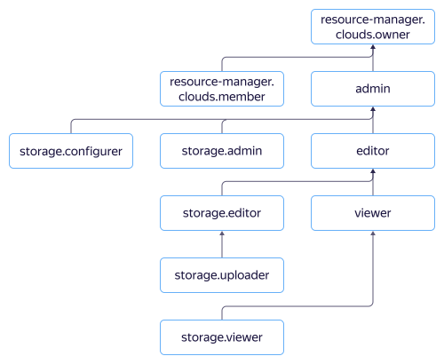

# Managing access with {{ iam-full-name }}



In this section, you will learn:

* [Which resources you can assign a role for](#resources).
* [Which roles exist in the service](#roles-list).



## Which resources you can assign a role for {#resources}

Using the {{ yandex-cloud }} console or the YC CLI, you can assign a role for a [cloud](../../resource-manager/concepts/resources-hierarchy.md#cloud), a [folder](../../resource-manager/concepts/resources-hierarchy.md#folder), or an individual bucket. These assigned roles will also apply to nested resources.

To learn how to manage access to buckets and objects in them, see [{#T}](../concepts/acl.md).

## Which roles exist in the service {#roles-list}



### Service roles {#service-roles}

#### storage.viewer {#storage-viewer}



#### storage.configViewer {#storage-config-viewer}



#### storage.configurer {#storage-configurer}



#### storage.uploader {#storage-uploader}



#### storage.editor {#storage-editor}



#### storage.admin {#storage-admin}



### Primitive roles {#primitive-roles}



## See also {#see-also}

* [{#T}](../operations/buckets/iam-access.md)
