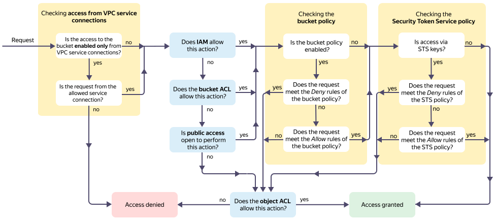

# Access management methods in {{ objstorage-name }}: Overview

{{ objstorage-name }} incorporates various access management methods:
* [{{ iam-full-name }} ({{ iam-short-name }})](#iam)
* [Access control list (ACL)](#acl)
* [Bucket policy](#policy)
* [Public access](#anonymous)
* [{{ sts-name }}](#sts)
* [Pre-signed URLs](#pre-signed)

Also, enabled encryption may affect access to buckets and objects in {{ objstorage-name }}. For more information about working with encrypted buckets, see [{#T}](../concepts/encryption.md).

The flow chart below shows how these methods work together in {{ objstorage-name }}.

The checks follow this algorithm:

1. _IAM_ and _bucket ACL_:
    * If the request passes the _IAM_ **or** _bucket ACL_ check, it is checked whether the _bucket policy_ is configured.
    * If the request fails the _IAM_ **and** _bucket ACL_ checks, it is checked whether _public access_ to the bucket is enabled.
1. _Public access_:
    * If public access to perform the action is enabled, it is checked whether the _bucket policy_ is configured.
    * If public access to perform the action is disabled, an access check based on the _object ACL_ is performed.
1. _Bucket policy_:
    * If the bucket policy is configured:
      1. If the request meets at least one of the `Deny` rules in the bucket policy, an access check based on the _object ACL_ is performed.
      1. If the request meets at least one of the `Allow` rules in the bucket policy, it is checked whether there is access via _{{ sts-name }}_.
      1. If the request does not meet any of the bucket policy rules, an access check based on the _object ACL_ is performed.
    * If the bucket policy is not configured, it is checked whether there is access via _{{ sts-name }}_.
1. _{{ sts-name }}_:
    * If the request is made using {{ sts-name }}:
      1. If the request meets at least one of the `Deny` rules in the policy for the temporary key, an access check based on the _object ACL_ is performed.
      1. If the request meets at least one of the `Allow` rules in the policy for the temporary key, access will be allowed.
      1. If the request does not meet any of the policy rules for the temporary key, an access check based on the _object ACL_ is performed.
    * If the request is made directly, access will be allowed.
1. _Object ACL_:
    * If the request passes the _object ACL_ check, access will be allowed.
    * If the request fails the _object ACL_ check, access will be denied.

## {{ iam-name }} {#iam}

[{{ iam-name }}](./index.md): Basic method for managing access in {{ yandex-cloud }} using role assignment. Enables the basic access control policy. For more details, see [{#T}](./index.md#roles-list).

Access grantees include: 
* Yandex account
* [Service account](../../iam/concepts/users/service-accounts.md)
* [Federated user](../../iam/concepts/federations.md)
* [System group](../../iam/concepts/access-control/system-group.md)
* [Public group](../../iam/concepts/access-control/public-group.md)

Access is granted to a [cloud](../../resource-manager/concepts/resources-hierarchy.md#cloud), [folder](../../resource-manager/concepts/resources-hierarchy.md#folder), or [bucket](../concepts/bucket.md).

## Access control list (ACL) {#acl}

An [access control list (ACL)](./acl.md) is a list of action permissions stored directly in {{ objstorage-name }}. Enables the basic access control policy. ACL permissions for buckets and objects are different; see [{#T}](./acl.md#permissions-types) for details.



If you do not need to differentiate access to specific objects, we recommend using {{ iam-name }}.



Access grantees include: 
* Yandex account
* [Service account](../../iam/concepts/users/service-accounts.md)
* [Federated user](../../iam/concepts/federations.md)
* [System group](../../iam/concepts/access-control/system-group.md)
* [Public group](../../iam/concepts/access-control/public-group.md)

Access is granted to a [bucket](../concepts/bucket.md) or [object](../concepts/object.md).

## Bucket policy {#policy}

A [bucket policy](./policy.md) is a list of rules that prohibit or allow [actions](../s3/api-ref/policy/actions.md) when certain [conditions](../s3/api-ref/policy/conditions.md) are met. Allows you to granularly differentiate access to buckets, objects and groups of objects.

Access grantees include: 
* Yandex account
* [Service account](../../iam/concepts/users/service-accounts.md)
* [Federated user](../../iam/concepts/federations.md)
* Anonymous user

Access is granted to a [bucket](../concepts/bucket.md), [object](../concepts/object.md), or a group of objects.

## Public access {#anonymous}

[Public access](./public-access.md) defines access permissions for anonymous users to read objects, list of objects and bucket settings.

Access is granted to a [bucket](../concepts/bucket.md).



## {{ sts-name }} {#sts}

[{{ sts-name }}](./sts.md): {{ iam-name }} component to get temporary access keys compatible with [AWS S3 API](../s3/index.md).

With temporary keys, you can set up granular access to buckets for multiple users with a single service account.

## Pre-signed URLs {#pre-signed}

[Pre-signed URLs](./pre-signed-urls.md) are a way of giving anonymous users temporary access to certain actions in {{ objstorage-name }} using URLs that contain request authorization data in their parameters.

Access is granted to a [bucket](../concepts/bucket.md) or [object](../concepts/object.md).

### See also {#see-also}

* [{#T}](../operations/buckets/iam-access.md)
* [{#T}](../operations/buckets/edit-acl.md)
* [{#T}](../operations/objects/edit-acl.md)
* [{#T}](../operations/buckets/policy.md)
* [{#T}](../operations/buckets/bucket-availability.md)
* [{#T}](../operations/buckets/create-sts-key.md)