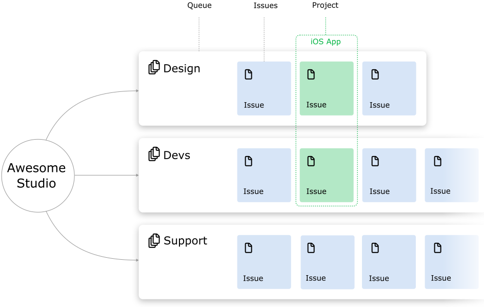
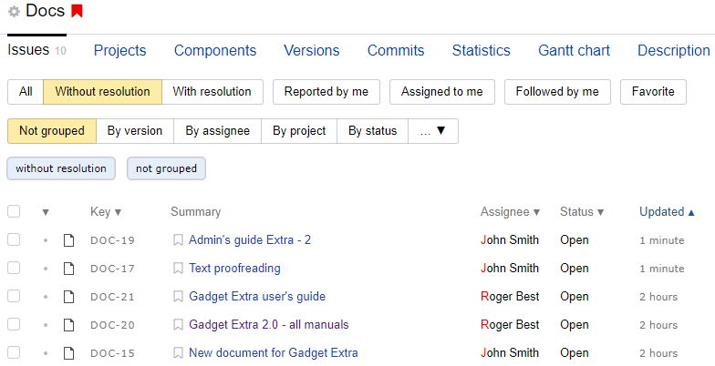
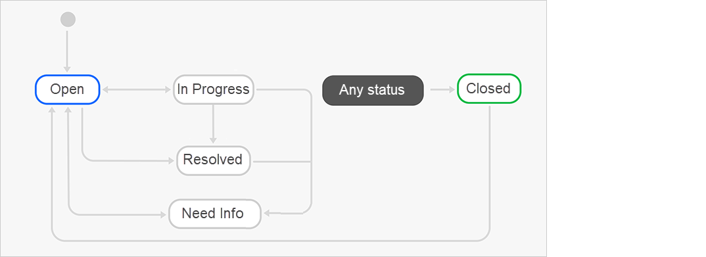
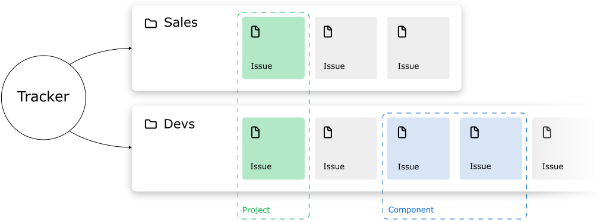
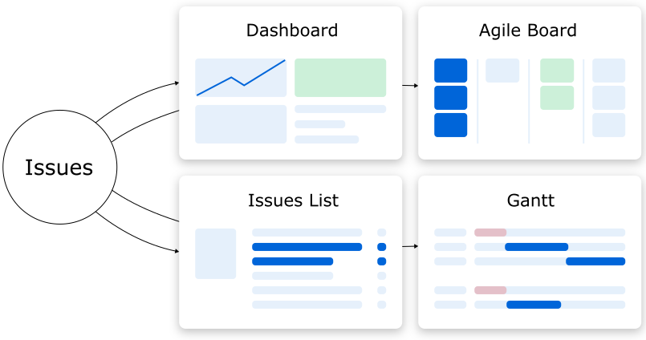

# How {{ tracker-name }} works

In this section, you'll learn all about how {{ tracker-name }} works and how you can use {{ tracker-name }} to suit your workflow.

Before you start, see {{ tracker-name }} setup instructions in [{#T}](quick-start.md).

## {{ tracker-name }} structure {#blocks}

Organizing your workflow in {{ tracker-name }} requires managing two crucial elements: _issues_ and _queues_. Issues describe tasks that need to be completed, while a queue sets the rules all issues within must abide by.

There are other optional elements, such as components, issue boards, and dashboards, which help users manage issues, track their status, and monitor results. You can find an overview of all these features below.

#### Issue

To manage your team's workload via {{ tracker-name }}, you need to break it down into smaller chunks called issues. These may include adding a new feature to your app, managing a support service request from a client, creating a new logo, or applying for a business trip.

Each issue has its own name, assignee, deadline, and other parameters. Issues can be interlinked or form a hierarchy relative to each other.

If you want to give your employee a task to do, create an issue and make them an assignee.

#### Queue

Queues combine issues that share a common topic (be it a process, product, and so on) and let users configure a [workflow](#process) for the issues. Each queue can have its own issue completion stages, rules for automated issue processing, and access rights to issues.

As a rule, each team has their own workflow, so we recommend creating standalone queries for each team or company division. You can create a queue for your development department, design team, or legal department. This will turn a queue into an issue feed for a particular team. As an example, you should create an issue in the designers' queue if you need to design a new logo.

## Organizing your workflow in {{ tracker-name }} {#process}

Issues are generally completed in multiple stages. For example, creation, resolution, review, and completion.

In {{ tracker-name }}, each issue stage corresponds to a certain _status_. Those include "Open", "In Progress", "Testing", and "Closed". To set your pipeline up around {{ tracker-name }}, you need to configure your _workflow_, which is a set of statuses an issue goes through from creation to completion as well as specific rules of transitioning between those statuses.

Your workflow is linked to your issue queue. If you need to set up multiple workflows for different teams, you can [create standalone queues for each of them](manager/create-queue.md). You can also add multiple [issue types](manager/add-ticket-type.md) to a single queue and set up an exclusive workflow for each type.

{{ tracker-name }} also provides [queue templates](manager/workflows.md) with preset workflows tailored for various processes to help you get started. Here's what a versatile workflow looks like:

You can [create unique workflows](manager/add-workflow.md) tailored for specific issues. Try not to overload them with needless statuses. The simpler a workflow is, the easier it is to work with.

In addition to setting up workflows, you can also use queues to configure [access rights to issues](manager/queue-access.md), [automated issue processing](./automation.md), integration with  [{{ forms-full-name }}](manager/forms-integration.md), and so on. These features will allow you to tailor queues to the needs of your team.

For some examples on how you can set up workflows in {{ tracker-name }}, see the following sections:

- [{#T}](dev-process.md)
- [{#T}](support-process.md)

## Grouping and sorting issues {#group}

Grouping issues can prove useful for determining your workload at various stages of the project or for indicating responsibilities of your various teams or individual employees.

You can use {{ tracker-name }} to group issues by the following criteria:

- [Components](manager/components.md) help you group issues in a queue that relate to the same topic. When managing issues with components, you can set up a default assignee and [access rights](manager/queue-access.md#section_tbh_cs5_qbb).
For example, you can use components to [group support service requests](support-process-group.md).
- [Versions](manager/versions.md) help you group issues within the same queue based on the product version they belong to.
For example, to schedule a bug fix for a specific product release, you can specify the product's version in the **Fix Version** field.
- A tag is a type of label that can be added manually to any issue. Tags let users group issues based on any attribute, which makes it easy to search for those issues by tag later. To add tags to an issue, [edit the **Tags**](user/edit-ticket.md#section_jqw_ppn_jz) setting.

## Planning your workload {#in-order}

There are multiple ways to plan your workload in {{ tracker-name }}:

- [Creating projects](#in-order-create-project)
- [Decomposing issues](#in-order-decompose-task)
- [Dividing your workload into sprints](#in-order-divide-work)
- [Planning deadlines on a Gantt chart](#in-order-gantt)

#### Creating projects {#in-order-create-project}

A project can include any type of job with fixed goals and deadlines.

[Use projects in {{ tracker-name }}](manager/projects.md) to combine issues that have a common goal to be completed within a given deadline. You can set a deadline and assign a responsible employee for any project. Projects can include issues from different queues.

#### Decomposing issues {#in-order-decompose-task}

Use issue decomposition to determine the workload that needs to be sorted out for a project to be completed or for a new version of a product to be released.

Issue decomposition means breaking down larger chunks of a project into standalone issues and sub-issues. If your workload is divided into smaller, singular issues, it becomes much easier to gauge their difficulty, distribute issues among your employees and plan your deadlines. In {{ tracker-name }}, you can decompose your issues using [links](user/links.md). Let's say you need to implement a new feature in your product, which implies resolving multiple smaller issues. For such cases, you can create a parent issue of the <q>New feature</q> type and link your sub-issues to it.

#### Dividing your workload into sprints {#in-order-divide-work}

If you are engaged in long-term development of a product or project and no concrete total workload or final deadline can be estimated, you can use sprints to plan your workload instead.

In [Scrum]({{ link-wiki-scrum }}), sprints are small iterative cycles of development that last 1 to 4 weeks. When a sprint starts, your team assesses the complexity of issues stored in the [backlog](glossary.md#rus-b) and selects the issues to be completed within the current sprint. Short iterative cycles make it easier to accurately gauge deadlines and change your priorities on the fly if necessary.

To use this planning strategy, first [create a <q>Scrum</q>](manager/create-agile-board.md) issue board. Using the board, you can [manage sprints](manager/create-agile-sprint.md), [estimate issues with planning poker](manager/planning-poker.md), and use [burn down charts](manager/burndown.md).

#### Planning deadlines on a Gantt chart {#in-order-gantt}

You can use a [Gantt chart](manager/gantt.md) to plan and keep track of deadlines for multiple issues on a single page. This can be helpful if you want issues to be solved in a specific order or if one employee is responsible for multiple issues.

You can create a Gantt chart for a project, a queue, or a filtered issue list. The start and end dates for your issue or project are displayed as horizontal lines and can be set or edited right on the chart.

## Monitoring results {#control}

{{ tracker-name }} offers several tools that let users view all issue-related data quickly and easily, monitor progress, and keep track of results.

#### Dashboards {#dash}

A dashboard is a page that helps users monitor the status of important issues and view statistics. You can customize your dashboard and add [widgets](glossary.md#rus-v) that display data you wish to track. Widgets receive issue-related data automatically and display it as issue lists, tables, or charts.

You can go to [{#T}](support-process-dashboards.md) to find an example of how to set up a dashboard.

#### Issue boards {#boards}

You can easily monitor issues assigned to your team on an [issue board](manager/create-agile-board.md). Issues are displayed on the board as cards with general issue parameters on them. The cards are arranged in columns that correspond to issue statuses.

A board can be used to any kind of work, not necessarily related to software development. If you aren't working with [Scrum]({{ link-wiki-scrum }}) or [Kanban]({{ link-wiki-kanban }}), try using a basic board.

#### Subscriptions and notifications {#subscriptios}

{{ tracker-name }} sends you notifications about issue changes by default. You can [configure the list of events](user/notification-settings.md) that you want to get notifications for.

You can [subscribe to notifications](user/subscribe.md) and not miss any updates in a queue, component, or issues of other users.

#### Searching for issues {#search}

You can use filters to find issues by any parameters or their combinations.

{{ tracker-name }} includes system filters that help you [find your issues](user/default-filters.md).

If you often need to search for issues with specific parameters, you can [create and save a custom filter](user/create-filter.md). For example, you can use custom filters to find all issues in queues where you have the author or assignee status.

