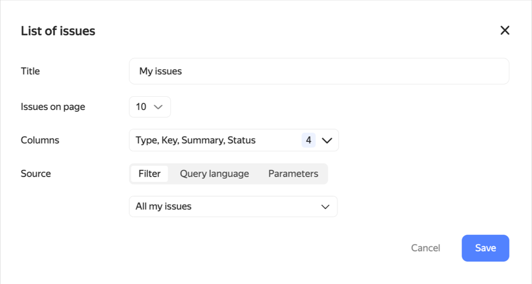

# {{ tracker-full-name }} revision history for October 2022

* [Managing user groups](#admin-groups)
* [User management page](#users-page)
* ["My issues" filter in the start page widget](#widget-my-issues)
* [Filtering issues in the {{ tracker-name }} mobile app](#filters-in-mobile-app)
* [Gantt chart updates](#gantt-news)
* [Choosing the start page](#custom-startpage)
* [Icon to navigate to the start "My page"](#startpage-mypage)

## Managing user groups {#admin-groups}

Administrators can configure access permissions for user groups from Yandex 360. Now, they don't have to assign permissions to each user manually.

Groups can be set up under [**Administration** → **Groups**](https://tracker.yandex.ru/admin/groups).

## User management page {#users-page}

There is now a [page](https://tracker.yandex.ru/admin/users) for administrators with a list of all users and additional information about them:
* [Group](../access.md#group-access) membership.
* [Organization](../add-users.md#invite_user) membership.
* Date of last login to {{ tracker-full-name }}.
* [Access permissions](../role-model.md#roles).

The page is available under **Administration** → **Users**.

## "My issues" filter in the start page widget {#widget-my-issues}

When configuring the issues widget on the [start page](../user/startpage.md#tasks), you can use the **My issues** filter. It contains the issues created by you, assigned to you, or followed by you, or the issues that you were invited to comment and that need your response.

## Filtering issues in the {{ tracker-name }} mobile app {#filters-in-mobile-app}

The {{ tracker-full-name }} mobile app now supports issue filtering. Using filters, you can select issues by any parameter, such as:
* From the specified board.
* From a project.
* By assignee.
* By deadline, and so on.

The list of filters in the app also lets you find your saved filters that you created in the {{ tracker-name }} interface.

## Gantt chart updates {#gantt-news}

When scrolling through the Gantt chart of a project, list of projects, or issue filter, the page header is hidden.



- Gantt chart for project issues

  1. The **Hide links** setting is now available: it hides blocking links between issues.
  1. When updating the page, the selected scale (weeks, months, or quarters) is retained in the chart.
  1. The Gantt chart of a project now lets you configure table columns to the left of the chart. You can add any fields there, such as status or key. To do this, click .
  1. In the chart, you can change the column width. In this case, new formatting persists when updating the page.

- Gantt chart for a list of projects

  1. The list of projects and its Gantt chart now support sorting by project parameters, such as status, start and end dates, or project owner.
  1. When clicking on the project from the Gantt chart, its card opens on the right.

- Gantt chart for queue issues

  The queue page now lets you switch to Gantt mode: in this case, the chart displays the queue issues.



## Choosing the start page {#custom-startpage}

{{ tracker-name }} users can now choose the start page as they wish. To select the type of your start page, open **Settings** → **Interface** and select one of the following in the **Start page** field:

* My page.
* Saved filter.
* Issue board.
* Dashboard.

## Icon to navigate to the start "My page" {#startpage-mypage}

Users who selected the start page different from **My page** can use the  icon to quickly navigate to this page.

