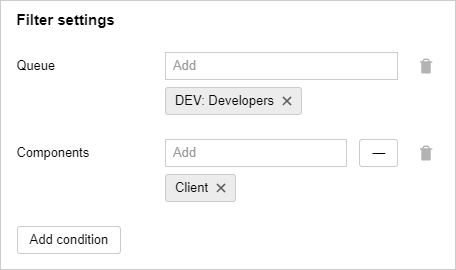

# Using Agile methodologies

If your team leverages [Agile development methodology]({{ link-wiki-agile-en }}), try Agile boards in {{ tracker-name }}. You can use boards to track your team's current issues, e.g., during daily meetings. On the board, issues are shown as cards assigned to columns depending on their status.

If you selected such template as *Basic development model*, *Scrum*, or *Kanban* [when creating a queue](dev-process-create-queue.md), an issue board with the queue's name will also appear automatically. All issues from your queue will be shown on the board.

You can also [create multiple issue boards](manager/create-agile-board.md). This can be useful if you have multiple work groups or issue types:

1. In the left-hand panel, select &nbsp;**{{ ui-key.startrek.ui_components_NavigationBar.boards }}** and click **{{ ui-key.startrek.ui_components_NavigationBar_BoardsPanel.create-button }}**.

1. Select the [board type](#board_types).

1. Under **Add issues**, enable **automatic** issue adding and set the filters so that only issues with certain parameters are displayed.

   For example, you can set up filters in such a way so that all issues from your queue are displayed on the board, or only issues with certain [components](manager/components.md) or assignees are displayed, and so on.

   

### Board types in {{ tracker-name }} {#board_types}

{{ tracker-name }} has multiple board types:

- *Basic* boards have the least features and display the team's issues and issue statues.

- *Kanban* boards are similar to basic boards, but all issues with the **Open** status are automatically moved to the [**{{ ui-key.startrek-backend.presets.kanbanDevelopmentPreset.board.column.open }}**](manager/agile.md#dlen_backlog) column.

- *{{ ui-key.startrek-backend.presets.scrumDevelopmentPreset.name }}* boards display issue statuses and provide [sprint](manager/agile.md#dlen_sprint) management, [issue estimation](manager/planning-poker.md) and [burndown charts](manager/agile.md#dlen_burndown).

### Scrum board tools

*{{ ui-key.startrek-backend.presets.scrumDevelopmentPreset.name }}* boards offers tools that help organize your workflow according to the [Scrum]({{ link-wiki-scrum }}) methodology:

#### Sprints {#sprints}

Under the Scrum methodology, you work in small iterations known as sprints. One sprint usually last for one or two weeks. Try planning your sprint so that your team can complete all the issues scheduled for the sprint. To gain a better insight into your scope of work, first estimate your issues by playing the [planning poker](#poker).

To [schedule a sprint in {{ tracker-name }}](manager/create-agile-sprint.md) :

- Click **Sprints** in the top-right corner of the issue board.

- [Create a sprint](manager/create-agile-sprint.md#create_sprint) and set its start and end dates.

- Add issues to your sprint: drag tasks from the **{{ ui-key.startrek-backend.presets.kanbanDevelopmentPreset.board.column.open }}** column to the sprint issues list. Alternatively, you can specify a sprint in the **{{ ui-key.startrek-backend.fields.issue.fields.agile }}** → **{{ ui-key.startrek-backend.fields.issue.sprint }}** field on the issue page.

To show the issues from a specific sprint on the board, select the sprint at the top of the page. To track issue completion speed for the issues included in a sprint use a [burndown chart](#burndown).

#### Planning poker {#poker}

To set a realistic schedule for the upcoming sprint, evaluate the expected effort for each issue. This is where the Scrum's [Planning Poker]({{ link-wiki-poker }}) comes handy. This method lets each member of your team score issues on their complexity independently, discuss the results, and finally pin down the total estimate. This scoring method usually involves relative issue complexity points called [Story Points](manager/agile.md#dlen_sp).

You can [use planning poker in {{ tracker-name }}](manager/planning-poker.md):

- To [estimate your issues](manager/planning-poker.md#section_estimate), ask your team members to go to the poker page. To do this, they need to click **Poker** in the upper-right corner of the issue board.

- You can also [set the issue estimation scale](manager/planning-poker.md#section_scale) and [specify rules for calculating the final score](manager/planning-poker.md#section_calc) in the board settings.

#### Burndown chart {#burndown}

A burndown chart shows the issue completion rate and the remaining amount of work within a single [sprint](manager/agile.md#dlen_sprint). Burndown charts are useful for evaluating whether the team will be able to solve the planned issues in time.

The chart's vertical axis shows the total workload left in [Story Points](manager/agile.md#dlen_sp), while the horizontal axis shows time. An ideal burnout chart should be close to a straight line: it should start at a point with a maximum scope of work (the total of all the issues in the sprint) on day 1 of the sprint and end at zero on the last day of the sprint.

To [view the burndown chart in {{ tracker-name }}](manager/burndown.md), click **Burndown chart** in the top-right corner of the issue board.

### Issue breakdown

In Agile development methodologies, issues are broken down as follows:

- Major issues that cannot be completed within one iteration or sprint, are referred to as epics.

- Epics break down into user stories, which are finalized product features implementable within a single sprint.

- User Stories are split into individual issues, e.g., GUI design, backend development, and frontend development.

The {{ ui-key.startrek-backend.presets.scrumDevelopmentPreset.name }} [queue template](manager/workflows.md#sec_scrum) provides epic and story issue types to accommodate such issue decomposition system. If you picked a template that does not include Epic or Story issues when [creating a queue](dev-process-create-queue.md), you can manually [add them in the queue settings](manager/add-ticket-type.md).