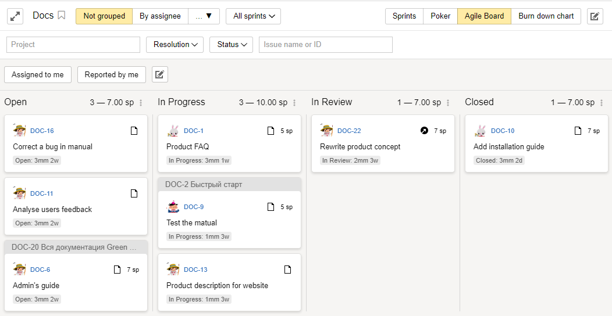

# Using Agile methodologies

If your team's work is organized around [Agile software development]({{ link-wiki-agile }}), it can be a good idea to try issue boards in {{ tracker-name }}. Boards help you keep track of issues laid out for the team (such as during daily meetups). Issues are displayed on the board as cards sorted into columns based on their status.







If you selected the <q>Basic development model</q>, <q>Scrum</q>, or <q>Kanban</q> template when [creating a queue](dev-process-create-queue.md), an issue board with the queue's name is also created automatically. The board will display all issues contained in your queue.

You can also [create multiple issue boards](manager/create-agile-board.md). This can be useful if you have multiple work groups or issue types:

1. On the top panel in {{ tracker-name }}, select **Boards** → **New board**.

1. Select the [board type](#board_types).

1. Under **Add issues**, enable **automatic** issue adding and set the filters so that only issues with certain parameters are displayed.

    For example, you can set up filters in such a way so that all issues from your queue are displayed on the board, or only issues with certain [components](manager/components.md) or assignees are displayed, and so on.

    

### Board types in {{ tracker-name }} {#board_types}

{{ tracker-name }} has multiple board types:

- <q>Basic</q> boards have the least features and display the team's issues and issue statues.

- <q>Kanban</q> boards are similar to basic boards, but all issues with the **Open** status are automatically moved to the [**Backlog**](manager/agile.md#dlen_backlog) column.

- <q>Scrum</q> boards display issue statuses and provide [sprint](manager/agile.md#dlen_sprint) management tools, [issue estimation](manager/planning-poker.md), and [burndown charts](manager/agile.md#dlen_burndown).

### Scrum board tools

The <q>Scrum</q> board offers tools that help organize your workflow according to the [Scrum]({{ link-wiki-scrum }}) methodology:

- **Sprints**

    Scrum implies that your workflow is broken down into smaller cycles called sprints. A sprint usually lasts one or two weeks. Please try planning your sprints in a way that lets your team solve all scheduled issues in the allotted time. You should also estimate your issues with [planning poker](#poker) to visualize your workload more clearly beforehand.

    To [schedule a sprint in {{ tracker-name }}](manager/create-agile-sprint.md):

    - Click **Sprints** in the upper-right corner of the issue board.

    - [Create a sprint](manager/create-agile-sprint.md#create_sprint) and set its start and end dates.

    - Add issues to your sprint: drag tasks from the **Backlog** column to the sprint issues list. Alternatively, you can specify a sprint in the **Agile** → **Sprint** field on the issue page.

    If you want the board to only display issues related to a specific sprint, select that sprint at the top of the page. To track issue completion speed for the issues included in a sprint use a [burn down chart](#burndown).

- **Planning poker** {#poker}

    To accurately gauge the workload for the upcoming sprint, you need to be able to evaluate its issue complexity. To do this, Scrum uses [Planning Poker]({{ link-wiki-poker }}). This method lets each member of your team score issues on their complexity independently, discuss the results, and finally pin down the total estimate. This scoring method usually involves relative issue complexity points called [Story Points](manager/agile.md#dlen_sp).

    You can use [planning poker in {{ tracker-name }}](manager/planning-poker.md):

    - To [estimate your issues](manager/planning-poker.md#section_estimate), ask your team members to go to the poker page. To do this, they need to click **Poker** in the upper-right corner of the issue board.

    - You can also [set the issue estimation scale](manager/planning-poker.md#section_scale) and [specify rules for calculating the final score](manager/planning-poker.md#section_calc) in the board settings.

- **Burn down chart** {#burndown}

    A burn down chart shows the issue completion rate and the remaining amount of work within a single [sprint](manager/agile.md#dlen_sprint). Burn down charts are useful for evaluating whether the team will be able to solve the planned issues in time.

    The chart's vertical axis shows the total workload left in [Story Points](manager/agile.md#dlen_sp), while the horizontal axis shows time. The ideal burn down chart should be as close as possible to a straight line that starts at the point with the most amount of work during the first day (total workload volume within a sprint) and ends at the zero point during the last day of the sprint.

    To [view the burn down chart in {{ tracker-name }}](manager/burndown.md), click **Burn down chart** in the upper-right corner of the issue board.

### Issue decomposition

Agile development strategies decompose issues as follows:

- Larger tasks that cannot be completed within a single sprint are called Epics.

- Epics are <q>User Stories</q>, which are finalized product features that can be implemented in a single sprint.

- User Stories are then broken down into standalone issues, such as designing the interface, or backend and frontend development.

The [<q>Scrum</q> queue template](manager/workflows.md#sec_scrum) provides Epic and Story issue types to accommodate such a system. If you picked a template that doesn't include Epic or Story issues [when creating a queue](dev-process-create-queue.md), you can manually [add them in the queue settings](manager/add-ticket-type.md).

